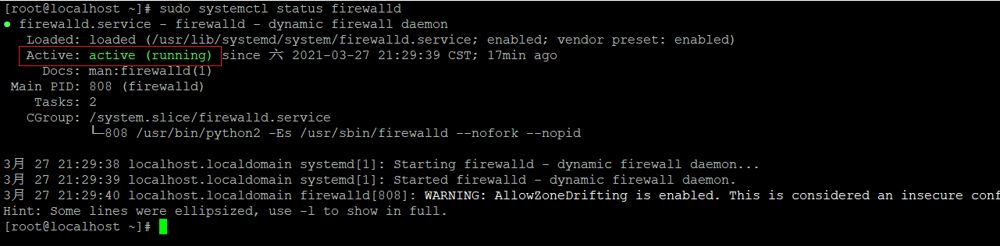
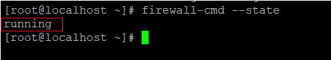
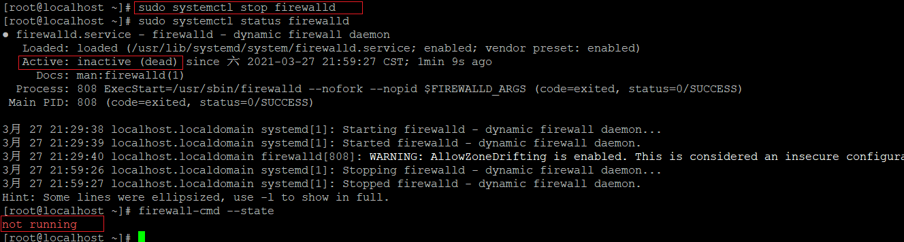
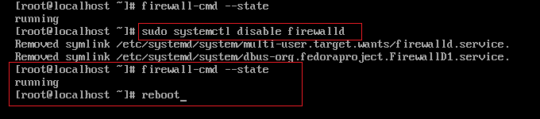
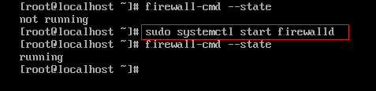
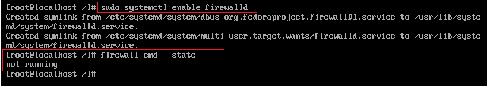

以下截图中的操作均在`Centos7`上进行。

## 1.查看防火墙状态命令

### 命令 1

```shell
sudo systemctl status firewalld
```



### 命令 2

```shell
firewall-cmd state
```




## 2.关闭防火墙命令

### 临时关闭防火墙

```shell
sudo systemctl stop firewalld
```

此种方式关闭后，使用 `reboot` 命令重启后会恢复到原来的状态，也就是说这种方式相当于一种`临时关闭防火墙`的作用。



### 永久关闭防火墙

```shell
sudo systemctl disable firewalld
```

此种方式关闭后，重启将不会恢复到原来的状态，并且需要重启后（`reboot` 命令）才能生效，即这种关闭方式是`永久性`的关闭防火墙。



##  3.开启防火墙命令

### 临时开启防火墙

```shell
sudo systemctl  start firewalld
```

同样的，这种开启防火墙的方式也是临时的开启，当重启后将会恢复到原来的状态。




### 永久开启防火墙

```shell
sudo systemctl enable firewalld
```

这种方式开启防火墙是永久性的，执行命令后需要重启才能生效。



## 总结

```shell
查看防火墙状态命令
1）sudo systemctl status firewalld
2) firewall-cmd --state

关闭防火墙命令
1）临时性关闭（重启后失效）：sudo systemctl stop firewalld
2) 永久性关闭（重启后生效）：sudo systemctl disable firewalld

开启防火墙命令
1）临时性开启（重启后失效）：sudo systemctl start firewalld
2) 永久性开启（重启后生效）：sudo systemctl enable firewalld
```