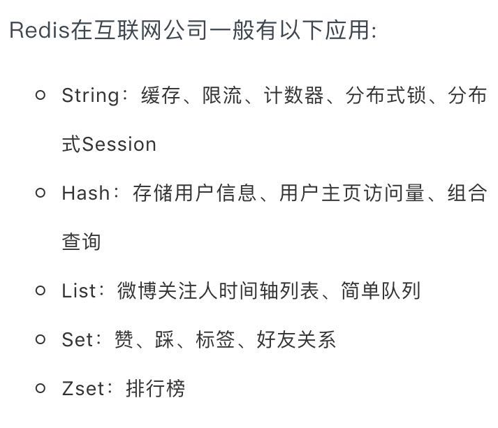

## Redis简介

1. 基于内存的`key-value`数据库
2. 基于`c`语言编写的，可以支持多种语言的`api` //**set每秒11万次，取get 81000次**
3. 支持数据持久化
4. `value`可以是`string`，`hash`， `list`， `set`, `sorted set`

## Redis使用场景

1. 去最新`n`个数据的操作
2. 排行榜，取`top n`个数据 //最佳人气前`10`条
3. 精确的设置过期时间
4. 计数器
5. 实时系统， 反垃圾系统
6. `pub`， `sub`发布订阅构建实时消息系统
7. 构建消息队列
8. 缓存

## Redis互联网公司应用

## Redis常用命令

cmd访问redis
redis-cli.exe -h 127.0.0.1 -p 6379

key
keys * 获取所有的key
select 0 选择第一个库
move myString 1 将当前的数据库key移动到某个数据库,目标库有，则不能移动
flush db      清除指定库
randomkey     随机key
type key      类型

    set key1 value1 设置key
    get key1    获取key
    mset key1 value1 key2 value2 key3 value3
    mget key1 key2 key3
    del key1   删除key
    exists key      判断是否存在key
    expire key 10   10过期
    pexpire key 1000 毫秒
    persist key     删除过期时间

string
set name cxx
get name
getrange name 0 -1        字符串分段
getset name new_cxx       设置值，返回旧值
mset key1 key2            批量设置
mget key1 key2            批量获取
setnx key value           不存在就插入（not exists）
setex key time value      过期时间（expire）
setrange key index value  从index开始替换value
incr age        递增
incrby age 10   递增
decr age        递减
decrby age 10   递减
incrbyfloat     增减浮点数
append          追加
strlen          长度
getbit/setbit/bitcount/bitop    位操作

hash
hset myhash name cxx
hget myhash name
hmset myhash name cxx age 25 note "i am notes"
hmget myhash name age note   
hgetall myhash               获取所有的
hexists myhash name          是否存在
hsetnx myhash score 100      设置不存在的
hincrby myhash id 1          递增
hdel myhash name             删除
hkeys myhash                 只取key
hvals myhash                 只取value
hlen myhash                  长度

list
lpush mylist a b c  左插入
rpush mylist x y z  右插入
lrange mylist 0 -1  数据集合
lpop mylist  弹出元素
rpop mylist  弹出元素
llen mylist  长度
lrem mylist count value  删除
lindex mylist 2          指定索引的值
lset mylist 2 n          索引设值
ltrim mylist 0 4         删除key
linsert mylist before a  插入
linsert mylist after a   插入
rpoplpush list list2     转移列表的数据

set
sadd myset redis
smembers myset       数据集合
srem myset set1         删除
sismember myset set1 判断元素是否在集合中
scard key_name       个数
sdiff | sinter | sunion 操作：集合间运算：差集 | 交集 | 并集
srandmember          随机获取集合中的元素
spop                 从集合中弹出一个元素

zset
zadd zset 1 one
zadd zset 2 two
zadd zset 3 three
zincrby zset 1 one              增长分数
zscore zset two                 获取分数
zrange zset 0 -1 withscores     范围值
zrangebyscore zset 10 25 withscores 指定范围的值
zrangebyscore zset 10 25 withscores limit 1 2 分页
Zrevrangebyscore zset 10 25 withscores  指定范围的值
zcard zset  元素数量
Zcount zset 获得指定分数范围内的元素个数
Zrem zset one two        删除一个或多个元素
Zremrangebyrank zset 0 1  按照排名范围删除元素
Zremrangebyscore zset 0 1 按照分数范围删除元素
Zrank zset 0 -1    分数最小的元素排名为0
Zrevrank zset 0 -1  分数最大的元素排名为0
Zinterstore
zunionstore rank:last_week 7 rank:20150323 rank:20150324 rank:20150325  weights 1 1 1 1 1 1 1

排序：
sort mylist  排序
sort mylist alpha desc limit 0 2 字母排序
sort list by it:* desc           by命令
sort list by it:* desc get it:*  get参数
sort list by it:* desc get it:* store sorc:result  sort命令之store参数：表示把sort查询的结果集保存起来

订阅与发布：
订阅频道：subscribe chat1
发布消息：publish chat1 "hell0 ni hao"
查看频道：pubsub channels
查看某个频道的订阅者数量: pubsub numsub chat1
退订指定频道： unsubscrible chat1   , punsubscribe java.*
订阅一组频道： psubscribe java.*

redis事物：
隔离性，原子性，
步骤：  开始事务，执行命令，提交事务
multi  //开启事务
sadd myset a b c
sadd myset e f g
lpush mylist aa bb cc
lpush mylist dd ff gg

服务器管理
dump.rdb
appendonly.aof
//BgRewriteAof 异步执行一个aop(appendOnly file)文件重写
会创建当前一个AOF文件体积的优化版本

    //BgSave 后台异步保存数据到磁盘，会在当前目录下创建文件dump.rdb
    //save同步保存数据到磁盘，会阻塞主进程，别的客户端无法连接
    
    //client kill 关闭客户端连接
    //client list 列出所有的客户端
    
    //给客户端设置一个名称
      client setname myclient1
      client getname
      
     config get port
     //configRewrite 对redis的配置文件进行改写
rdb save 900 1save 300 10save 60 10000

aop备份处理appendonly yes    开启持久化appendfsync everysec  每秒备份一次

命令：bgsave异步保存数据到磁盘（快照保存）lastsave返回上次成功保存到磁盘的unix的时间戳shutdown同步保存到服务器并关闭redis服务器bgrewriteaof文件压缩处理（命令）