## 效果图

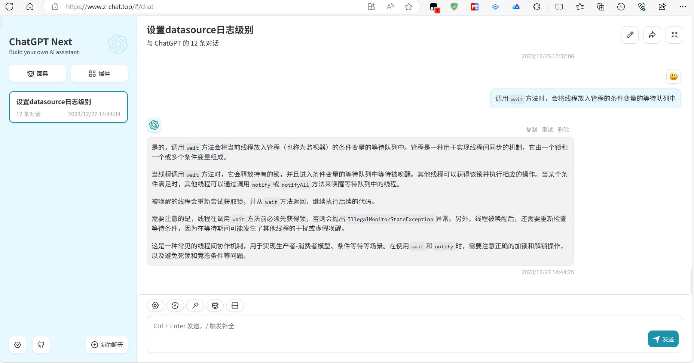

### 优点

* 免费

### 缺点

* 需要经常更换`ChatGPT`的Key，比较麻烦

## 搭建要求

搭建这个ChatGPT网站需要一下几个网站和项目，所以请确保能正常访问：

* [ChatGPT-Next-Web项目](https://github.com/ChatGPTNextWeb/ChatGPT-Next-Web)：`ChatGPT`的壳子
* [Vercel](https://vercel.com/)：云服务平台，用于部署
* [水龙头](https://faucet.openkey.cloud/)：`ChatGPT`的key和接口

## 搭建步骤

### 1、登录你的GitHub

* 登录你的`GitHub`，然后`Fork`上面的`ChatGPT-Next-Web`项目到你的仓库：

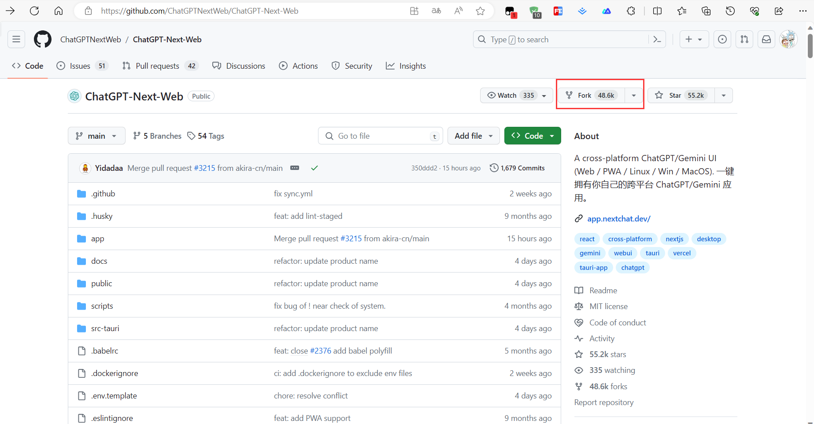

* 保证仓库名字可用即可，因为我已经搭建过一次了，所以使用了`ChatGPT-Next-Web2`这个名字。

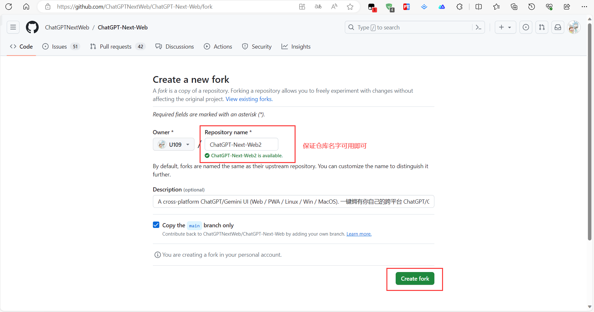

* 然后完成创建

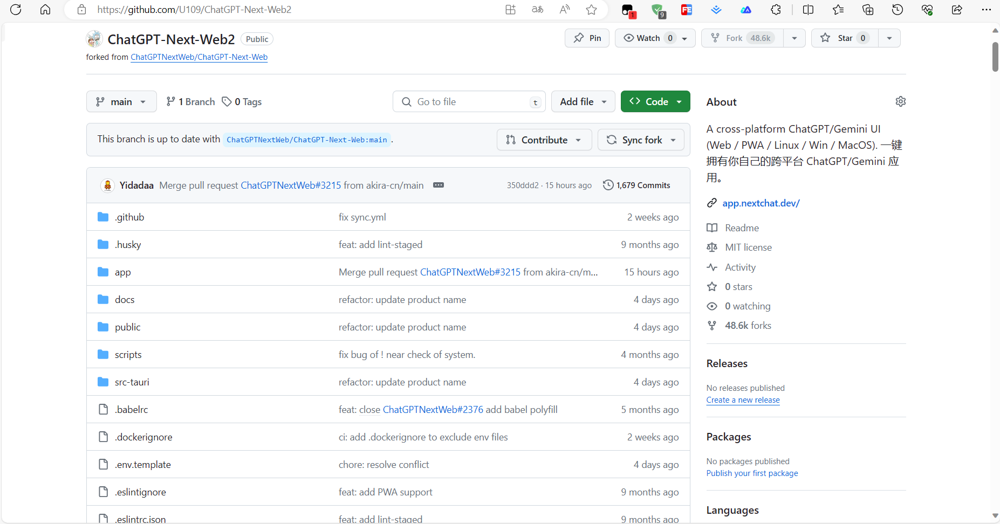

### 2、登录Vercel

* 访问`Vercel`，选择`GitHub`登录

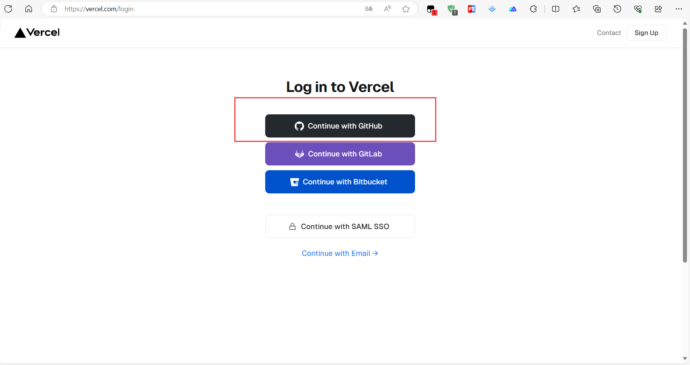

* 选择`Overview -> Add New -> Project`

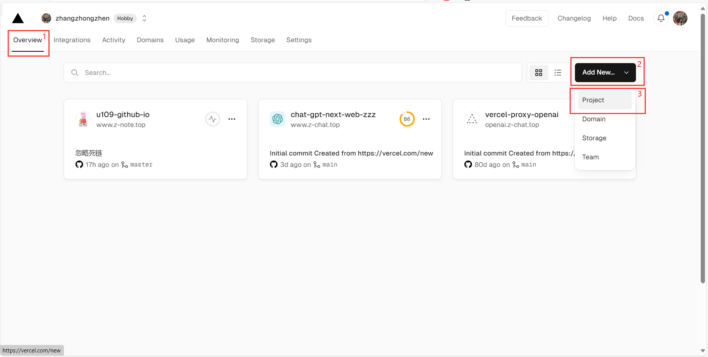

* 导入刚才`Fork`的项目

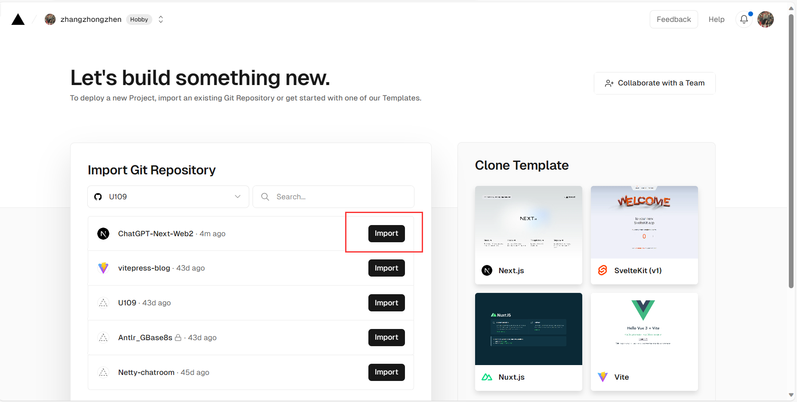

* 直接`Deploy`，等待部署完成

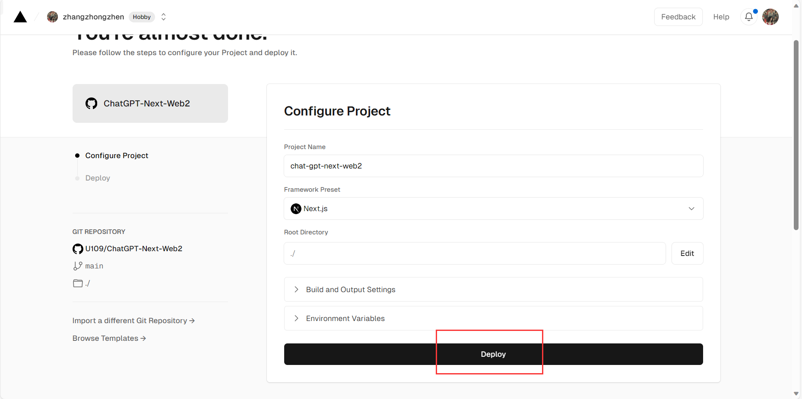

* 部署完成后，可以看到你的网站已经部署成功了，点击`Visit`即可访问

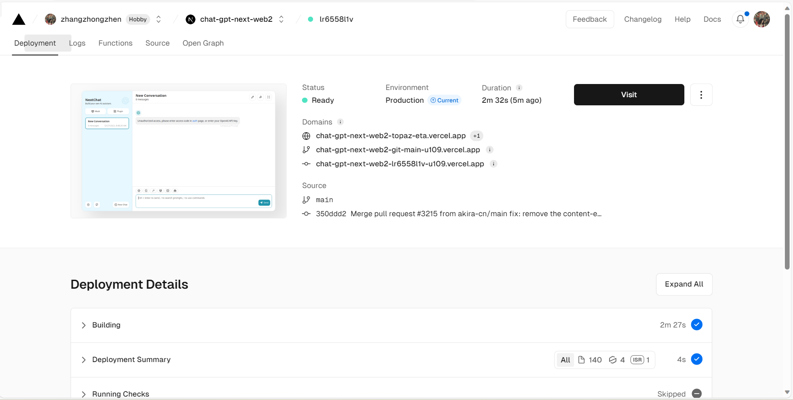

* 网站效果

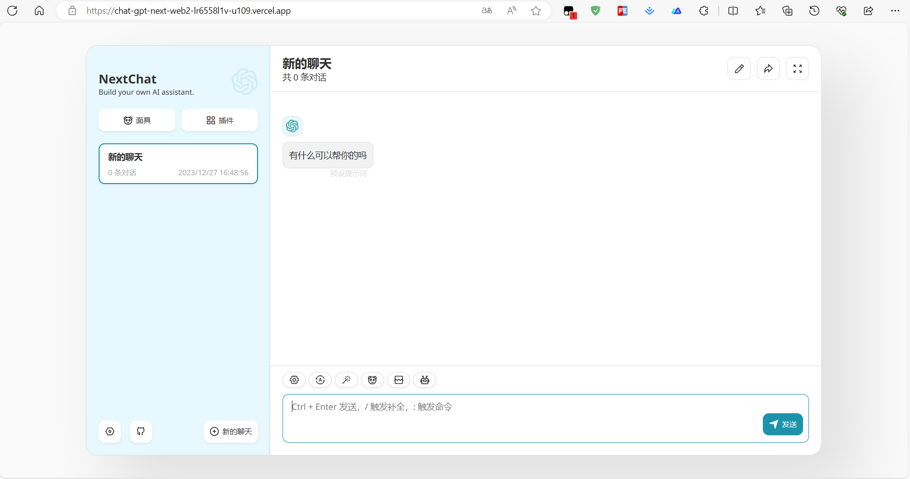

因为我们还没有配置`ChatGPT`的Key，此时我们还不能正常使用。如果你已经有了`ChatGPT`的Key，可以直接配置。如果没有，请往下看。

### 3、获取ChatGPT的Key

* 访问水龙头

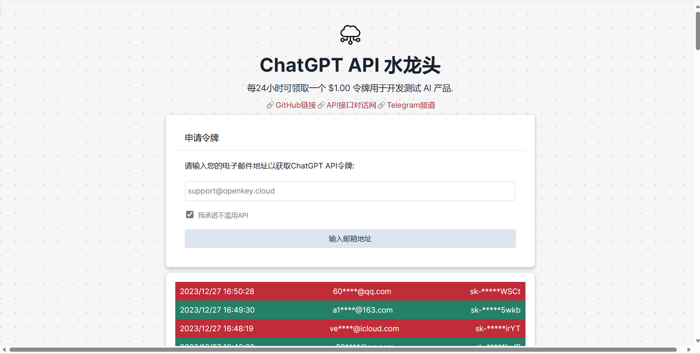

水龙头可以每24小时可领取一个 $1.00 令牌用于开发测试 AI 产品。但是必须使用他提供的代理接口：`https://openkey.cloud`

* 输入邮箱，获取验证码后，可以看到Key和接口地址

* 返回到`Vercel`，进行`Setting`环境配置

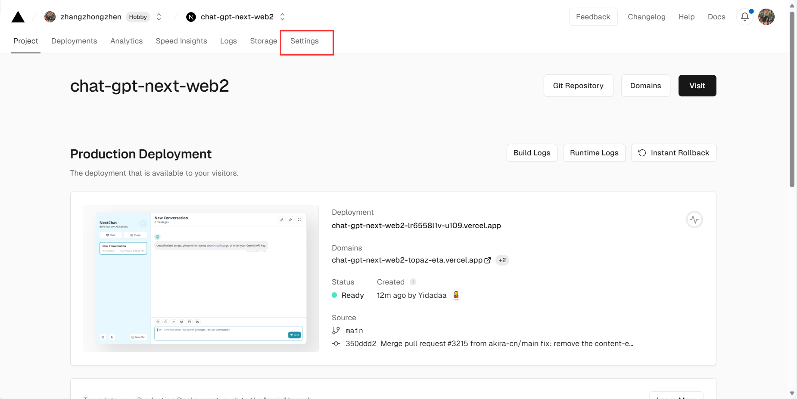

* 配置环境变量

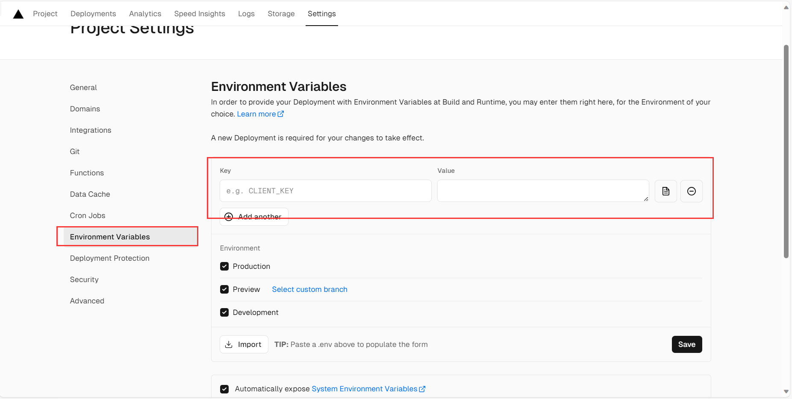

根据项目`ChatGPT-Next-Web`的描述，可以看到相关的配置。我们一般只需要三个：

* `OPENAI_API_KEY`：`ChatGPT`的Key，例如：`sk-XLtpmaADdsM8tpqDyiB2Io8EccjxUWIy3PFalaoh5HvX3MYp`
* `BASE_URL`：接口地址，必须填写水龙头提供的接口：`https://openkey.cloud`
* `CODE`：访问密码，如果你不想设置密码，当然可以

当然你也可以在第一次部署的时候设置，至于我为什么没有设置，因为我不知道你的网站是否可以部署成功。

* 填写完成后进行保存

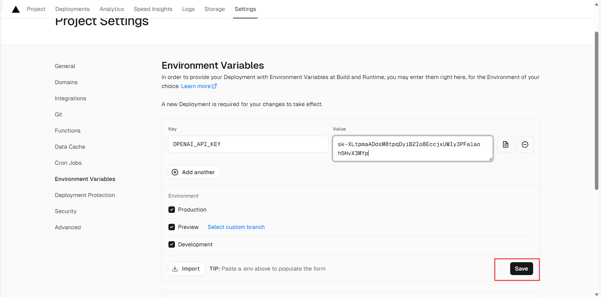

* 重新部署

因为更改了环境变量，所以需要重新进行部署

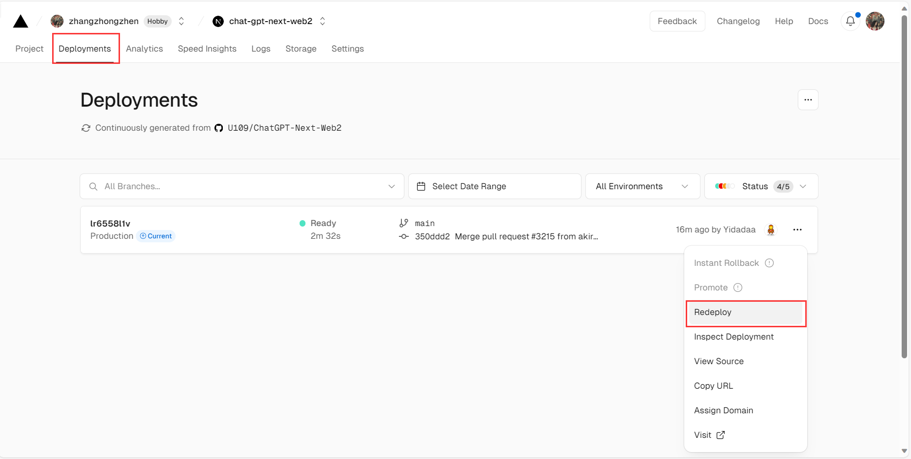

* 成功后即可进行访问

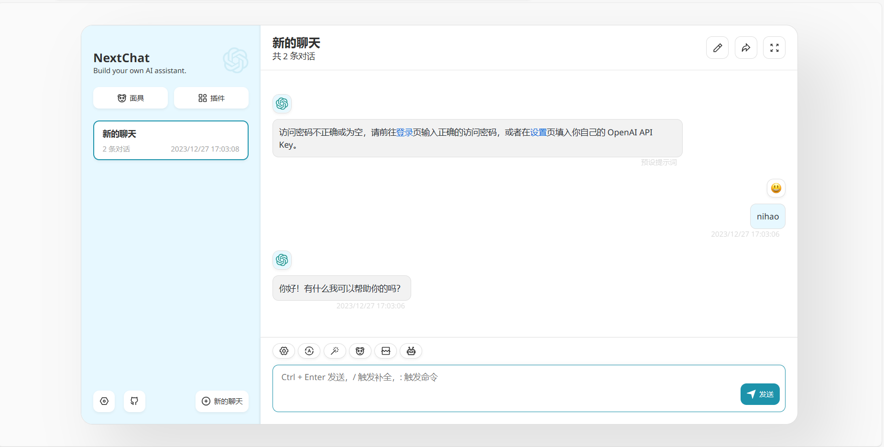

### 4、配置域名

如果你感觉这个网址很Low，当然也可以配置自己的域名。

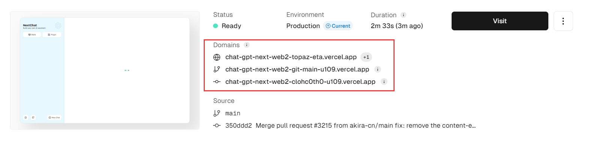

* 前提是你已经购买了自己的域名

可以在`Setting -> Domains`中进行配置，填写后直接进行Add，他会自动监测

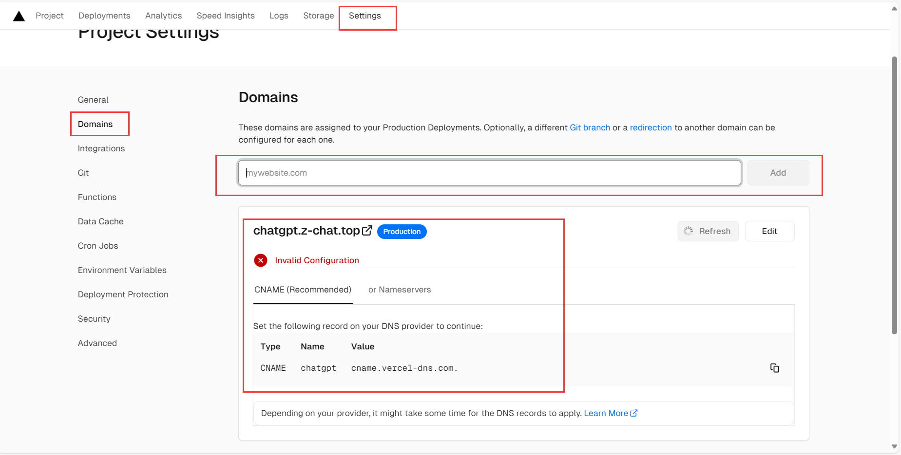

第一次肯定会出错，出错后就需要到购买的域名的地方去设置域名的解析。然后`try again`