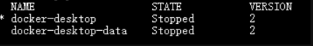

# Window

## 1.版本信息

* window 11
* Docker Desktop Installer v20.10.0

## 2.使用WSL修改docker文件存储位置

WSL2模式下docker-desktop-data vm磁盘映像通常位于以下位置：`C:\Users\jayzhen\AppData\Local\Docker\wsl\data\ext4.vhdx`。按照以下说明将其重新定位到其他驱动器/目录，并保留所有现有的Docker数据。

* 首先，右键单击Docker Desktop图标关闭Docker桌面，然后选择退出Docker桌面，然后，打开命令提示符：

```shell
wsl --list -v
```

* 应该能够看到，确保两个状态都已停止。



:::tip
默认情况下，Docker Desktop for Window会创建如下两个发行版（distro)

* docker-desktop (对应distro/ext4.vhdx)
* docker-desktop-data （对应data/ext4.vhdx）

按官网提示：vhdx文件最大支持256G，超出大小会有异常。
:::

* 将docker-desktop-data导出到文件中(备份image及相关文件)，使用如下命令

```shell
wsl --export docker-desktop-data "D:\\docker-desktop-data.tar"
```

* 从wsl取消注册docker-desktop-data，请注意C:\Users\jayzhen\AppData\Local\Docker\wsl\data\ext4.vhdx文件将被自动删除。

```shell
wsl --unregister docker-desktop-data
```

* 将导出的docker-desktop-data再导入回wsl，并设置我们想要的路径，即新的镜像及各种docker使用的文件的挂载目录，我这里设置到D:\\docker\\wsl

```shell
wsl --import docker-desktop-data "D:\\docker\\wsl" "D:\\docker-desktop-data.tar" --version 2
```

命令执行完毕，就能再目录下看到文件了，这时次启动Docker Desktop，可以正常工作了
