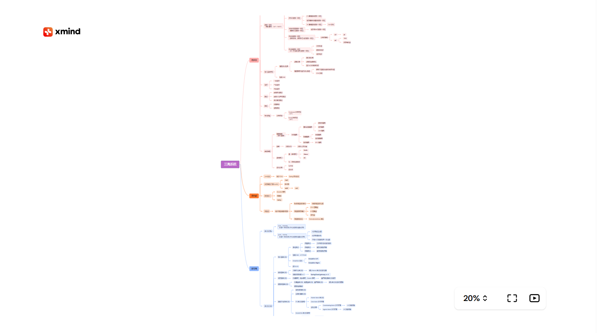

## 效果图



## 实现

### 依赖包

通过[xmind-embed-viewer](https://github.com/xmindltd/xmind-embed-viewer)进行实现

```shell
npm install xmind-embed-viewer
```

### 包装一下

:::code-group 
```vue [XmindViewer.vue]
<template>
  <div id="xmind-container">
    <Loading v-if="showLoading" />
  </div>
</template>

<script setup>
import { onMounted, ref } from 'vue'
import Loading from './Loading.vue'

const showLoading = ref(true)

const props = defineProps({
  url: String
})

onMounted(async () => {
  const { XMindEmbedViewer } = await import('xmind-embed-viewer')
  const viewer = new XMindEmbedViewer({
    el: '#xmind-container', // HTMLElement | HTMLIFrameElement | string
    // 如果在中国大陆境内速度慢，可以添加的参数 `region: 'cn'` 改为使用 xmind.cn 的图库作为依赖。
    region: 'cn' //optinal, global(default) or cn
  })
  viewer.setStyles({
    width: '100%',
    height: '100%'
  })
  const callback = () => {
    showLoading.value = false
    viewer.removeEventListener('map-ready', callback)
  }
  viewer.addEventListener('map-ready', callback)
  fetch(props.url)
      .then(res => res.arrayBuffer())
      .then(file => {
        viewer.load(file)
      })
      .catch(err => {
        showLoading.value = false
        console.log('加载xmind文件出错！')
        viewer.removeEventListener('map-ready', callback)
      })
})
</script>

<style>
#xmind-container {
  display: flex;
  height: 80vh;
  align-items: center;
  justify-content: center;
}
</style>
```
:::

给容器加了一个`loading`的效果：

:::code-group
```vue
<template>
  <div class="loading"></div>
</template>
<style>
.loading {
  display: block;
  position: absolute;
  width: 6px;
  height: 10px;
  animation: rectangle infinite 1s ease-in-out -0.2s;
  background-color: #000;
}

.loading:before,
.loading:after {
  position: absolute;
  width: 6px;
  height: 10px;
  content: "";
  background-color: #000;
}

.loading:before {
  left: -14px;
  animation: rectangle infinite 1s ease-in-out -0.4s;
}

.loading:after {
  right: -14px;
  animation: rectangle infinite 1s ease-in-out;
}

@keyframes rectangle {

  0%,
  80%,
  100% {
    height: 20px;
    box-shadow: 0 0 #000;
  }

  40% {
    height: 30px;
    box-shadow: 0 -20px #000;
  }
}
</style>
```
:::

## 使用

将两个vue页面放在`components`文件夹下，然后在需要使用的地方引入即可：

```vue
<script setup>
  import XmindViewer from '../../components/XmindViewer.vue'
</script>

//像图片一样使用即可
<XmindViewer url="/xmind/ThreeHighSystem.xmind"/>
```

:::warning 注意

如果`url`中使用了中文路径，有可能在部署到网站后找不到`xmind`文件，推荐将资源放在全英文目录下

:::
