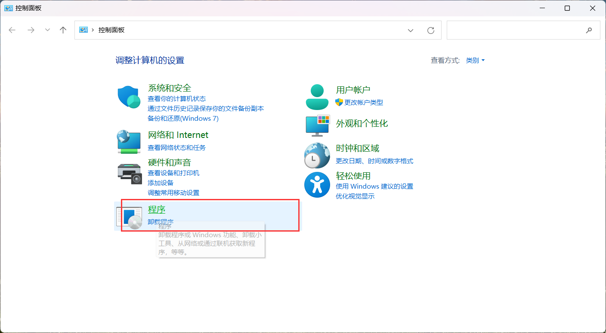
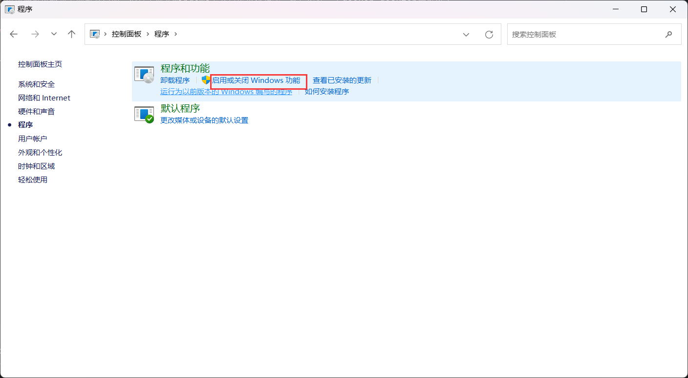
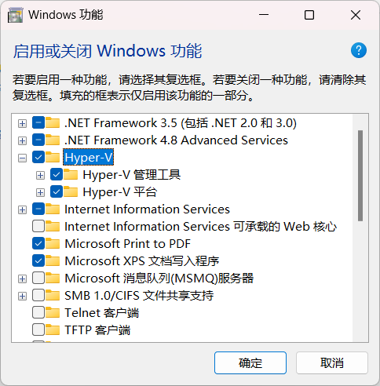
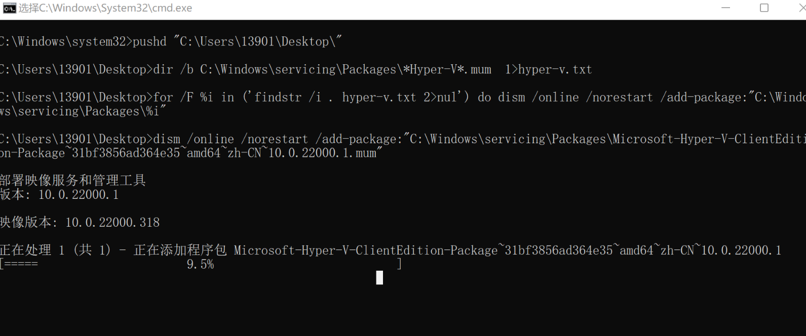
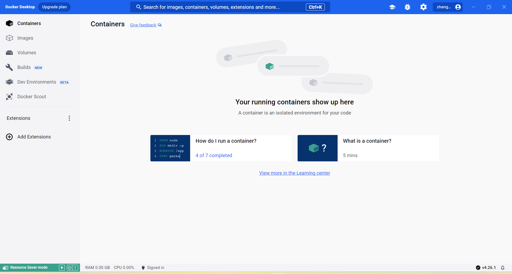

我们知道docker的安装一般我们是安装在linux系统上的，但是如果你的宿主机是windows，那么你还想装docker，那么就需要现在你的windows上装上虚拟机，虚拟机上装linux操作系统，
然后在Linux操作系统上再去安装docker，这样比较麻烦。

docker desktop的出现就可以解决上面那个问题，你只需要在windows上开启虚拟化功能，然后安装一下docker desktop就可以了。


# Window 11

## 第一步、开始hype-v的虚拟化功能。

打开控制面板–程序-启用或关闭window功能。







如果没有hype-v，所以需要添加一下。

具体添加步骤如下：

* 在本地创建一个.bat文件，内容为：

```shell
pushd "%~dp0"
dir /b %SystemRoot%\servicing\Packages\*Hyper-V*.mum >hyper-v.txt
for /f %%i in ('findstr /i . hyper-v.txt 2^>nul') do dism /online /norestart /add-package:"%SystemRoot%\servicing\Packages\%%i"
del hyper-v.txt
Dism /online /enable-feature /featurename:Microsoft-Hyper-V-All /LimitAccess /ALL
```

保存为.bat文件，然后右键，以管理员身份运行。



等待安装好之后,最后一步点击Y。完成安装。

* 然后以管理员身份运行powershell

这个其实就是cmd的升级版，cmd大家应该很熟悉，就是windows下的命令行工具，就跟我们的linux的命令行逸一样，只是windows使用更多的是图形化界面，面向的用户群体比较广。

回到正文，在power shell中执行以下几个命令：

```shell
dism.exe /online /enable-feature /featurename:Microsoft-Windows-Subsystem-Linux /all /norestart
```

该命令是启动WSL。WSL是linux操作系统内核的一些组件，其实我们虽然是在windows下进行安装docker 实际上我们的docker还是跑在了Linux上的，这就是为什么我们需要用WSL的原因。

上面的命令执行完成之后，执行下面的语句：

```shell
dism.exe /online /enable-feature /featurename:VirtualMachinePlatform /all /norestart
```

上面的命令是启动虚拟机的功能。完成之后重启电脑。

## 2、安装更新为wsl2，首先下载

```shell
下载地址：
https://wslstorestorage.blob.core.windows.net/wslblob/wsl_update_x64.msi
```

下载完成之后，进行安装。安装完成之后，将wsl2设置为默认版本。

```shell
wsl --set-default-version 2
```

完成之后，重启电脑。

## 3、安装docker desktop installer

```shell
https://docs.docker.com/desktop/windows/install/
```

下载完成之后，点击安装，一直下一步，完成之后，就可以使用了。如下：

