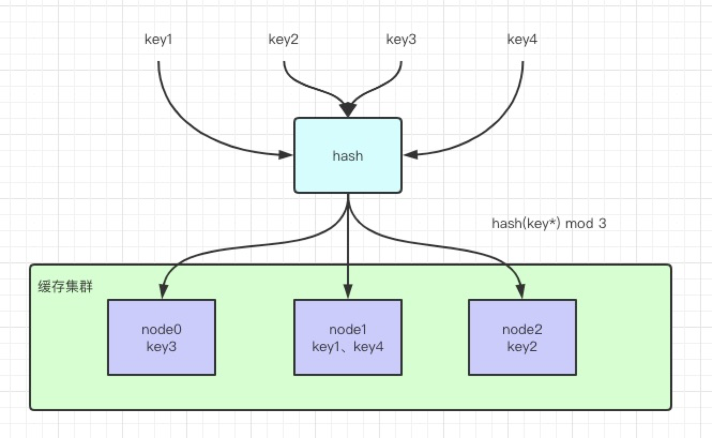
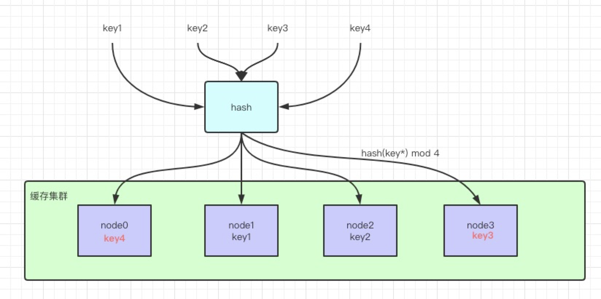
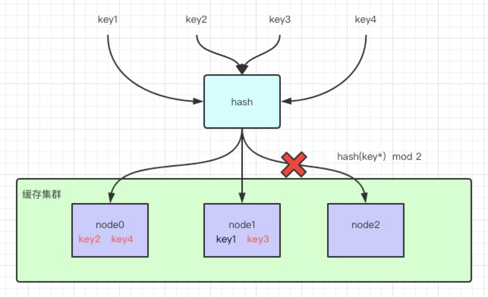
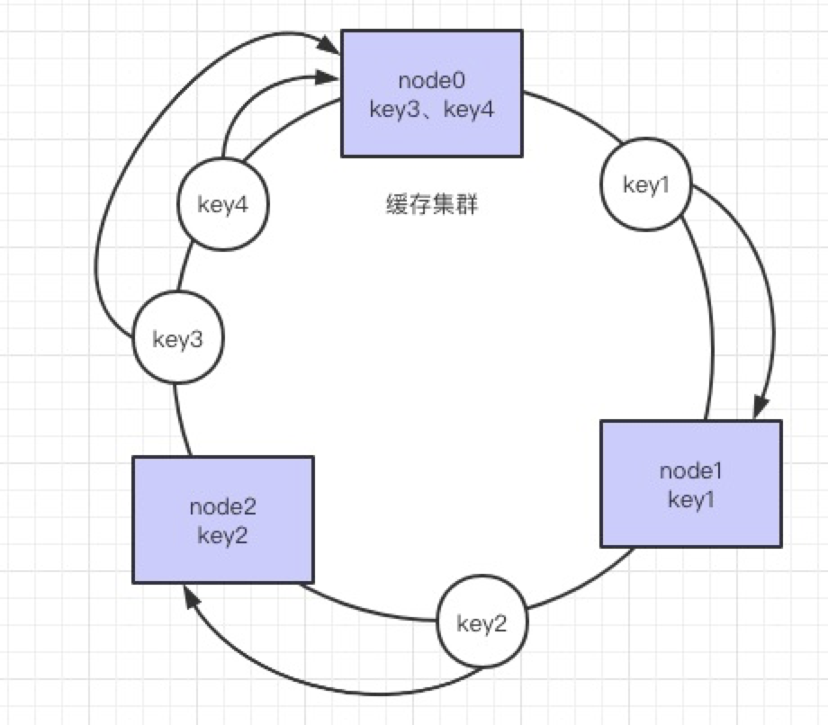
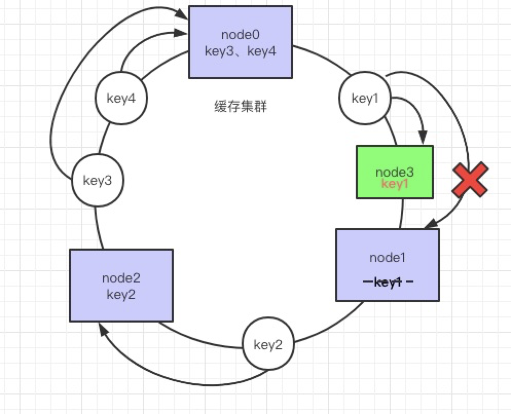
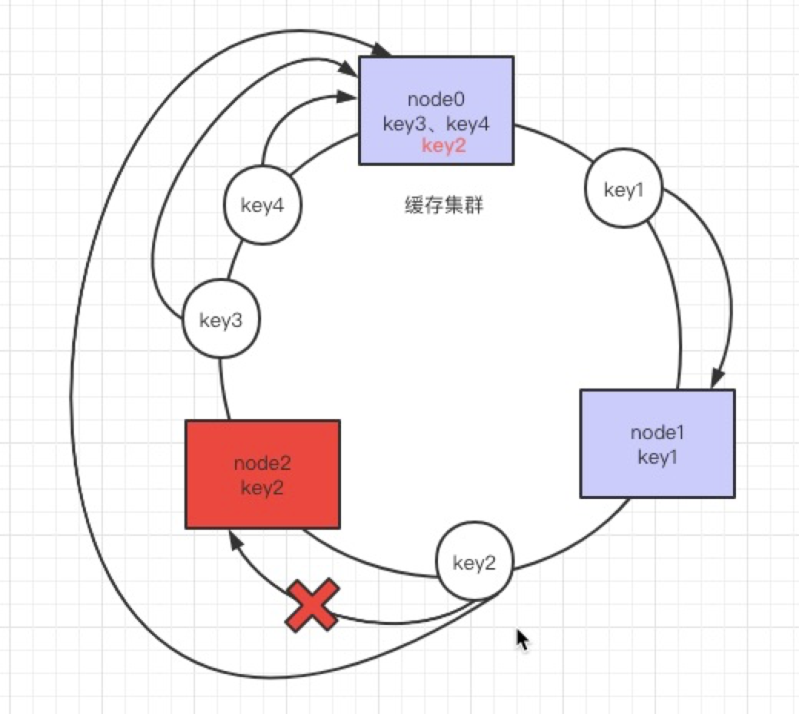
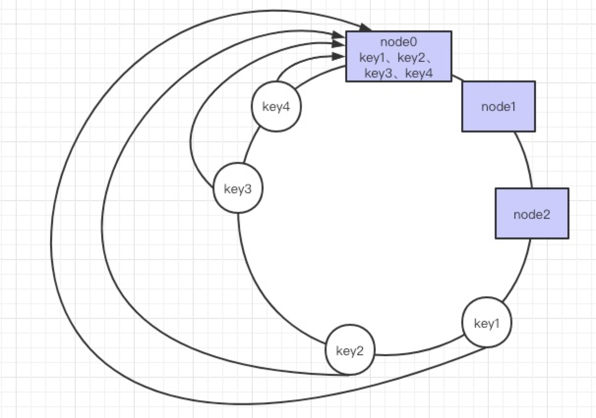
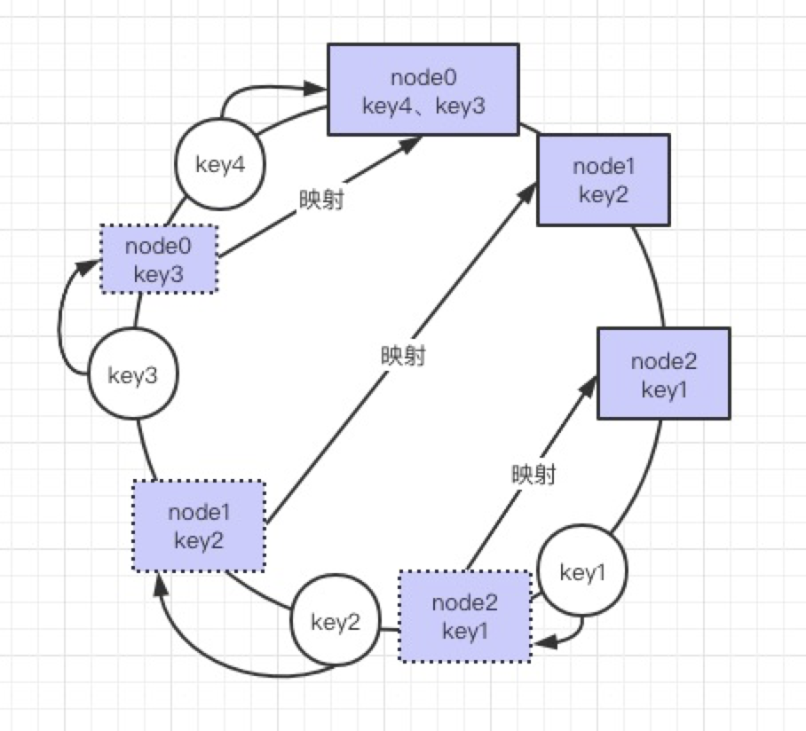

## 普通hash算法

普通`hash`算法就是把存储的`key`取`hash`然后再对节点数取模之后判断`key`所在节点的位置，

如上图所示，假设现在有`key1`，`key2`，`key3`，`key4`四个`key`，通过上面说的方法均匀分布在了这`4`个节点上面。看上去非常`nice~`

但是如果现在我们集群需要扩容，增加一台机器会发生啥？

可以看到，由于现在增加了一台机器，所以现在我们取模的对象由`3`变成了`4`。

导致什么现象呢？假设我们的数据现在没有迁移，那原来的`key3`和`key4`本来是分别在`node0`和`node1`上的，现在通过`hash`取模运算之后却是在`node0`和`node3`上，所以在数据不做迁移的情况下会导致原有的缓存会大量失效。
然后这种大面积的数据迁移是非常麻烦的！

这是扩容导致的问题，如果集群中的节点宕机呢？

现在`node2`挂了，集群节点数量变成了`2`，对应的`key`通过`hash`取模之后所在的节点也会变化。导致`node2`上面原有的`key`查询不到，会直接查库。其余的`key`，除了`key1`能正常查询外，
其他`key`全都失效了。这时不仅涉及到数据迁移还会导致`缓存穿透`。

## 一致性hash

一致性`hash`其实是普通取模`hash`算法的改良版，其`hash`计算方法没有变化，但是`hash`空间发生了变化，由原来的`线性`的变成了`环`。缓存节点通过`hash`计算之后得到在`hash`环中的位置；
`key`通过`hash`计算之后得到所在环的位置，然后顺时针方向找到第一个节点，这个节点就是存放`key`的节点。

来看看一致性`hash`是如何解决普通取模`hash`中扩容和宕机的问题的。

假设现在我们增加了一个节点`node3`，原来的`key1`现在顺时针找到了新增加`node3`，对其余的节点没有任何影响。只需要将`node0`到`node3`之间的`key`迁移到新的节点即可。

如果`node2`现在宕机了，那么原来的`key2`顺时针找到的节点会变成`node0`，其余节点也没有任何影响，只需要把`node2`上的`key`迁移到`node0`上即可。

那这个一致性`hash`难道就没有啥毛病了嘛？

想一下，如果我们的节点数量很少，并且节点偏向一侧会发生什么事情？

可以看到很大一部分的`key`都会落在`node0`上，从而导致`node0`的压力过大挂掉，`node0`挂掉之后数据同时又会向`node1`上转移，`node1`又会挂掉，最终导致整个集群不可用！这就是`数据倾斜`的问题，会引起`节点雪崩`。可想而知这个问题会很严重。

## 一致性hash优化

`数据倾斜`的问题是通过`虚拟节点`来解决的。

就是在节点稀疏的`hash`环上对物理节点虚拟出一部分虚拟节点，`key`会打到虚拟节点上面，而虚拟节点上的`key`实际也是映射到物理节点上的，这样就避免了数据倾斜导致单节点压力过大导致节点雪崩的问题。

