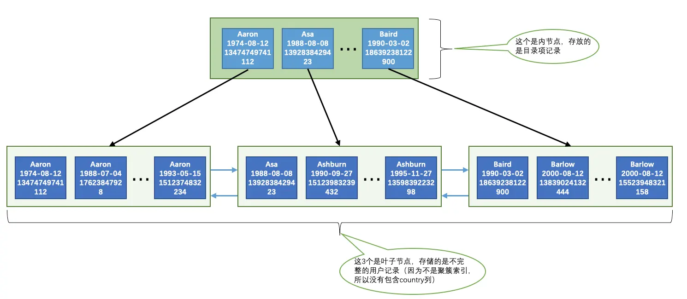

# B+树索引适用的条件

下边我们将唠叨许多种让`B+`树索引发挥最大效能的技巧和注意事项，不过大家要清楚，所有的技巧都是源自你对`B+`树索引本质的理解，所以如果你还不能保证对`B+`树索引充分的理解，那么再次建议回过头把前边的内容看完了再来，要不然读文章对你来说是一种折磨。
首先，`B+`树索引并不是万能的，并不是所有的查询语句都能用到我们建立的索引。下边介绍几个我们可能使用`B+`树索引来进行查询的情况。为了故事的顺利发展，我们需要先创建一个表，这个表是用来存储人的一些基本信息的：

```sql
CREATE TABLE person_info(
    id INT NOT NULL auto_increment,
    name VARCHAR(100) NOT NULL,
    birthday DATE NOT NULL,
    phone_number CHAR(11) NOT NULL,
    country varchar(100) NOT NULL,
    PRIMARY KEY (id),
    KEY idx_name_birthday_phone_number (name, birthday, phone_number)
);

```

对于这个`person_info`表我们需要注意两点：

* 表中的主键是`id列`，它存储一个自动递增的整数。所以`InnoDB`存储引擎会自动为`id列`建立`聚簇索引`。

* 我们额外定义了一个二级索引`idx_name_birthday_phone_number`，它是由3个列组成的联合索引。所以在这个索引对应的`B+`树的叶子节点处存储的用户记录只保留`name`、`birthday`、`phone_number`这三个列的值以及主键id的值，并不会保存`country`列的值。

从这两点注意中我们可以再次看到，一个表中有多少索引就会建立多少棵`B+`树，`person_info`表会为聚簇索引和`idx_name_birthday_phone_number`索引建立2棵B+树。下边我们画一下索引`idx_name_birthday_phone_number`的示意图，
不过既然我们已经掌握了`InnoDB`的B+树索引原理，那我们在画图的时候为了让图更加清晰，所以在省略一些不必要的部分，比如`记录的额外信息`，各`页面的页号`等等，其中内节点中目录项记录的页号信息我们用箭头来代替，在记录结构中只保留`name`、`birthday`、`phone_number`、`id`这四个列的真实数据值，
所以示意图就长这样（留心的同学看出来了，这其实和《高性能MySQL》里举的例子的图差不多，我觉得这个例子特别好，所以就借鉴了一下）：



为了方便大家理解，我们特意标明了哪些是内节点，哪些是叶子节点。再次强调一下，**内节点中存储的是目录项记录，叶子节点中存储的是用户记录**（由于不是聚簇索引，所以用户记录是不完整的，缺少`country`列的值）。从图中可以看出，
这个`idx_name_birthday_phone_number`索引对应的B+树中页面和记录的排序方式就是这样的：

* 先按照`name`列的值进行排序。
* 如果`name`列的值相同，则按照`birthday`列的值进行排序。
* 如果`birthday`列的值也相同，则按照`phone_number`的值进行排序。

这个排序方式十分、特别、非常、巨、very very very重要，因为只要页面和记录是排好序的，我们就可以通过二分法来快速定位查找。下边的内容都仰仗这个图了，大家对照着图理解。

## 全值匹配

如果我们的搜索条件中的列和索引列一致的话，这种情况就称为全值匹配，比方说下边这个查找语句：

```sql
SELECT * FROM person_info WHERE name = 'Ashburn' AND birthday = '1990-09-27' AND phone_number = '15123983239';
```
我们建立的`idx_name_birthday_phone_number`索引包含的3个列在这个查询语句中都展现出来了。大家可以想象一下这个查询过程：

* 因为`B+`树的数据页和记录先是按照`name`列的值进行排序的，所以先可以很快定位`name`列的值是`Ashburn`的记录位置。

* 在`name`列相同的记录里又是按照`birthday`列的值进行排序的，所以在`name`列的值是`Ashburn`的记录里又可以快速定位`birthday`列的值是`1990-09-27`的记录。

* 如果很不幸，`name`和`birthday`列的值都是相同的，那记录是按照`phone_number`列的值排序的，所以联合索引中的三个列都可能被用到。

有的同学也许有个疑问，`WHERE`子句中的几个搜索条件的顺序对查询结果有啥影响么？也就是说如果我们调换`name`、`birthday`、`phone_number`这几个搜索列的顺序对查询的执行过程有影响么？比方说写成下边这样：

```sql
SELECT * FROM person_info WHERE birthday = '1990-09-27' AND phone_number = '15123983239' AND name = 'Ashburn';
```
答案是：没影响哈。MySQL有一个叫`查询优化器`的东东，会分析这些搜索条件并且按照可以使用的索引中列的顺序来决定先使用哪个搜索条件，后使用哪个搜索条件。我们后边儿会有专门的章节来介绍查询优化器，敬请期待。

## 匹配左边的列

其实在我们的搜索语句中也可以不用包含全部联合索引中的列，只包含左边的就行，比方说下边的查询语句：

```sql
SELECT * FROM person_info WHERE name = 'Ashburn';
```
或者包含多个左边的列也行：

```sql
SELECT * FROM person_info WHERE name = 'Ashburn' AND birthday = '1990-09-27';
```
那为什么搜索条件中必须出现左边的列才可以使用到这个`B+`树索引呢？比如下边的语句就用不到这个`B+`树索引么？

```sql
SELECT * FROM person_info WHERE birthday = '1990-09-27';
```
是的，的确用不到，因为`B+`树的数据页和记录先是按照`name`列的值排序的，在`name`列的值相同的情况下才使用`birthday`列进行排序，也就是说`name`列的值不同的记录中`birthday`的值可能是无序的。而现在你跳过`name`列直接根据`birthday`的值去查找，
臣妾做不到呀～ 那如果我就想在只使用`birthday`的值去通过`B+`树索引进行查找咋办呢？这好办，你再对`birthday`列建一个`B+`树索引就行了，创建索引的语法不用我唠叨了吧。

但是需要特别注意的一点是，如果我们想使用联合索引中尽可能多的列，搜索条件中的各个列必须是联合索引中从最左边连续的列。比方说联合索引`idx_name_birthday_phone_number`中列的定义顺序是`name`、`birthday`、`phone_number`，
如果我们的搜索条件中只有`name`和`phone_number`，而没有中间的`birthday`，比方说这样：

```sql
SELECT * FROM person_info WHERE name = 'Ashburn' AND phone_number = '15123983239';
```
这样只能用到`name`列的索引，`birthday`和`phone_number`的索引就用不上了，因为`name`值相同的记录先按照`birthday`的值进行排序，`birthday`值相同的记录才按照`phone_number`值进行排序。

## 匹配列前缀

我们前边说过为某个列建立索引的意思其实就是在对应的`B+`树的记录中使用该列的值进行排序，比方说`person_info`表上建立的联合索引`idx_name_birthday_phone_number`会先用`name`列的值进行排序，所以这个联合索引对应的`B+`树中的记录的`name`列的排列就是这样的：

```sql
Aaron
Aaron
...
Aaron
Asa
Ashburn
...
Ashburn
Baird
Barlow
...
Barlow
```
字符串排序的本质就是比较哪个字符串大一点儿，哪个字符串小一点，比较字符串大小就用到了该列的字符集和比较规则，这个我们前边儿唠叨过，就不多唠叨了。这里需要注意的是，一般的比较规则都是逐个比较字符的大小，也就是说我们比较两个字符串的大小的过程其实是这样的：

* 先比较字符串的第一个字符，第一个字符小的那个字符串就比较小。

* 如果两个字符串的第一个字符相同，那就再比较第二个字符，第二个字符比较小的那个字符串就比较小。

* 如果两个字符串的第二个字符也相同，那就接着比较第三个字符，依此类推。

所以一个排好序的字符串列其实有这样的特点：

* 先按照字符串的第一个字符进行排序。

* 如果第一个字符相同再按照第二个字符进行排序。

* 如果第二个字符相同再按照第三个字符进行排序，依此类推。

也就是说这些字符串的前n个字符，也就是前缀都是排好序的，所以对于字符串类型的索引列来说，我们只匹配它的前缀也是可以快速定位记录的，比方说我们想查询名字以`'As'`开头的记录，那就可以这么写查询语句：

```sql
SELECT * FROM person_info WHERE name LIKE 'As%';
```

但是需要注意的是，如果只给出后缀或者中间的某个字符串，比如这样：

```sql
SELECT * FROM person_info WHERE name LIKE '%As%';
```
MySQL就无法快速定位记录位置了，因为字符串中间有`'As'`的字符串并没有排好序，所以只能全表扫描了。有时候我们有一些匹配某些字符串后缀的需求，比方说某个表有一个`url`列，该列中存储了许多`url`：

```sql
+----------------+
| url            |
+----------------+
| www.baidu.com  |
| www.google.com |
| www.gov.cn     |
| ...            |
| www.wto.org    |
+----------------+
```
假设已经对该`url`列创建了索引，如果我们想查询以`com`为后缀的网址的话可以这样写查询条件：`WHERE url LIKE '%com'`，但是这样的话无法使用该`url`列的索引。为了在查询时用到这个索引而不至于全表扫描，我们可以把后缀查询改写成前缀查询，
不过我们就得把表中的数据全部逆序存储一下，也就是说我们可以这样保存`url`列中的数据：

```sql
+----------------+
| url            |
+----------------+
| moc.udiab.www  |
| moc.elgoog.www |
| nc.vog.www     |
| ...            |
| gro.otw.www    |
+----------------+
```
这样再查找以`com`为后缀的网址时搜索条件便可以这么写：`WHERE url LIKE 'moc%'`，这样就可以用到索引了。

## 匹配范围值

回头看我们`idx_name_birthday_phone_number`索引的`B+`树示意图，所有记录都是按照索引列的值从小到大的顺序排好序的，所以这极大的方便我们查找索引列的值在某个范围内的记录。比方说下边这个查询语句：

```sql
SELECT * FROM person_info WHERE name > 'Asa' AND name < 'Barlow';
```
由于`B+`树中的数据页和记录是先按`name`列排序的，所以我们上边的查询过程其实是这样的：

* 通过B+树在叶子节点中找到第一条`name`值大于`Asa`的二级索引记录，读取该记录的主键值进行回表操作，获得对应的聚簇索引记录后发送给客户端。
* 根据上一步找到的记录，沿着记录所在的链表向后查找（同一页面中的记录使用单向链表连接起来，数据页之间用双向链表连接起来）下一条二级索引记录，判断该记录是否符合`name < 'Barlow'`条件，如果符合，则进行回表操作后发送至客户端。
* 重复上一步骤，直到某条二级索引记录不符合`name <'Barlow'`条件为止。

不过在使用联合进行范围查找的时候需要注意，如果对多个列同时进行范围查找的话，只有对索引最左边的那个列进行范围查找的时候才能用到`B+`树索引，比方说这样：

```sql
SELECT * FROM person_info WHERE name > 'Asa' AND name < 'Barlow' AND birthday > '1980-01-01';
```
上边这个查询可以分成两个部分：

1. 通过条件`name > 'Asa' AND name < 'Barlow'` 来对`name`进行范围，查找的结果可能有多条`name`值不同的记录，

2. 对这些`name`值不同的记录继续通过`birthday > '1980-01-01'`条件继续过滤。

这样子对于联合索引`idx_name_birthday_phone_number`来说，只能用到`name`列的部分，而用不到`birthday`列的部分，因为只有`name`值相同的情况下才能用`birthday`列的值进行排序，而这个查询中通过`name`进行范围查找的记录中可能并不是按照`birthday`列进行排序的，
所以在搜索条件中继续以`birthday`列进行查找时是用不到这个`B+`树索引的。

## 精确匹配某一列并范围匹配另外一列

对于同一个联合索引来说，虽然对多个列都进行范围查找时只能用到最左边那个索引列，但是如果左边的列是精确查找，则右边的列可以进行范围查找，比方说这样：

```sql
SELECT * FROM person_info WHERE name = 'Ashburn' AND birthday > '1980-01-01' AND birthday < '2000-12-31' AND phone_number > '15100000000';
```
这个查询的条件可以分为3个部分：

1. `name = 'Ashburn'`，对`name`列进行精确查找，当然可以使用`B+`树索引了。

2. `birthday > '1980-01-01' AND birthday < '2000-12-31'`，由于`name`列是精确查找，所以通过`name = 'Ashburn'`条件查找后得到的结果的`name`值都是相同的，它们会再按照`birthday`的值进行排序。所以此时对`birthday`列进行范围查找是可以用到`B+`树索引的。

3. `phone_number > '15100000000'`，通过`birthday`的范围查找的记录的`birthday`的值可能不同，所以这个条件无法再利用`B+`树索引了，只能遍历上一步查询得到的记录。

同理，下边的查询也是可能用到这个`idx_name_birthday_phone_number`联合索引的：

```sql
SELECT * FROM person_info WHERE name = 'Ashburn' AND birthday = '1980-01-01' AND phone_number > '15100000000';
```

## 用于排序

我们在写查询语句的时候经常需要对查询出来的记录通过`ORDER BY`子句按照某种规则进行排序。一般情况下，我们只能把记录都加载到内存中，再用一些排序算法，比如快速排序、归并排序、吧啦吧啦排序等等在内存中对这些记录进行排序，
有的时候可能查询的结果集太大以至于不能在内存中进行排序的话，还可能暂时借助磁盘的空间来存放中间结果，排序操作完成后再把排好序的结果集返回到客户端。在MySQL中，把这种在内存中或者磁盘上进行排序的方式统称为`文件排序`（英文名：`filesort`），跟文件这个词儿一沾边儿，
就显得这些排序操作非常慢了（磁盘和内存的速度比起来，就像是飞机和蜗牛的对比）。但是如果`ORDER BY`子句里使用到了我们的`索引列`，就有可能省去在内存或文件中排序的步骤，比如下边这个简单的查询语句：

```sql
SELECT * FROM person_info ORDER BY name, birthday, phone_number LIMIT 10;
```

这个查询的结果集需要先按照`name`值排序，如果记录的`name`值相同，则需要按照`birthday`来排序，如果`birthday`的值相同，则需要按照`phone_number`排序。大家可以回过头去看我们建立的`idx_name_birthday_phone_number`索引的示意图，
因为这个`B+`树索引本身就是按照上述规则排好序的，所以直接从索引中提取数据，然后进行回表操作取出该索引中不包含的列就好了。简单吧？是的，索引就是这么牛逼。

### 使用联合索引进行排序注意事项

对于联合索引有个问题需要注意，`ORDER BY`的子句后边的列的顺序也必须按照索引列的顺序给出，如果给出`ORDER BY phone_number, birthday, name`的顺序，那也是用不了`B+`树索引，这种颠倒顺序就不能使用索引的原因我们上边详细说过了，这就不赘述了。

同理，`ORDER BY name`、`ORDER BY name, birthday`这种匹配索引左边的列的形式可以使用部分的`B+`树索引。当联合索引左边列的值为常量，也可以使用后边的列进行排序，比如这样：

```sql
SELECT * FROM person_info WHERE name = 'A' ORDER BY birthday, phone_number LIMIT 10;
```
这个查询能使用联合索引进行排序是因为`name`列的值相同的记录是按照`birthday`,`phone_number`排序的，说了好多遍了都。

### 不可以使用索引进行排序的几种情况

#### ASC、DESC混用

对于使用联合索引进行排序的场景，我们要求各个排序列的排序顺序是一致的，也就是要么各个列都是`ASC`规则排序，要么都是`DESC`规则排序。

:::tip 小贴士
ORDER BY子句后的列如果不加ASC或者DESC默认是按照ASC排序规则排序的，也就是升序排序的。
:::

为啥会有这种奇葩规定呢？这个还得回头想想这个`idx_name_birthday_phone_number`联合索引中记录的结构：

* 先按照记录的`name`列的值进行升序排列。

* 如果记录的`name`列的值相同，再按照`birthday`列的值进行升序排列。

* 如果记录的`birthday`列的值相同，再按照`phone_number`列的值进行升序排列。

如果查询中的各个排序列的排序顺序是一致的，比方说下边这两种情况：

* `ORDER BY name, birthday LIMIT 10`

这种情况直接从索引的最左边开始往右读10行记录就可以了。

* `ORDER BY name DESC, birthday DESC LIMIT 10，`

这种情况直接从索引的最右边开始往左读10行记录就可以了。

但是如果我们查询的需求是先按照`name`列进行升序排列，再按照`birthday`列进行降序排列的话，比如说这样的查询语句：

```sql
SELECT * FROM person_info ORDER BY name, birthday DESC LIMIT 10;
```
这样如果使用索引排序的话过程就是这样的：

* 先从索引的最左边确定`name`列最小的值，然后找到`name`列等于该值的所有记录，然后从`name`列等于该值的最右边的那条记录开始往左找10条记录。

* 如果`name`列等于最小的值的记录不足10条，再继续往右找`name`值第二小的记录，重复上边那个过程，直到找到10条记录为止。

累不累？累！重点是这样不能高效使用索引，而要采取更复杂的算法去从索引中取数据，设计MySQL的大叔觉得这样还不如直接文件排序来的快，所以就规定使用联合索引的各个排序列的排序顺序必须是一致的。

#### 排序列包含非同一个索引的列

有时候用来排序的多个列不是一个索引里的，这种情况也不能使用索引进行排序，比方说：

```sql
SELECT * FROM person_info ORDER BY name, country LIMIT 10;
```
`name`和`country`并不属于一个联合索引中的列，所以无法使用索引进行排序，至于为啥我就不想再唠叨了，自己用前边的理论自己捋一捋吧～

#### 排序列使用了复杂的表达式

要想使用索引进行排序操作，必须保证索引列是以单独列的形式出现，而不是修饰过的形式，比方说这样：

```sql
SELECT * FROM person_info ORDER BY UPPER(name) LIMIT 10;
```
使用了`UPPER`函数修饰过的列就不是单独的列啦，这样就无法使用索引进行排序啦。

## 用于分组

有时候我们为了方便统计表中的一些信息，会把表中的记录按照某些列进行分组。比如下边这个分组查询：

```sql
SELECT name, birthday, phone_number, COUNT(*) FROM person_info GROUP BY name, birthday, phone_number
```
这个查询语句相当于做了3次分组操作：

1. 先把记录按照`name`值进行分组，所有`name`值相同的记录划分为一组。

2. 将每个`name`值相同的分组里的记录再按照`birthday`的值进行分组，将`birthday`值相同的记录放到一个小分组里，所以看起来就像在一个大分组里又化分了好多小分组。

3. 再将上一步中产生的小分组按照`phone_number`的值分成更小的分组，所以整体上看起来就像是先把记录分成一个`大分组`，然后把`大分组`分成若干个`小分组`，然后把若干个`小分组`再细分成更多的`小小分组`。

然后针对那些`小小分组`进行统计，比如在我们这个查询语句中就是统计每个`小小分组`包含的记录条数。如果没有索引的话，这个分组过程全部需要在内存里实现，而如果有了索引的话，恰巧这个分组顺序又和我们的B+树中的索引列的顺序是一致的，
而我们的`B+`树索引又是按照索引列排好序的，这不正好么，所以可以直接使用`B+`树索引进行分组。

和使用`B+`树索引进行排序是一个道理，分组列的顺序也需要和索引列的顺序一致，也可以只使用索引列中左边的列进行分组，吧啦吧啦的～
