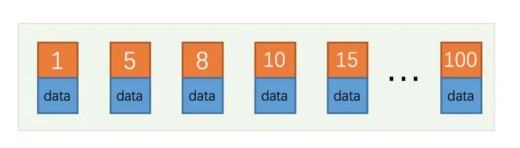
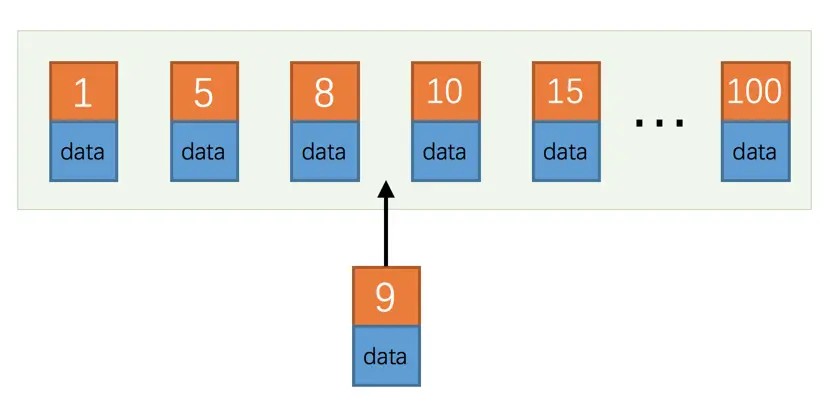

# 如何挑选索引

上边我们以`idx_name_birthday_phone_number`索引为例对索引的适用条件进行了详细的唠叨，下边看一下我们在建立索引时或者编写查询语句时就应该注意的一些事项。

## 只为用于搜索、排序或分组的列创建索引

也就是说，只为出现在`WHERE`子句中的列、连接子句中的连接列，或者出现在`ORDER BY`或`GROUP BY`子句中的列创建索引。而出现在查询列表中的列就没必要建立索引了：

```sql
SELECT birthday, country FROM person_name WHERE name = 'Ashburn';
```
像查询列表中的`birthday`、`country`这两个列就不需要建立索引，我们只需要为出现在`WHERE`子句中的`name`列创建索引就可以了。

## 考虑列的基数

列的基数指的是某一列中不重复数据的个数，比方说某个列包含值`2, 5, 8, 2, 5, 8, 2, 5, 8`，虽然有9条记录，但该列的基数却是`3`。也就是说，在记录行数一定的情况下，列的基数越大，该列中的值越分散，列的基数越小，该列中的值越集中。
这个列的基数指标非常重要，直接影响我们是否能有效的利用索引。假设某个列的基数为`1`，也就是所有记录在该列中的值都一样，那为该列建立索引是没有用的，因为所有值都一样就无法排序，无法进行快速查找了～ 而且如果某个建立了二级索引的列的重复值特别多，
那么使用这个二级索引查出的记录还可能要做回表操作，这样性能损耗就更大了。所以结论就是：最好为那些列的基数大的列建立索引，为基数太小列的建立索引效果可能不好。

## 索引列的类型尽量小

我们在定义表结构的时候要显式的指定列的类型，以整数类型为例，有`TINYINT`、`MEDIUMINT`、`INT`、`BIGINT`这么几种，它们占用的存储空间依次递增，我们这里所说的类型大小指的就是该类型表示的数据范围的大小。能表示的整数范围当然也是依次递增，
如果我们想要对某个整数列建立索引的话，在表示的整数范围允许的情况下，尽量让索引列使用较小的类型，比如我们能使用`INT`就不要使用`BIGINT`，能使用`MEDIUMINT`就不要使用`INT`～ 这是因为：

* 数据类型越小，在查询时进行的比较操作越快（这是`CPU`层次的东东）

* 数据类型越小，索引占用的存储空间就越少，在一个数据页内就可以放下更多的记录，从而减少`磁盘I/O`带来的性能损耗，也就意味着可以把更多的数据页缓存在内存中，从而加快读写效率。

这个建议对于表的主键来说更加适用，因为不仅是聚簇索引中会存储主键值，其他所有的二级索引的节点处都会存储一份记录的主键值，如果主键适用更小的数据类型，也就意味着节省更多的存储空间和更高效的`I/O`。

## 索引字符串值的前缀

我们知道一个字符串其实是由若干个字符组成，如果我们在MySQL中使用`utf8`字符集去存储字符串的话，编码一个字符需要占用`1~3`个字节。假设我们的字符串很长，那存储一个字符串就需要占用很大的存储空间。在我们需要为这个字符串列建立索引时，那就意味着在对应的`B+`树中有这么两个问题：

* `B+`树索引中的记录需要把该列的完整字符串存储起来，而且字符串越长，在索引中占用的存储空间越大。

* 如果`B+`树索引中索引列存储的字符串很长，那在做字符串比较时会占用更多的时间。

我们前边儿说过索引列的字符串前缀其实也是排好序的，所以索引的设计者提出了个方案 --- 只对字符串的前几个字符进行索引也就是说在二级索引的记录中只保留字符串前几个字符。这样在查找记录时虽然不能精确的定位到记录的位置，但是能定位到相应前缀所在的位置，
然后根据前缀相同的记录的主键值回表查询完整的字符串值，再对比就好了。这样只在`B+`树中存储字符串的前几个字符的编码，既节约空间，又减少了字符串的比较时间，还大概能解决排序的问题，何乐而不为，比方说我们在建表语句中只对`name`列的前10个字符进行索引可以这么写：

```sql
CREATE TABLE person_info(
name VARCHAR(100) NOT NULL,
birthday DATE NOT NULL,
phone_number CHAR(11) NOT NULL,
country varchar(100) NOT NULL,
KEY idx_name_birthday_phone_number (name(10), birthday, phone_number)
);   
``` 
`name(10)`就表示在建立的`B+`树索引中只保留记录的前10个字符的编码，这种只索引字符串值的前缀的策略是我们非常鼓励的，尤其是在字符串类型能存储的字符比较多的时候。

### 索引列前缀对排序的影响

如果使用了索引列前缀，比方说前边只把`name`列的前10个字符放到了二级索引中，下边这个查询可能就有点儿尴尬了：

```sql
SELECT * FROM person_info ORDER BY name LIMIT 10;
```
因为二级索引中不包含完整的`name`列信息，所以无法对前十个字符相同，后边的字符不同的记录进行排序，也就是使用索引列前缀的方式无法支持使用索引排序，只好乖乖的用文件排序喽。

## 让索引列在比较表达式中单独出现

假设表中有一个整数列`my_col`，我们为这个列建立了索引。下边的两个`WHERE`子句虽然语义是一致的，但是在效率上却有差别：

1. `WHERE my_col * 2 < 4`

2. `WHERE my_col < 4/2`

第1个`WHERE`子句中`my_col`列并不是以单独列的形式出现的，而是以`my_col * 2`这样的表达式的形式出现的，存储引擎会依次遍历所有的记录，计算这个表达式的值是不是小于`4`，所以这种情况下是使用不到为`my_col`列建立的`B+`树索引的。
而第2个WHERE子句中`my_col`列并是以单独列的形式出现的，这样的情况可以直接使用`B+`树索引。

所以结论就是：**如果索引列在比较表达式中不是以单独列的形式出现，而是以某个表达式，或者函数调用形式出现的话，是用不到索引的**。

## 主键插入顺序

我们知道，对于一个使用`InnoDB`存储引擎的表来说，在我们没有显式的创建索引时，表中的数据实际上都是存储在聚簇索引的叶子节点的。而记录又是存储在数据页中的，数据页和记录又是按照记录主键值从小到大的顺序进行排序，所以如果我们插入的记录的主键值是依次增大的话，
那我们每插满一个数据页就换到下一个数据页继续插，而如果我们插入的主键值忽大忽小的话，这就比较麻烦了，假设某个数据页存储的记录已经满了，它存储的主键值在`1~100`之间：



如果此时再插入一条主键值为`9`的记录，那它插入的位置就如下图：



可这个数据页已经满了啊，再插进来咋办呢？我们需要把当前页面分裂成两个页面，把本页中的一些记录移动到新创建的这个页中。页面分裂和记录移位意味着什么？意味着：`性能损耗！`所以如果我们想尽量避免这样无谓的性能损耗，
最好让插入的记录的主键值依次递增，这样就不会发生这样的性能损耗了。所以我们建议：让主键具有`AUTO_INCREMENT`，让存储引擎自己为表生成主键，而不是我们手动插入 ，比方说我们可以这样定义`person_info`表：

```sql
CREATE TABLE person_info(
    id INT UNSIGNED NOT NULL AUTO_INCREMENT,
    name VARCHAR(100) NOT NULL,
    birthday DATE NOT NULL,
    phone_number CHAR(11) NOT NULL,
    country varchar(100) NOT NULL,
    PRIMARY KEY (id),
    KEY idx_name_birthday_phone_number (name(10), birthday, phone_number)
);    

```

我们自定义的主键列`id`拥有`AUTO_INCREMENT`属性，在插入记录时存储引擎会自动为我们填入自增的主键值。

## 冗余和重复索引

有时候有的同学有意或者无意的就对同一个列创建了多个索引，比方说这样写建表语句：

```sql
CREATE TABLE person_info(
id INT UNSIGNED NOT NULL AUTO_INCREMENT,
name VARCHAR(100) NOT NULL,
birthday DATE NOT NULL,
phone_number CHAR(11) NOT NULL,
country varchar(100) NOT NULL,
PRIMARY KEY (id),
KEY idx_name_birthday_phone_number (name(10), birthday, phone_number),
KEY idx_name (name(10))
);    
```
我们知道，通过`idx_name_birthday_phone_number`索引就可以对`name`列进行快速搜索，再创建一个专门针对`name`列的索引就算是一个`冗余索引`，维护这个索引只会增加维护的成本，并不会对搜索有什么好处。

另一种情况，我们可能会对某个列重复建立索引，比方说这样：

```sql
CREATE TABLE repeat_index_demo (
c1 INT PRIMARY KEY,
c2 INT,
UNIQUE uidx_c1 (c1),
INDEX idx_c1 (c1)
);  
```
我们看到，`c1`既是主键、又给它定义为一个`唯一索引`，还给它定义了一个`普通索引`，可是主键本身就会生成`聚簇索引`，所以定义的唯一索引和普通索引是重复的，这种情况要避免。