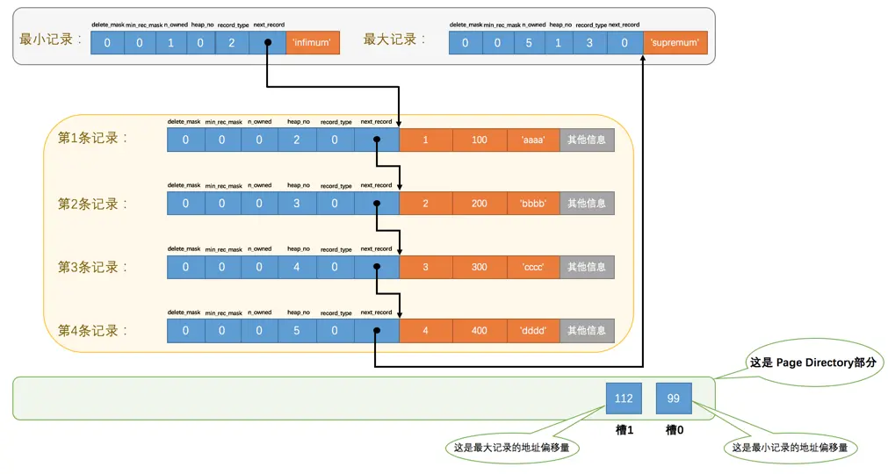
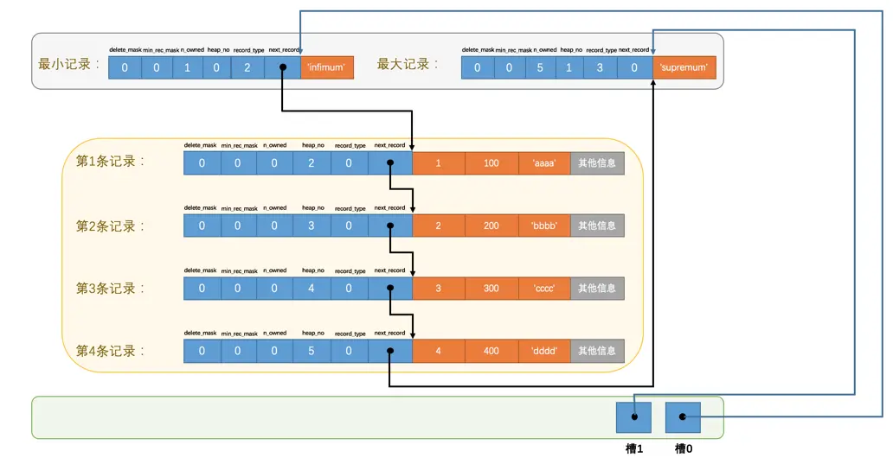

# Page Directory（页目录）

现在我们了解了记录在页中按照主键值由小到大顺序串联成一个单链表，那如果我们想根据主键值查找页中的某条记录该咋办呢？比如说这样的查询语句：

```sql
SELECT * FROM page_demo WHERE c1 = 3;
```
最笨的办法：从`Infimum`记录（最小记录）开始，沿着链表一直往后找，总有一天会找到（或者找不到），在找的时候还能投机取巧，因为链表中各个记录的值是按照从小到大顺序排列的，
所以当链表的某个节点代表的记录的主键值大于你想要查找的主键值时，你就可以停止查找了，因为该节点后边的节点的主键值依次递增。

这个方法在页中存储的记录数量比较少的情况用起来也没啥问题，比方说现在我们的表里只有4条自己插入的记录，所以最多找4次就可以把所有记录都遍历一遍，但是如果一个页中存储了非常多的记录，
这么查找对性能来说还是有损耗的，所以我们说这种遍历查找这是一个笨办法。但是设计`InnoDB`的大叔们是什么人，他们能用这么笨的办法么，当然是要设计一种更6的查找方式喽，他们从书的目录中找到了灵感。

我们平常想从一本书中查找某个内容的时候，一般会先看目录，找到需要查找的内容对应的书的页码，然后到对应的页码查看内容。设计`InnoDB`的大叔们为我们的记录也制作了一个类似的目录，他们的制作过程是这样的：

&emsp;  1、将所有正常的记录（包括最大和最小记录，不包括标记为已删除的记录）划分为几个组。

&emsp;  2、每个组的最后一条记录（也就是组内最大的那条记录）的头信息中的`n_owned`属性表示该记录拥有多少条记录，也就是该组内共有几条记录。

&emsp;  3、将每个组的最后一条记录的地址偏移量单独提取出来按顺序存储到靠近`页`的尾部的地方，这个地方就是所谓的`Page Directory`，也就是`页目录`。页面目录中的这些地址偏移量被称为`槽`（英文名：`Slot`），所以这个页面目录就是由`槽`组成的。

比方说现在的`page_demo`表中正常的记录共有6条，`InnoDB`会把它们分成两组，第一组中只有一个最小记录，第二组中是剩余的5条记录，看下边的示意图：



从这个图中我们需要注意这么几点：

* 现在页目录部分中有两个`槽`，也就意味着我们的记录被分成了两个组，槽1中的值是`112`，代表最大记录的地址偏移量（就是从页面的0字节开始数，数`112`个字节）；槽0中的值是`99`，代表最小记录的地址偏移量。

* 注意最小和最大记录的头信息中的`n_owned`属性
  - 最小记录的`n_owned`值为1，这就代表着以最小记录结尾的这个分组中只有1条记录，也就是最小记录本身。
  - 最大记录的`n_owned`值为5，这就代表着以最大记录结尾的这个分组中只有5条记录，包括最大记录本身还有我们自己插入的4条记录。
  
`99`和`112`这样的地址偏移量很不直观，我们用箭头指向的方式替代数字，这样更易于我们理解，所以修改后的示意图就是这样：



哎呀，咋看上去怪怪的，这么乱的图对于我这个强迫症真是不能忍，那我们就暂时不管各条记录在存储设备上的排列方式了，单纯从逻辑上看一下这些记录和页目录的关系：


这样看就顺眼多了嘛！为什么最小记录的`n_owned`值为1，而最大记录的`n_owned`值为5呢，这里头有什么猫腻么？

是的，设计`InnoDB`的大叔们对每个分组中的记录条数是有规定的：对于最小记录所在的分组只能有 1 条记录，最大记录所在的分组拥有的记录条数只能在 1~8 条之间，剩下的分组中记录的条数范围只能在是 4~8 条之间。所以分组是按照下边的步骤进行的：

* 初始情况下一个数据页里只有最小记录和最大记录两条记录，它们分属于两个分组。

* 之后每插入一条记录，都会从页目录中找到主键值比本记录的主键值大并且差值最小的槽，然后把该槽对应的记录的`n_owned`值加1，表示本组内又添加了一条记录，直到该组中的记录数等于8个。

* 在一个组中的记录数等于8个后再插入一条记录时，会将组中的记录拆分成两个组，一个组中4条记录，另一个5条记录。这个过程会在页目录中新增一个槽来记录这个新增分组中最大的那条记录的偏移量。

由于现在`page_demo`表中的记录太少，无法演示添加了页目录之后加快查找速度的过程，所以再往`page_demo`表中添加一些记录：

```sql
mysql> INSERT INTO page_demo VALUES(5, 500, 'eeee'), (6, 600, 'ffff'), (7, 700, 'gggg'), (8, 800, 'hhhh'), (9, 900, 'iiii'), (10, 1000, 'jjjj'), (11, 1100, 'kkkk'), (12, 1200, 'llll'), (13, 1300, 'mmmm'), (14, 1400, 'nnnn'), (15, 1500, 'oooo'), (16, 1600, 'pppp');
Query OK, 12 rows affected (0.00 sec)
Records: 12  Duplicates: 0  Warnings: 0
```

哈，我们一口气又往表中添加了12条记录，现在页里边就一共有18条记录了（包括最小和最大记录），这些记录被分成了5个组，如图所示：


因为把16条记录的全部信息都画在一张图里太占地方，让人眼花缭乱的，所以只保留了用户记录头信息中的`n_owned`和`next_record`属性，也省略了各个记录之间的箭头，我没画不等于没有啊！
现在看怎么从这个页目录中查找记录。因为各个槽代表的记录的主键值都是从小到大排序的，所以我们可以使用所谓的二分法来进行快速查找。5个槽的编号分别是：`0、1、2、3、4`，所以初始情况下最低的槽就是`low=0`，最高的槽就是`high=4`。
比方说我们想找主键值为6的记录，过程是这样的：

1、计算中间槽的位置：`(0+4)/2=2`，所以查看槽2对应记录的主键值为8，又因为`8 > 6`，所以设置`high=2`，`low`保持不变。

2、重新计算中间槽的位置：`(0+2)/2=1`，所以查看槽1对应的主键值为4，又因为`4 < 6`，所以设置`low=1`，`high`保持不变。

3、因为`high - low`的值为1，所以确定主键值为6的记录在槽2对应的组中。此刻我们需要找到槽2中主键值最小的那条记录，然后沿着单向链表遍历槽2中的记录。但是我们前边又说过，每个槽对应的记录都是该组中主键值最大的记录，这里槽2对应的记录是主键值为8的记录，
怎么定位一个组中最小的记录呢？别忘了各个槽都是挨着的，我们可以很轻易的拿到槽1对应的记录（主键值为4），该条记录的下一条记录就是槽2中主键值最小的记录，该记录的主键值为5。所以我们可以从这条主键值为5的记录出发，遍历槽2中的各条记录，
直到找到主键值为6的那条记录即可。由于一个组中包含的记录条数只能是1~8条，所以遍历一个组中的记录的代价是很小的。

所以在一个数据页中查找指定主键值的记录的过程分为两步：

1、通过二分法确定该记录所在的槽，并找到该槽所在分组中主键值最小的那条记录。

2、通过记录的`next_record`属性遍历该槽所在的组中的各个记录。