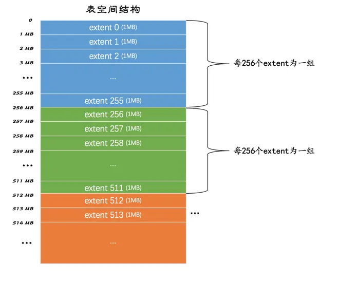
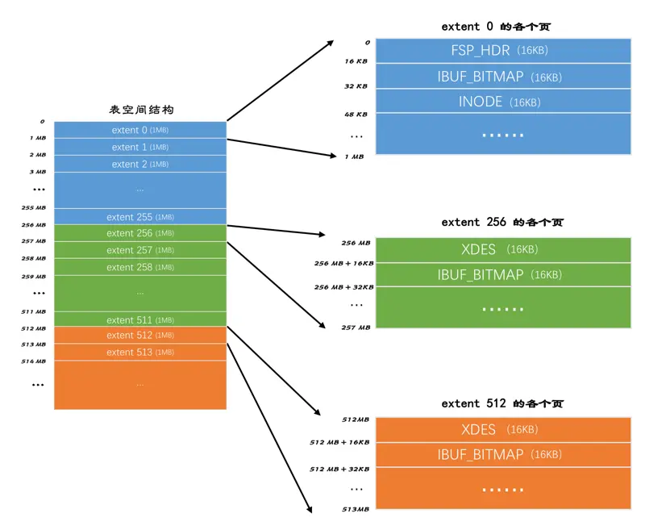
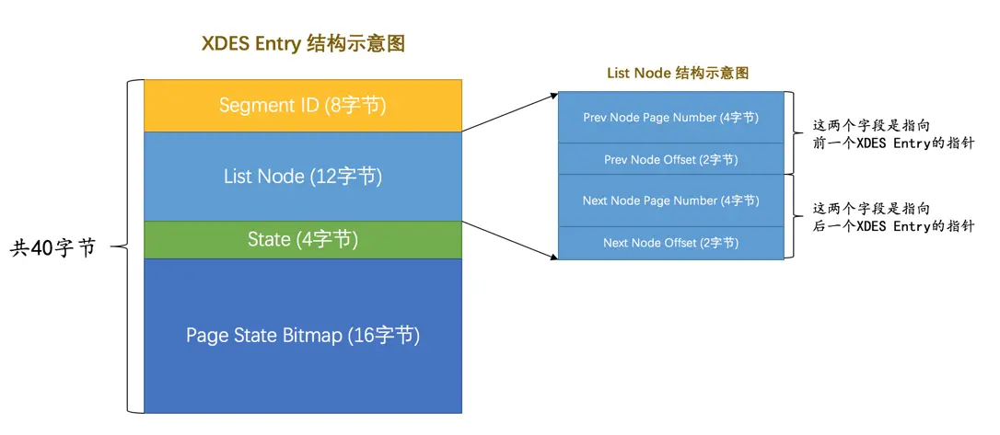
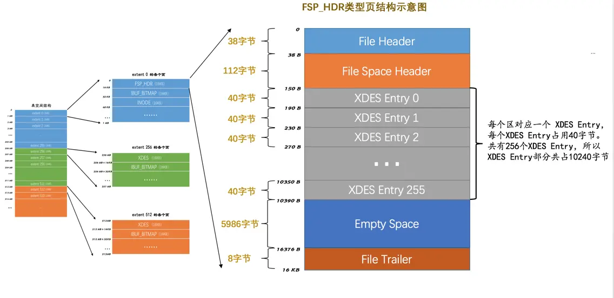
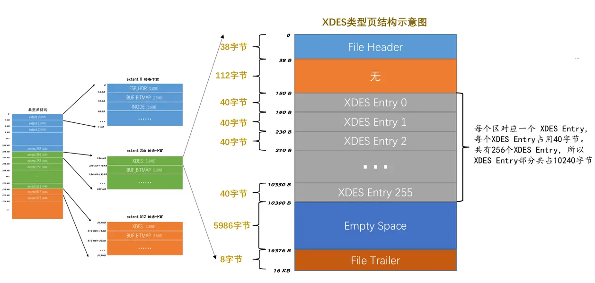
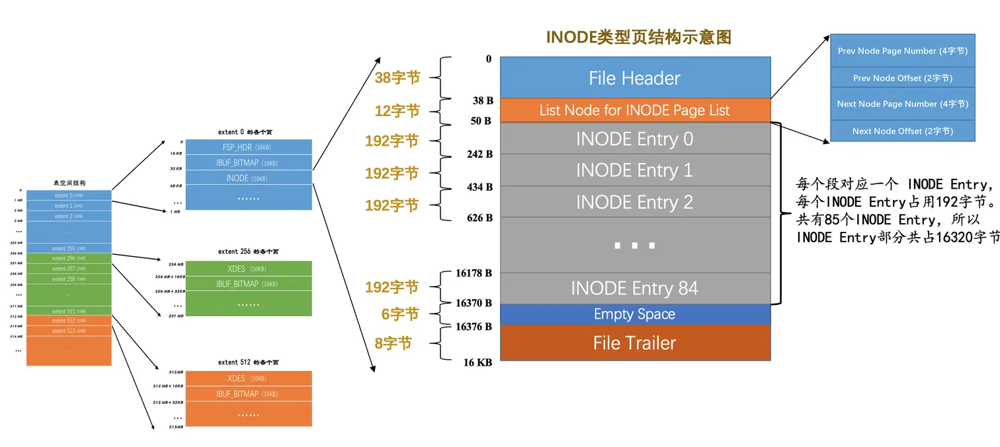

# 独立表空间结构

我们知道`InnoDB`支持许多种类型的表空间，本章重点关注`独立表空间`和`系统表空间`的结构。它们的结构比较相似，但是由于系统表空间中额外包含了一些关于整个系统的信息，所以我们先挑简单一点的独立表空间来唠叨，
稍后再说系统表空间的结构。

## 区（extent）的概念

表空间中的页实在是太多了，为了更好的管理这些页面，设计`InnoDB`的大叔们提出了`区`（英文名：`extent`）的概念。对于`16KB`的页来说，连续的`64`个页就是一个区，也就是说一个区默认占用`1MB`空间大小。
不论是系统表空间还是独立表空间，都可以看成是由若干个区组成的，每`256`个区被划分成一`组`。画个图表示就是这样：



其中`extent 0 ~ extent 255`这`256`个区算是第一个`组`，`extent 256 ~ extent 511`这`256`个区算是第二个`组`，`extent 512 ~ extent 767`这`256`个区算是第三个`组`（上图中并未画全第三个组全部的区，请自行脑补），
依此类推可以划分更多的组。这些组的头几个页面的类型都是类似的，就像这样：



从上图中我们能得到如下信息：

* 第一个组最开始的3个页面的类型是固定的，也就是说`extent 0`这个区最开始的3个页面的类型是固定的，分别是：

    * `FSP_HDR`类型：这个类型的页面是用来登记整个表空间的一些整体属性以及本组所有的区，也就是`extent 0 ~ extent 255`这`256`个区的属性，稍后详细唠叨。需要注意的一点是，整个表空间只有一个`FSP_HDR`类型的页面。

    * `IBUF_BITMAP`类型：这个类型的页面是存储本组所有的区的所有页面关于`INSERT BUFFER`的信息。当然，你现在不用知道啥是个`INSERT BUFFER`，后边会详细说到你吐。

    * `INODE`类型：这个类型的页面存储了许多称为`INODE`的数据结构，还是那句话，现在你不需要知道啥是个`INODE`，后边儿会说到你吐。

* 其余各组最开始的2个页面的类型是固定的，也就是说`extent 256、extent 512`这些区最开始的2个页面的类型是固定的，分别是：

    * `XDES`类型：全称是`extent descriptor`，用来登记本组`256`个区的属性，也就是说对于在`extent 256`区中的该类型页面存储的就是`extent 256 ~ extent 511`这些区的属性，对于在`extent 512`区中的该类型页面存储的就是`extent 512 ~ extent 767`这些区的属性。
     上边介绍的`FSP_HDR`类型的页面其实和`XDES`类型的页面的作用类似，只不过`FSP_HDR`类型的页面还会额外存储一些表空间的属性。

    * `IBUF_BITMAP`类型：上边介绍过了。

好了，宏观的结构介绍完了，里边儿的名词大家也不用记清楚，只要大致记得：表空间被划分为许多连续的区，每个区默认由64个页组成，每`256`个区划分为一组，每个组的最开始的几个页面类型是固定的就好了。

## 段（segment）的概念

为啥好端端的提出一个`区（extent）`的概念呢？我们以前分析问题的套路都是这样的：表中的记录存储到页里边儿，然后页作为节点组成`B+`树，这个`B+`树就是索引，然后吧啦吧啦一堆聚簇索引和二级索引的区别。
这套路也没啥不妥的呀～

是的，如果我们表中数据量很少的话，比如说你的表中只有几十条、几百条数据的话，的确用不到区的概念，因为简单的几个页就能把对应的数据存储起来，但是你架不住表里的记录越来越多呀。

？？啥？？表里的记录多了又怎样？`B+`树的每一层中的页都会形成一个双向链表呀，`File Header`中的`FIL_PAGE_PREV`和`FIL_PAGE_NEXT`字段不就是为了形成双向链表设置的么？

是的是的，您说的都对，从理论上说，不引入区的概念只使用页的概念对存储引擎的运行并没啥影响，但是我们来考虑一下下边这个场景：

* 我们每向表中插入一条记录，本质上就是向该表的`聚簇索引`以及所有`二级索引`代表的`B+`树的节点中插入数据。而`B+`树的每一层中的页都会形成一个双向链表，如果是以页为单位来分配存储空间的话，
双向链表相邻的两个页之间的物理位置可能离得非常远。我们介绍`B+`树索引的适用场景的时候特别提到范围查询只需要定位到最左边的记录和最右边的记录，然后沿着双向链表一直扫描就可以了，
而如果链表中相邻的两个页物理位置离得非常远，就是所谓的`随机I/O`。再一次强调，磁盘的速度和内存的速度差了好几个数量级，`随机I/O`是非常慢的，所以我们应该尽量让链表中相邻的页的物理位置也相邻，
这样进行范围查询的时候才可以使用所谓的`顺序I/O`。

所以，所以，所以才引入了`区（extent）`的概念，一个`区`就是在物理位置上连续的`64个页`。在表中数据量大的时候，为某个索引分配空间的时候就不再按照页为单位分配了，而是按照区为单位分配，
甚至在表中的数据十分非常特别多的时候，可以一次性分配多个连续的区。虽然可能造成一点点空间的浪费（数据不足填充满整个区），但是从性能角度看，可以消除很多的`随机I/O`，功大于过嘛！

事情到这里就结束了么？太天真了，我们提到的范围查询，其实是对`B+`树叶子节点中的记录进行顺序扫描，而如果不区分叶子节点和非叶子节点，统统把节点代表的页面放到申请到的区中的话，
进行范围扫描的效果就大打折扣了。所以设计`InnoDB`的大叔们对`B+`树的叶子节点和非叶子节点进行了区别对待，也就是说叶子节点有自己独有的区，非叶子节点也有自己独有的区。
存放叶子节点的区的集合就算是一个`段（segment）`，存放非叶子节点的区的集合也算是一个段。也就是说一个索引会生成2个段，一个`叶子节点段`，一个`非叶子节点段`。

默认情况下一个使用`InnoDB`存储引擎的表只有一个`聚簇索引`，一个索引会生成`2`个段，而段是以区为单位申请存储空间的，一个区默认占用`1M`存储空间，所以默认情况下一个只存了几条记录的小表也需要`2M`的存储空间么？
以后每次添加一个索引都要多申请`2M`的存储空间么？这对于存储记录比较少的表简直是天大的浪费。设计`InnoDB`的大叔们都挺节俭的，当然也考虑到了这种情况。
这个问题的症结在于到现在为止我们介绍的区都是非常纯粹的，也就是一个区被整个分配给某一个段，或者说区中的所有页面都是为了存储同一个段的数据而存在的，即使段的数据填不满区中所有的页面，
那余下的页面也不能挪作他用。现在为了考虑以完整的区为单位分配给某个段对于数据量较小的表太浪费存储空间的这种情况，设计`InnoDB`的大叔们提出了一个`碎片（fragment）`区的概念，也就是在一个碎片区中，
并不是所有的页都是为了存储同一个段的数据而存在的，而是碎片区中的页可以用于不同的目的，比如有些页用于`段A`，有些页用于`段B`，有些页甚至哪个段都不属于。碎片区直属于表空间，并不属于任何一个段。
所以此后为某个段分配存储空间的策略是这样的：

* 在刚开始向表中插入数据的时候，段是从某个碎片区以单个页面为单位来分配存储空间的。

* 当某个段已经占用了`32`个碎片区页面之后，就会以完整的区为单位来分配存储空间。

所以现在段不能仅定义为是某些区的集合，更精确的应该是某些零散的页面以及一些完整的区的集合。除了索引的叶子节点段和非叶子节点段之外，`InnoDB`中还有为存储一些特殊的数据而定义的段，比如回滚段，
当然我们现在并不关心别的类型的段，现在只需要知道段是一些零散的页面以及一些完整的区的集合就好了。

## 区的分类

通过上边一通唠叨，大家知道了表空间的是由若干个区组成的，这些区大体上可以分为4种类型：

* `空闲的区`：现在还没有用到这个区中的任何页面。

* `有剩余空间的碎片区`：表示碎片区中还有可用的页面。

* `没有剩余空间的碎片区`：表示碎片区中的所有页面都被使用，没有空闲页面。

* `附属于某个段的区`：每一个索引都可以分为叶子节点段和非叶子节点段，除此之外InnoDB还会另外定义一些特殊作用的段，在这些段中的数据量很大时将使用区来作为基本的分配单位。

这4种类型的区也可以被称为区的4种状态（`State`），设计`InnoDB`的大叔们为这4种状态的区定义了特定的名词儿：

| 状态名	| 含义 |
| --- | --- |
| FREE | 空闲的区 |
| FREE_FRAG | 有剩余空间的碎片区 |
| FULL_FRAG | 没有剩余空间的碎片区 |
| FSEG | 附属于某个段的区 |

需要再次强调一遍的是，处于`FREE`、`FREE_FRAG`以及`FULL_FRAG`这三种状态的区都是独立的，算是直属于表空间；而处于`FSEG`状态的区是附属于某个段的。

:::tip 小贴士
如果把表空间比作是一个集团军，段就相当于师，区就相当于团。一般的团都是隶属于某个师的，就像是处于FSEG的区全都隶属于某个段，
而处于FREE、FREE_FRAG以及FULL_FRAG这三种状态的区却直接隶属于表空间，就像独立团直接听命于军部一样。
:::

为了方便管理这些区，设计`InnoDB`的大叔设计了一个称为`XDES Entry`的结构（全称就是`Extent Descriptor Entry`），每一个区都对应着一个`XDES Entry`结构，这个结构记录了对应的区的一些属性。
我们先看图来对这个结构有个大致的了解：



从图中我们可以看出，`XDES Entry`是一个`40`个字节的结构，大致分为4个部分，各个部分的释义如下：

* `Segment ID`（8字节）

每一个段都有一个唯一的编号，用`ID`表示，此处的`Segment ID`字段表示就是该区所在的段。当然前提是该区已经被分配给某个段了，不然的话该字段的值没啥意义。

* `List Node`（12字节）

这个部分可以将若干个`XDES Entry`结构串联成一个链表，大家看一下这个`List Node`的结构：


如果我们想定位表空间内的某一个位置的话，只需指定页号以及该位置在指定页号中的页内偏移量即可。所以：

&emsp; 1、`Pre Node Page Number`和`Pre Node Offset`的组合就是指向前一个`XDES Entry`的指针

&emsp; 2、`Next Node Page Number`和`Next Node Offset`的组合就是指向后一个`XDES Entry`的指针。

把一些`XDES Entry`结构连成一个链表有啥用？稍安勿躁，我们稍后唠叨`XDES Entry`结构组成的链表问题。

* `State`（4字节）

这个字段表明区的状态。可选的值就是我们前边说过的那4个，分别是：`FREE`、`FREE_FRAG`、`FULL_FRAG`和`FSEG`。具体释义就不多唠叨了，前边说的够仔细了。

* `Page State Bitmap`（16字节）

这个部分共占用`16`个字节，也就是`128`个比特位。我们说一个区默认有`64`个页，这`128`个比特位被划分为`64`个部分，每个部分`2`个比特位，对应区中的一个页。
比如`Page State Bitmap`部分的第1和第2个比特位对应着区中的第1个页面，第3和第4个比特位对应着区中的第2个页面，依此类推，`Page State Bitmap`部分的第`127`和`128`个比特位对应着区中的第`64`个页面。
这两个比特位的第一个位表示对应的页是否是空闲的，第二个比特位还没有用。

### XDES Entry链表

到现在为止，我们已经提出了五花八门的概念，什么`区`、`段`、`碎片区`、`附属于段的区`、`XDES Entry`结构吧啦吧啦的概念，走远了千万别忘了自己为什么出发，我们把事情搞这么麻烦的初心仅仅是想提高向表插入数据的效率又不至于数据量少的表浪费空间。
现在我们知道向表中插入数据本质上就是向表中各个索引的叶子节点段、非叶子节点段插入数据，也知道了不同的区有不同的状态，再回到最初的起点，捋一捋向某个段中插入数据的过程：

* 当段中数据较少的时候，首先会查看表空间中是否有状态为`FREE_FRAG`的区，也就是找还有`空闲空间的碎片区`，如果找到了，那么从该区中取一些零散的页把数据插进去；否则到表空间下申请一个状态为`FREE`的区，
也就是`空闲的区`，把该区的状态变为`FREE_FRAG`，然后从该新申请的区中取一些零散的页把数据插进去。之后不同的段使用零散页的时候都会从该区中取，直到该区中没有空闲空间，然后该区的状态就变成了`FULL_FRAG`。

现在的问题是你怎么知道表空间里的哪些区是`FREE`的，哪些区的状态是`FREE_FRAG`的，哪些区是`FULL_FRAG`的？要知道表空间的大小是可以不断增大的，当增长到GB级别的时候，区的数量也就上千了，
我们总不能每次都遍历这些区对应的`XDES Entry`结构吧？这时候就是`XDES Entry`中的`List Node`部分发挥奇效的时候了，我们可以通过`List Node`中的指针，做这么三件事：

&emsp;  1、把状态为`FREE`的区对应的`XDES Entry`结构通过`List Node`来连接成一个链表，这个链表我们就称之为`FREE链表`。

&emsp;  2、把状态为`FREE_FRAG`的区对应的`XDES Entry`结构通过`List Node`来连接成一个链表，这个链表我们就称之为`FREE_FRAG链表`。

&emsp;  3、把状态为`FULL_FRAG`的区对应的`XDES Entry`结构通过`List Node`来连接成一个链表，这个链表我们就称之为`FULL_FRAG链表`。

这样每当我们想找一个`FREE_FRAG`状态的区时，就直接把`FREE_FRAG链表`的头节点拿出来，从这个节点中取一些零散的页来插入数据，当这个节点对应的区用完时，就修改一下这个节点的`State`字段的值，
然后从`FREE_FRAG链表`中移到`FULL_FRAG链表`中。同理，如果`FREE_FRAG链表`中一个节点都没有，那么就直接从`FREE链表`中取一个节点移动到`FREE_FRAG`链表的状态，并修改该节点的`STATE`字段值为`FREE_FRAG`，然后从这个节点对应的区中获取零散的页就好了。

* 当段中数据已经占满了`32`个零散的页后，就直接申请完整的区来插入数据了。

还是那个问题，我们怎么知道哪些区属于哪个段的呢？再遍历各个`XDES Entry`结构？遍历是不可能遍历的，这辈子都不可能遍历的，有链表还遍历个毛线啊。所以我们把状态为`FSEG`的区对应的`XDES Entry`结构都加入到一个链表喽？
傻呀，不同的段哪能共用一个区呢？你想把`索引a`的叶子节点段和`索引b`的叶子节点段都存储到一个区中么？显然我们想要每个段都有它独立的链表，所以可以根据段号（也就是`Segment ID`）来建立链表，
有多少个段就建多少个链表？好像也有点问题，因为一个段中可以有好多个区，有的区是完全空闲的，有的区还有一些页面可以用，有的区已经没有空闲页面可以用了，所以我们有必要继续细分，
设计`InnoDB`的大叔们为每个段中的区对应的`XDES Entry`结构建立了三个链表：

&emsp;  1、`FREE链表`：同一个段中，所有页面都是空闲的区对应的`XDES Entry`结构会被加入到这个链表。注意和直属于表空间的FREE链表区别开了，此处的`FREE链表`是附属于某个`段`的。

&emsp;  2、`NOT_FULL链表`：同一个段中，仍有空闲空间的区对应的`XDES Entry`结构会被加入到这个链表。

&emsp;  3、`FULL链表`：同一个段中，已经没有空闲空间的区对应的`XDES Entry`结构会被加入到这个链表。

再次强调一遍，每一个索引都对应两个段，每个段都会维护上述的3个链表，比如下边这个表：

```sql
CREATE TABLE t (
c1 INT NOT NULL AUTO_INCREMENT,
c2 VARCHAR(100),
c3 VARCHAR(100),
PRIMARY KEY (c1),
KEY idx_c2 (c2)
)ENGINE=InnoDB;
```

这个`表t`共有两个索引，一个`聚簇索引`，一个`二级索引idx_c2`，所以这个表共有4个段，每个段都会维护上述`3`个链表，总共是`12`个链表，加上我们上边说过的直属于表空间的3个链表，
整个独立表空间共需要维护`15`个链表。所以段在数据量比较大时插入数据的话，会先获取`NOT_FULL链表`的头节点，直接把数据插入这个头节点对应的区中即可，如果该区的空间已经被用完，
就把该节点移到`FULL链表`中。

### 链表基节点

上边光是介绍了一堆链表，可我们怎么找到这些链表呢，或者说怎么找到某个链表的头节点或者尾节点在表空间中的位置呢？设计`InnoDB`的大叔当然考虑了这个问题，他们设计了一个叫`List Base Node`的结构，
翻译成中文就是链表的基节点。这个结构中包含了链表的头节点和尾节点的指针以及这个链表中包含了多少节点的信息，我们画图看一下这个结构的示意图：


我们上边介绍的每个链表都对应这么一个`List Base Node`结构，其中：

* `List Length`表明该链表一共有多少节点，

* `First Node Page Number`和`First Node Offset`表明该链表的头节点在表空间中的位置。

* `Last Node Page Number`和`Last Node Offset`表明该链表的尾节点在表空间中的位置。

一般我们把某个链表对应的`List Base Node`结构放置在表空间中固定的位置，这样想找定位某个链表就变得so easy啦。

### 链表小结

综上所述，表空间是由若干个区组成的，每个区都对应一个`XDES Entry`的结构，直属于表空间的区对应的`XDES Entry`结构可以分成`FREE`、`FREE_FRAG`和`FULL_FRAG`这3个链表；每个段可以附属若干个区，
每个段中的区对应的`XDES Entry`结构可以分成`FREE`、`NOT_FULL`和`FULL`这3个链表。每个链表都对应一个`List Base Node`的结构，这个结构里记录了链表的头、尾节点的位置以及该链表中包含的节点数。
正是因为这些链表的存在，管理这些区才变成了一件so easy的事情。

## 段的结构

我们前边说过，段其实不对应表空间中某一个连续的物理区域，而是一个逻辑上的概念，由若干个零散的页面以及一些完整的区组成。像每个区都有对应的`XDES Entry`来记录这个区中的属性一样，
设计`InnoDB`的大叔为每个段都定义了一个`INODE Entry`结构来记录一下段中的属性。大家看一下示意图：


它的各个部分释义如下：

* `Segment ID`

就是指这个`INODE Entry`结构对应的段的编号（`ID`）。

* `NOT_FULL_N_USED`

这个字段指的是在`NOT_FULL链表`中已经使用了多少个页面。

* 3个`List Base Node`

分别为段的`FREE链表`、`NOT_FULL链表`、`FULL链表`定义了`List Base Node`，这样我们想查找某个段的某个链表的头节点和尾节点的时候，就可以直接到这个部分找到对应链表的`List Base Node`。

* `Magic Number`

这个值是用来标记这个`INODE Entry`是否已经被初始化了（初始化的意思就是把各个字段的值都填进去了）。如果这个数字是值的`97937874`，表明该`INODE Entry`已经初始化，否则没有被初始化。（不用纠结这个值有啥特殊含义，人家规定的）。

* `Fragment Array Entry`

我们前边强调过无数次段是一些零散页面和一些完整的区的集合，每个`Fragment Array Entry`结构都对应着一个零散的页面，这个结构一共4个字节，表示一个零散页面的页号。

结合着这个`INODE Entry`结构，大家可能对段是一些零散页面和一些完整的区的集合的理解再次深刻一些。

## 各类型页面详细情况

到现在为止我们已经大概清楚了`表空间`、`段`、`区`、`XDES Entry`、`INODE Entry`、各种以`XDES Entry`为节点的链表的基本概念了，可是总有一种飞在天上不踏实的感觉，
每个区对应的`XDES Entry`结构到底存储在表空间的什么地方？直属于表空间的`FREE`、`FREE_FRAG`、`FULL_FRAG`链表的基节点到底存储在表空间的什么地方？每个段对应的`INODE Entry`结构到底存在表空间的什么地方？
我们前边介绍了每`256`个连续的区算是一个`组`，想解决刚才提出来的这些个疑问还得从每个组开头的一些类型相同的页面说起，接下来我们一个页面一个页面的分析，真相马上就要浮出水面了。

### `FSP_HDR`类型

首先看第一个组的第一个页面，当然也是表空间的第一个页面，页号为`0`。这个页面的类型是`FSP_HDR`，它存储了表空间的一些整体属性以及第一个组内`256`个区的对应的`XDES Entry`结构，
直接看这个类型的页面的示意图：



从图中可以看出，一个完整的`FSP_HDR`类型的页面大致由5个部分组成，各个部分的具体释义如下表：

|名称|中文名|占用空间大小|简单描述|
|---|---|---|---|
|File Header|文件头部|38字节|页的一些通用信息|
|File Space Header|表空间头部|112字节|表空间的一些整体属性信息|
|XDES Entry|区描述信息|10240字节|存储本组256个区对应的属性信息|
|Empty Space|尚未使用空间|5986字节|用于页结构的填充，没啥实际意义|
|File Trailer|文件尾部|8字节|校验页是否完整|


`File Header`和`File Trailer`就不再强调了，另外的几个部分中，`Empty Space`是尚未使用的空间，我们不用管它，重点来看看`File Space Header`和`XDES Entry`这两个部分。

#### File Space Header部分

从名字就可以看出来，这个部分是用来存储表空间的一些整体属性的，废话少说，看图：


哇唔，字段有点儿多哦，不急一个一个慢慢看。下面是各个属性的简单描述：

|名称|占用空间大小|描述|
|---|---|---|
|Space ID|4字节|表空间的ID|
|Not Used|4字节|这4个字节未被使用，可以忽略|
|Size|4字节|当前表空间占有的页面数|
|FREE Limit|4字节|尚未被初始化的最小页号，大于或等于这个页号的区对应的XDES Entry结构都没有被加入FREE链表|
|Space Flags|4字节|表空间的一些占用存储空间比较小的属性|
|FRAG_N_USED|4字节|FREE_FRAG链表中已使用的页面数量|
|List Base Node for FREE List|16字节|FREE链表的基节点|
|List Base Node for FREE_FRAG List|16字节|FREE_FRAG链表的基节点|
|List Base Node for FULL_FRAG List|16字节|FULL_FRAG链表的基节点|
|Next Unused Segment ID|8字节|当前表空间中下一个未使用的 Segment ID|
|List Base Node for SEG_INODES_FULL List|16字节|SEG_INODES_FULL链表的基节点|
|List Base Node for SEG_INODES_FREE List|16字节|SEG_INODES_FREE链表的基节点|

这里头的`Space ID`、`Not Used`、`Size`这三个字段大家肯定一看就懂，其他的字段我们再详细瞅瞅，为了大家的阅读体验，我就不严格按照实际的字段顺序来解释各个字段了哈。

* `List Base Node for FREE List`、`List Base Node for FREE_FRAG List`、`List Base Node for FULL_FRAG List`。

这三个大家看着太亲切了，分别是直属于表空间的`FREE`链表的基节点、`FREE_FRAG`链表的基节点、`FULL_FRAG`链表的基节点，这三个链表的基节点在表空间的位置是固定的，就是在表空间的第一个页面（也就是FSP_HDR类型的页面）的`File Space Header`部分。

* `FRAG_N_USED`

这个字段表明在`FREE_FRAG`链表中已经使用的页面数量。

* `FREE Limit`

我们知道表空间都对应着具体的磁盘文件，一开始我们创建表空间的时候对应的磁盘文件中都没有数据，所以我们需要对表空间完成一个初始化操作，包括为表空间中的区建立`XDES Entry`结构，
为各个段建立`INODE Entry`结构，建立各种链表吧啦吧啦的各种操作。我们可以一开始就为表空间申请一个特别大的空间，但是实际上有绝大部分的区是空闲的，
我们可以选择把所有的这些空闲区对应的`XDES Entry`结构加入`FREE链表`，也可以选择只把一部分的空闲区加入`FREE链表`，等啥时候空闲链表中的`XDES Entry`结构对应的区不够使了，
再把之前没有加入`FREE链表`的空闲区对应的`XDES Entry`结构加入`FREE链表`，中心思想就是啥时候用到啥时候初始化，设计`InnoDB`的大叔采用的就是后者，他们为表空间定义了`FREE Limit`这个字段，
在该字段表示的页号之前的区都被初始化了，之后的区尚未被初始化。

* `Next Unused Segment ID`

表中每个索引都对应`2`个段，每个段都有一个唯一的`ID`，那当我们为某个表新创建一个索引的时候，就意味着要创建两个新的段。那怎么为这个新创建的段找一个唯一的`ID`呢？去遍历现在表空间中所有的段么？我们说过，遍历是不可能遍历的，这辈子都不可能遍历，
所以设计`InnoDB`的大叔们提出了这个名叫`Next Unused Segment ID`的字段，该字段表明当前表空间中`最大的段ID`的下一个`ID`，这样在创建新段的时候赋予新段一个唯一的`ID`值就so easy啦，直接使用这个字段的值就好了。

* `Space Flags`

表空间对于一些布尔类型的属性，或者只需要寥寥几个比特位搞定的属性都放在了这个`Space Flags`中存储，虽然它只有`4`个字节，`32`个比特位大小，却存储了好多表空间的属性，详细情况如下表：

|标志名称|占用的空间（单位：bit）|描述|
|---|---|---|
|POST_ANTELOPE	|1	|表示文件格式是否大于ANTELOPE |
|PAGE_SSIZE	|4	|页面大小 |
|ZIP_SSIZE	|4	|表示压缩页面的大小 |
|ATOMIC_BLOBS	|1	|表示是否自动把值非常长的字段放到BLOB页里 |
|DATA_DIR	|1	|表示表空间是否是从默认的数据目录中获取的 |
|SHARED	|1	|是否为共享表空间 |
|TEMPORARY	|1	|是否为临时表空间 |
|ENCRYPTION	|1	|表空间是否加密 |
|UNUSED	|18	|没有使用到的比特位 |

:::tip 小贴士
不同MySQL版本里 SPACE_FLAGS 代表的属性可能有些差异，我们这里列举的是5.7.21版本的。不过大家现在不必深究它们的意思，因为我们一旦把这些概念展开，就需要非常大的篇幅，主要怕大家受不了。我们还是先挑重要的看，把主要的表空间结构了解完，
这些 SPACE_FLAGS 里的属性的细节就暂时不深究了。
:::

* `List Base Node for SEG_INODES_FULL List`和`List Base Node for SEG_INODES_FREE List`

每个段对应的`INODE Entry`结构会集中存放到一个类型为`INODE`的页中，如果表空间中的段特别多，则会有多个`INODE Entry`结构，可能一个页放不下，这些INODE类型的页会组成两种列表：

&emsp; 1、`SEG_INODES_FULL链表`，该链表中的`INODE`类型的页面都已经被`INODE Entry`结构填充满了，没空闲空间存放额外的`INODE Entry`了。

&emsp; 2、`SEG_INODES_FREE链表`，该链表中的`INODE`类型的页面仍有空闲空间来存放`INODE Entry`结构。

#### XDES Entry部分

紧接着`File Space Header`部分的就是`XDES Entry`部分了，我们嘴上唠叨过无数次，却从没见过真身的`XDES Entry`就是在表空间的第一个页面中保存的。我们知道一个`XDES Entry`结构的大小是`40`字节，但是一个页面的大小有限，只能存放有限个`XDES Entry`结构，所以我们才把`256`个区划分成一组，
在每组的第一个页面中存放`256`个`XDES Entry`结构。大家回看那个`FSP_HDR`类型页面的示意图，`XDES Entry 0`就对应着`extent 0`，`XDES Entry 1`就对应着`extent 1...` 依此类推，`XDES Entry255`就对应着`extent 255`。

因为每个区对应的`XDES Entry`结构的地址是固定的，所以我们访问这些结构就so easy啦，至于该结构的详细使用情况我们已经唠叨的够明白了，在这就不赘述了。

### `XDES`类型

我们说过，每一个`XDES Entry`结构对应表空间的一个区，虽然一个`XDES Entry`结构只占用`40`字节，但你抵不住表空间的区的数量也多啊。在区的数量非常多时，一个单独的页可能就不够存放足够多的`XDES Entry`结构，所以我们把表空间的区分为了若干个组，
每组开头的一个页面记录着本组内所有的区对应的`XDES Entry`结构。由于第一个组的第一个页面有些特殊，因为它也是整个表空间的第一个页面，所以除了记录本组中的所有区对应的`XDES Entry`结构以外，还记录着表空间的一些整体属性，这个页面的类型就是我们刚刚说完的`FSP_HDR`类型，
整个表空间里只有一个这个类型的页面。除去第一个分组以外，之后的每个分组的第一个页面只需要记录本组内所有的区对应的`XDES Entry`结构即可，不需要再记录表空间的属性了，为了和`FSP_HDR`类型做区别，我们把之后每个分组的第一个页面的类型定义为`XDES`，
它的结构和`FSP_HDR`类型是非常相似的：



与`FSP_HDR`类型的页面对比，除了少了`File Space Header`部分之外，也就是除了少了记录表空间整体属性的部分之外，其余的部分是一样一样的。由于我们上边唠叨的已经够仔细了，对于`XDES`类型的页面也就不重复唠叨了哈。

### `IBUF_BITMAP`类型

对比前边介绍表空间的图，每个分组的第二个页面的类型都是`IBUF_BITMAP`，这种类型的页里边记录了一些有关`Change Buffer`的东东，由于这个`Change Buffer`里又包含了贼多的概念，考虑到大家在一章中接受这么多新概念有点呼吸不适，
怕大家心脏病犯了所以就把`Change Buffer`的相关知识放到后边的章节中，大家稍安勿躁哈。

### `INODE`类型

再次对比前边介绍表空间的图，第一个分组的第三个页面的类型是`INODE`。我们前边说过设计`InnoDB`的大叔为每个索引定义了两个段，而且为某些特殊功能定义了些特殊的段。为了方便管理，他们又为每个段设计了一个`INODE Entry`结构，
这个结构中记录了关于这个段的相关属性。而我们这会儿要介绍的这个`INODE`类型的页就是为了存储`INODE Entry`结构而存在的。好了，废话少说，直接看图：



从图中可以看出，一个`INODE`类型的页面是由这几部分构成的：

|名称	|中文名	|占用空间大小	|简单描述|
|---|---|---|---|
|File Header|	文件头部	|38字节	|页的一些通用信息|
|List Node for INODE Page List|	通用链表节点|	12字节|	存储上一个INODE页面和下一个INODE页面的指针|
|INODE Entry	|段描述信息|	16320字节||
|Empty Space|	尚未使用空间	|6字节	|用于页结构的填充，没啥实际意义|
|File Trailer|	文件尾部	|8字节|	校验页是否完整|

除了`File Header`、`Empty Space`、`File Trailer`这几个老朋友外，我们重点关注`List Node for INODE Page List`和`INODE Entry`这两个部分。

首先看`INODE Entry`部分，我们前边已经详细介绍过这个结构的组成了，主要包括对应的段内零散页面的地址以及附属于该段的`FREE`、`NOT_FULL`和`FULL`链表的基节点。每个`INODE Entry`结构占用`192`字节，一个页面里可以存储`85`个这样的结构。

重点看一下`List Node for INODE Page List`这个玩意儿，因为一个表空间中可能存在超过`85`个段，所以可能一个`INODE`类型的页面不足以存储所有的段对应的`INODE Entry`结构，所以就需要额外的`INODE`类型的页面来存储这些结构。
还是为了方便管理这些`INODE`类型的页面，设计`InnoDB`的大叔们将这些`INODE`类型的页面串联成两个不同的链表：

* `SEG_INODES_FULL链表`：该链表中的`INODE`类型的页面中已经没有空闲空间来存储额外的`INODE Entry`结构了。

* `SEG_INODES_FREE链表`：该链表中的`INODE`类型的页面中还有空闲空间来存储额外的`INODE Entry`结构了。

想必大家已经认出这两个链表了，我们前边提到过这两个链表的基节点就存储在`File Space Header`里边，也就是说这两个链表的基节点的位置是固定的，所以我们可以很轻松的访问到这两个链表。以后每当我们新创建一个段（创建索引时就会创建段）时，
都会创建一个`INODE Entry`结构与之对应，存储`INODE Entry`的大致过程就是这样的：

* 先看看`SEG_INODES_FREE链表`是否为空，如果不为空，直接从该链表中获取一个节点，也就相当于获取到一个仍有空闲空间的`INODE`类型的页面，然后把该`INODE Entry`结构放到该页面中。当该页面中无剩余空间时，就把该页放到`SEG_INODES_FULL链表`中。

* 如果`SEG_INODES_FREE链表`为空，则需要从表空间的`FREE_FRAG链表`中申请一个页面，修改该页面的类型为`INODE`，把该页面放到`SEG_INODES_FREE链表`中，与此同时把该`INODE Entry`结构放入该页面。

## Segment Header 结构的运用

我们知道一个索引会产生两个段，分别是叶子节点段和非叶子节点段，而每个段都会对应一个`INODE Entry`结构，那我们怎么知道某个段对应哪个`INODE Entry`结构呢？所以得找个地方记下来这个对应关系。希望你还记得我们在唠叨数据页，
也就是`INDEX`类型的页时有一个`Page Header`部分，当然我不能指望你记住，所以把`Page Header`部分再抄一遍给你看：

### Page Header部分（为突出重点，省略了好多属性）

|名称 | 占用空间大小 | 简单描述 |
|---|---|---|
|...|	...	|...|
|PAGE_BTR_SEG_LEAF|	10字节|	B+树叶子段的头部信息，仅在B+树的根页定义|
|PAGE_BTR_SEG_TOP|	10字节	|B+树非叶子段的头部信息，仅在B+树的根页定义|

其中的`PAGE_BTR_SEG_LEAF`和`PAGE_BTR_SEG_TOP`都占用`10`个字节，它们其实对应一个叫`Segment Header`的结构，该结构图示如下：


各个部分的具体释义如下：

|名称|占用字节数|描述|
|---|---|---|
|Space ID of the INODE Entry|4|INODE Entry结构所在的表空间ID|
|Page Number of the INODE Entry|4|INODE Entry结构所在的页面页号|
|Byte Offset of the INODE Ent|2|INODE Entry结构在该页面中的偏移量|

这样子就很清晰了，`PAGE_BTR_SEG_LEAF`记录着叶子节点段对应的`INODE Entry`结构的地址是哪个表空间的哪个页面的哪个偏移量，`PAGE_BTR_SEG_TOP`记录着非叶子节点段对应的`INODE Entry`结构的地址是哪个表空间的哪个页面的哪个偏移量。这样子索引和其对应的段的关系就建立起来了。
不过需要注意的一点是，因为一个索引只对应两个段，所以只需要在索引的根页面中记录这两个结构即可。

## 真实表空间对应的文件大小

等会儿等会儿，上边的这些概念已经压的快喘不过气了。不过独立表空间有那么大么？我到数据目录里看了，一个新建的表对应的`.ibd`文件只占用了`96K`，才`6`个页面大小，上边的内容该不是扯犊子吧？

哈，一开始表空间占用的空间自然是很小，因为表里边都没有数据嘛！不过别忘了这些`.ibd`文件是自扩展的，随着表中数据的增多，表空间对应的文件也逐渐增大。