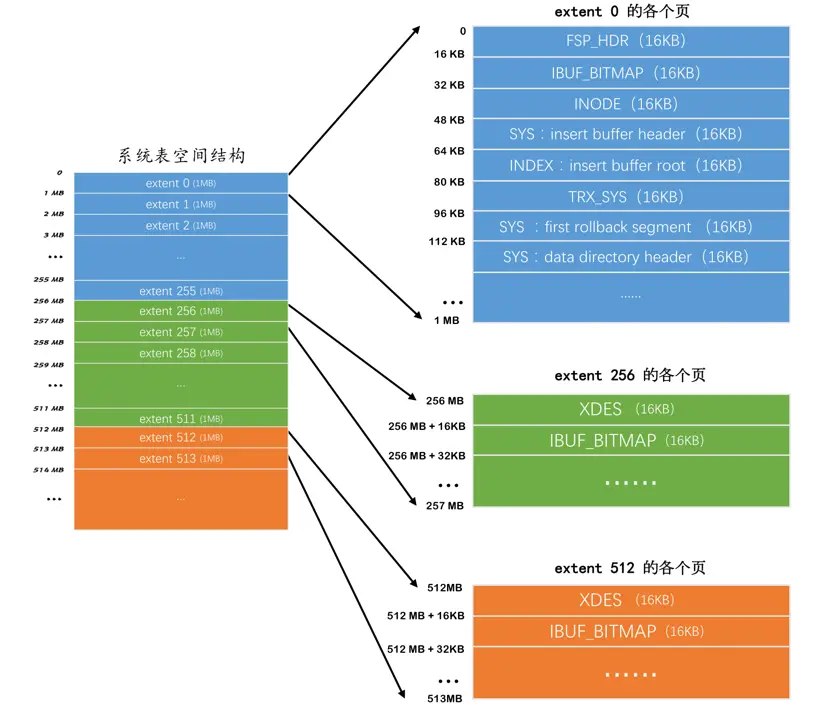
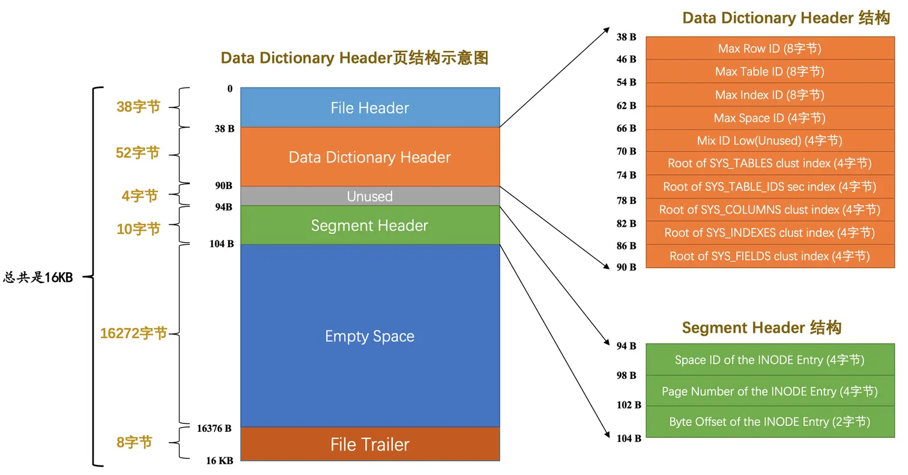

# 系统表空间

了解完了独立表空间的基本结构，系统表空间的结构也就好理解多了，系统表空间的结构和独立表空间基本类似，只不过由于整个MySQL进程只有一个系统表空间，在系统表空间中会额外记录一些有关整个系统信息的页面，所以会比独立表空间多出一些记录这些信息的页面。因为这个系统表空间最牛逼，
相当于是表空间之首，所以它的`表空间 ID`（`Space ID`）是`0`。

## 系统表空间的整体结构

系统表空间与独立表空间的一个非常明显的不同之处就是在表空间开头有许多记录整个系统属性的页面，如图：



可以看到，`系统表空间`和`独立表空间`的前三个页面（页号分别为`0`、`1`、`2`，类型分别是`FSP_HDR`、`IBUF_BITMAP`、`INODE`）的类型是一致的，只是页号为`3～7`的页面是系统表空间特有的，我们来看一下这些多出来的页面都是干啥使的：

|页号|页面类型|英文描述|描述|
|---|---|---|---|
|3|SYS|Insert Buffer Header|存储Insert Buffer的头部信息|
|4|INDEX|Insert Buffer Root|存储Insert Buffer的根页面|
|5|TRX_SYS|Transction System|事务系统的相关信息|
|6|SYS|First Rollback Segment|第一个回滚段的页面|
|7|SYS|Data Dictionary Header|数据字典头部信息|

除了这几个记录系统属性的页面之外，系统表空间的`extent 1`和`extent 2`这两个区，也就是页号从`64~191`这`128`个页面被称为`Doublewrite buffer`，也就是`双写缓冲区`。不过上述的大部分知识都涉及到了事务和多版本控制的问题，这些问题我们会放在后边的章节集中唠叨，
现在讲述太影响用户体验，所以现在我们只唠叨一下有关`InnoDB`数据字典的知识，其余的概念在后边再看。

### InnoDB数据字典

我们平时使用`INSERT`语句向表中插入的那些记录称之为`用户数据`，MySQL只是作为一个软件来为我们来保管这些数据，提供方便的增删改查接口而已。但是每当我们向一个表中插入一条记录的时候，MySQL先要校验一下插入语句对应的表存不存在，插入的列和表中的列是否符合，如果语法没有问题的话，
还需要知道该表的`聚簇索引`和所有`二级索引`对应的根页面是哪个表空间的哪个页面，然后把记录插入对应索引的`B+`树中。所以说，MySQL除了保存着我们插入的用户数据之外，还需要保存许多额外的信息，比方说：

* 某个表属于哪个表空间，表里边有多少列

* 表对应的每一个列的类型是什么

* 该表有多少索引，每个索引对应哪几个字段，该索引对应的根页面在哪个表空间的哪个页面

* 该表有哪些外键，外键对应哪个表的哪些列

* 某个表空间对应文件系统上文件路径是什么

* balabala ... 还有好多，不一一列举了

上述这些数据并不是我们使用`INSERT`语句插入的用户数据，实际上是为了更好的管理我们这些用户数据而不得已引入的一些额外数据，这些数据也称为元数据。`InnoDB`存储引擎特意定义了一些列的`内部系统表`（`internal system table`）来记录这些这些`元数据`：

|表名|描述|
|---|---|
|SYS_TABLES|记录了InnoDB存储引擎中所有的表的信息|
|SYS_COLUMNS|记录了InnoDB存储引擎中所有的列的信息|
|SYS_INDEXES|记录了InnoDB存储引擎中所有的索引的信息|
|SYS_FIELDS|记录了InnoDB存储引擎中所有的索引对应的列的信息|
|SYS_FOREIGN|记录了InnoDB存储引擎中所有的外键的信息|
|SYS_FOREIGN_COLS|整个InnoDB存储引擎中所有的外键对应列的信息|
|SYS_TABLESPACES|记录了InnoDB存储引擎中所有的表空间的信息|
|SYS_DATAFILES|记录了InnoDB存储引擎中所有的表空间对应文件系统的文件路径信息|
|SYS_VIRTUAL|记录了InnoDB存储引擎中所有的虚拟生成列的信息|

这些系统表也被称为`数据字典`，它们都是以`B+`树的形式保存在系统表空间的某些页面中，其中`SYS_TABLES`、`SYS_COLUMNS`、`SYS_INDEXES`、`SYS_FIELDS`这四个表尤其重要，称之为`基本系统表`（`basic system tables`），我们先看看这4个表的结构：

#### SYS_TABLES表

##### SYS_TABLES表的列

|列名|描述|
|---|---|
|ID|表的ID|
|NAME|表的名称|
|N_COLS|该表拥有列的个数|
|TYPE|表的类型，记录了一些文件格式、行格式、压缩等信息|
|MIX_ID|已过时，忽略|
|MIX_LEN|表的一些额外的属性|
|CLUSTER_ID|未使用，忽略|
|SPACE|该表所属表空间的ID|

这个`SYS_TABLES`表有两个索引：

* 以`NAME`列为主键的聚簇索引

* 以`ID`列建立的二级索引

#### SYS_COLUMNS表

##### SYS_COLUMNS表的列

|列名|描述|
|---|---|
|TABLE_ID|该列所属表对应的ID|
|POS|该列在表中是第几列|
|NAME|该列的名称|
|MTYPE|main data type，主数据类型，就是那堆INT、CHAR、VARCHAR、FLOAT、DOUBLE之类的东东|
|PRTYPE|precise type，精确数据类型，就是修饰主数据类型的那堆东东，比如是否允许NULL值，是否允许负数啥的|
|LEN|该列最多占用存储空间的字节数|
|PREC|该列的精度，不过这列貌似都没有使用，默认值都是0|

这个`SYS_COLUMNS`表只有一个聚集索引：

* 以(`TABLE_ID`, `POS`)列为主键的聚簇索引

#### SYS_INDEXES表

##### SYS_INDEXES表的列

|列名|描述|
|---|---|
|TABLE_ID|该索引所属表对应的ID|
|ID|InnoDB存储引擎中每个索引都有一个唯一的ID|
|NAME|该索引的名称|
|N_FIELDS|该索引包含列的个数|
|TYPE|该索引的类型，比如聚簇索引、唯一索引、更改缓冲区的索引、全文索引、普通的二级索引等等各种类型|
|SPACE|该索引根页面所在的表空间ID|
|PAGE_NO|该索引根页面所在的页面号|
|MERGE_THRESHOLD|如果页面中的记录被删除到某个比例，就把该页面和相邻页面合并，这个值就是这个比例|

这个`SYS_INDEXES`表只有一个聚集索引：

* 以(`TABLE_ID`, `ID`)列为主键的聚簇索引

#### SYS_FIELDS表

##### SYS_FIELDS表的列

|列名|描述|
|---|---|
|INDEX_ID|该索引列所属的索引的ID|
|POS|该索引列在某个索引中是第几列|
|COL_NAME|该索引列的名称|

这个`SYS_FIELDS`表只有一个聚集索引：

* 以(`INDEX_ID`, `POS`)列为主键的聚簇索引

#### Data Dictionary Header页面

只要有了上述4个基本系统表，也就意味着可以获取其他系统表以及用户定义的表的所有元数据。比方说我们想看看`SYS_TABLESPACES`这个系统表里存储了哪些表空间以及表空间对应的属性，那就可以：

* 到`SYS_TABLES`表中根据表名定位到具体的记录，就可以获取到`SYS_TABLESPACES`表的`TABLE_ID`

* 使用这个`TABLE_ID`到`SYS_COLUMNS`表中就可以获取到属于该表的所有列的信息。

* 使用这个`TABLE_ID`还可以到`SYS_INDEXES`表中获取所有的索引的信息，索引的信息中包括对应的`INDEX_ID`，还记录着该索引对应的`B+`数根页面是哪个表空间的哪个页面。

* 使用`INDEX_ID`就可以到`SYS_FIELDS`表中获取所有索引列的信息。

也就是说这4个表是表中之表，那这4个表的元数据去哪里获取呢？没法搞了，只能把这4个表的元数据，就是它们有哪些列、哪些索引等信息硬编码到代码中，然后设计`InnoDB`的大叔又拿出一个固定的页面来记录这4个表的聚簇索引和二级索引对应的`B+`树位置，
这个页面就是页号为`7`的页面，类型为`SYS`，记录了`Data Dictionary Header`，也就是数据字典的头部信息。除了这4个表的5个索引的根页面信息外，这个页号为`7`的页面还记录了整个`InnoDB`存储引擎的一些全局属性，说话太啰嗦，直接看这个页面的示意图：



可以看到这个页面由下边几个部分组成：

|名称|中文名|占用空间大小|简单描述|
|---|---|---|---|
|File Header|文件头部|38字节|页的一些通用信息|
|Data Dictionary Header|数据字典头部信息|56字节|记录一些基本系统表的根页面位置以及InnoDB存储引擎的一些全局信息|
|Segment Header|段头部信息|10字节|记录本页面所在段对应的INODE Entry位置信息|
|Page Directory	页目录	16字节|记录本页面中所有页的位置信息|
|Page Directory Pointers	页目录指针	16字节|记录本页面中所有页的位置信息|
|Free Space	空闲空间	16272字节|用于页结构的填充，没啥实际意义|
|File Trailer	文件尾部	8字节|校验页是否完整|

可以看到这个页面里竟然有`Segment Header`部分，意味着设计`InnoDB`的大叔把这些有关数据字典的信息当成一个段来分配存储空间，我们就姑且称之为`数据字典段`吧。由于目前我们需要记录的数据字典信息非常少（可以看到`Data Dictionary Header`部分仅占用了`56`字节），
所以该段只有一个碎片页，也就是页号为`7`的这个页。

接下来我们需要细细唠叨一下`Data Dictionary Header`部分的各个字段：

* `Max Row ID`：我们说过如果我们不显式的为表定义主键，而且表中也没有`UNIQUE`索引，那么`InnoDB`存储引擎会默认为我们生成一个名为`row_id`的列作为主键。因为它是主键，所以每条记录的`row_id`列的值不能重复。原则上只要一个表中的`row_id`列不重复就可以了，
也就是说`表a`和`表b`拥有一样的`row_id`列也没啥关系，不过设计`InnoDB`的大叔只提供了这个`Max Row ID`字段，不论哪个拥有`row_id`列的表插入一条记录时，该记录的`row_id`列的值就是`Max Row ID`对应的值，然后再把`Max Row ID`对应的值加`1`，也就是说这个`Max Row ID`是全局共享的。

* `Max Table ID`：`InnoDB`存储引擎中的所有的`表`都对应一个唯一的`ID`，每次新建一个表时，就会把本字段的值作为该表的`ID`，然后自增本字段的值。

* `Max Index ID`：`InnoDB`存储引擎中的所有的`索引`都对应一个唯一的`ID`，每次新建一个索引时，就会把本字段的值作为该索引的`ID`，然后自增本字段的值。

* `Max Space ID`：`InnoDB`存储引擎中的所有的`表空间`都对应一个唯一的`ID`，每次新建一个表空间时，就会把本字段的值作为该表空间的`ID`，然后自增本字段的值。

* `Mix ID Low(Unused)`：这个字段没啥用，跳过。

* `Root of SYS_TABLES clust index`：本字段代表`SYS_TABLES`表聚簇索引的根页面的页号。

* `Root of SYS_TABLE_IDS sec index`：本字段代表`SYS_TABLES`表为`ID`列建立的二级索引的根页面的页号。

* `Root of SYS_COLUMNS clust index`：本字段代表`SYS_COLUMNS`表聚簇索引的根页面的页号。

* `Root of SYS_INDEXES clust index`：本字段代表`SYS_INDEXES`表聚簇索引的根页面的页号。

* `Root of SYS_FIELDS clust index`：本字段代表`SYS_FIELDS`表聚簇索引的根页面的页号。

* `Unused`：这4个字节没用，跳过。

以上就是页号为7的页面的全部内容，初次看可能会懵逼（因为有点儿绕），大家多瞅几次。

#### information_schema系统数据库

需要注意一点的是，用户是不能直接访问`InnoDB`的这些内部系统表的，除非你直接去解析系统表空间对应文件系统上的文件。不过设计`InnoDB`的大叔考虑到查看这些表的内容可能有助于大家分析问题，所以在系统数据库`information_schema`中提供了一些以`innodb_sys`开头的表：

```sql
mysql> USE information_schema;
Database changed

mysql> SHOW TABLES LIKE 'innodb_sys%';
+--------------------------------------------+
| Tables_in_information_schema (innodb_sys%) |
+--------------------------------------------+
| INNODB_SYS_DATAFILES                       |
| INNODB_SYS_VIRTUAL                         |
| INNODB_SYS_INDEXES                         |
| INNODB_SYS_TABLES                          |
| INNODB_SYS_FIELDS                          |
| INNODB_SYS_TABLESPACES                     |
| INNODB_SYS_FOREIGN_COLS                    |
| INNODB_SYS_COLUMNS                         |
| INNODB_SYS_FOREIGN                         |
| INNODB_SYS_TABLESTATS                      |
+--------------------------------------------+
10 rows in set (0.00 sec)

```

在`information_schema`数据库中的这些以`INNODB_SYS`开头的表并不是真正的`内部系统表`（内部系统表就是我们上边唠叨的以`SYS`开头的那些表），而是在存储引擎启动时读取这些以`SYS`开头的系统表，然后填充到这些以`INNODB_SYS`开头的表中。
以`INNODB_SYS`开头的表和以SYS开头的表中的字段并不完全一样，但供大家参考已经足矣。这些表太多了，我就不唠叨了，大家自个儿动手试着查一查这些表中的数据吧哈～