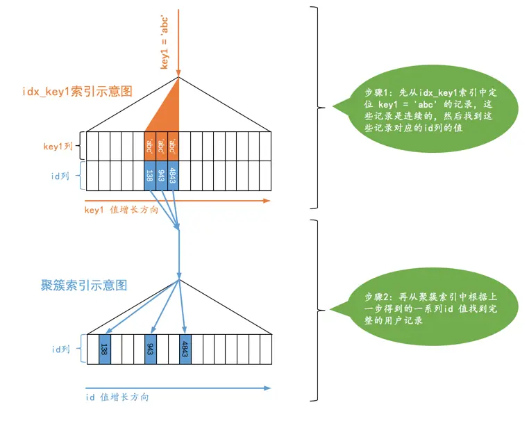

# ref

有时候我们对某个普通的二级索引列与常数进行等值比较，比如这样：

```sql
SELECT * FROM single_table WHERE key1 = 'abc';
```

对于这个查询，我们当然可以选择全表扫描来逐一对比搜索条件是否满足要求，我们也可以先使用二级索引找到对应记录的`id`值，然后再回表到聚簇索引中查找完整的用户记录。由于普通二级索引并不限制索引列值的唯一性，
所以可能找到多条对应的记录，也就是说使用二级索引来执行查询的代价取决于等值匹配到的二级索引记录条数。如果匹配的记录较少，则回表的代价还是比较低的，所以MySQL可能选择使用索引而不是全表扫描的方式来执行查询。
设计MySQL的大叔就把这种搜索条件为二级索引列与常数等值比较，采用二级索引来执行查询的访问方法称为：`ref`。我们看一下采用`ref`访问方法执行查询的图示：



从图示中可以看出，对于普通的二级索引来说，通过索引列进行等值比较后可能匹配到多条连续的记录，而不是像主键或者唯一二级索引那样最多只能匹配1条记录，所以这种`ref`访问方法比`const`差了那么一丢丢，
但是在二级索引等值比较时匹配的记录数较少时的效率还是很高的（如果匹配的二级索引记录太多那么回表的成本就太大了），跟坐高铁差不多。不过需要注意下边两种情况：

* 二级索引列值为`NULL`的情况

不论是普通的二级索引，还是唯一二级索引，它们的索引列对包含`NULL`值的数量并不限制，所以我们采用`key IS NULL`这种形式的搜索条件最多只能使用`ref`的访问方法，而不是`const`的访问方法。

* 对于某个包含多个索引列的二级索引来说，只要是最左边的连续索引列是与常数的等值比较就可能采用`ref`的访问方法，比方说下边这几个查询：

```sql
SELECT * FROM single_table WHERE key_part1 = 'god like';

SELECT * FROM single_table WHERE key_part1 = 'god like' AND key_part2 = 'legendary';

SELECT * FROM single_table WHERE key_part1 = 'god like' AND key_part2 = 'legendary' AND key_part3 = 'penta kill';

```

但是如果最左边的连续索引列并不全部是等值比较的话，它的访问方法就不能称为`ref`了，比方说这样：

```sql
SELECT * FROM single_table WHERE key_part1 = 'god like' AND key_part2 > 'legendary';

```