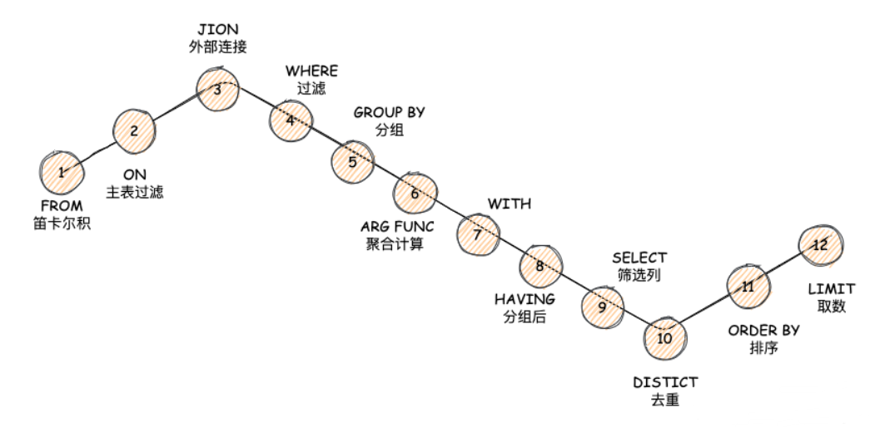
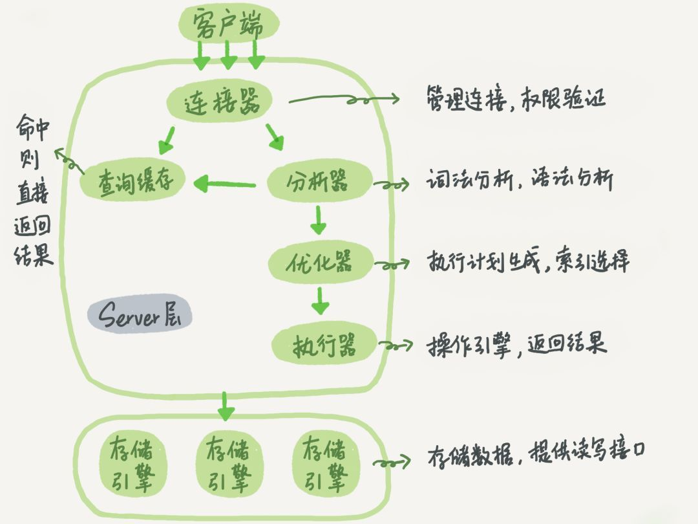
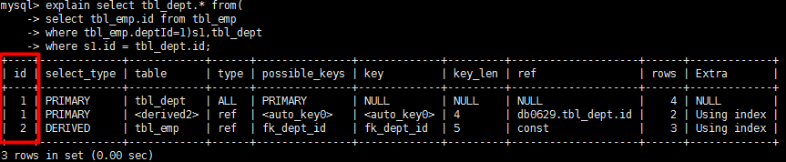
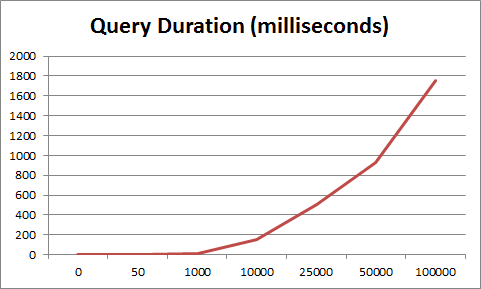

:::tip
本章内容简单的介绍，各类知识的详细介绍请移步：[MySQL是怎么运行的？](/数据库/书籍鉴赏/MySQL是怎样运行的/字符集和比较规则/字符集和比较规则简介)

相关知识书籍请移步：[MySQL海量数据存储与优化](/书籍下载/数据库/数据库#mysql)
:::

## 一、 语法

`SQL` 是一门 `ANSI` 标准计算机语言，用来访问和操作数据库系统。通常 `SQL` 语句可以分为两类：

* **数据操作语言（DML）**：`SELECT`、`DELETE`、`INSERT INTO`、`UPDATE`
* **数据定义语言（DDL）**：`CREATE`、`DROP`、`ALTER`

实践中，还有一种

* **数据控制语言（Data Control Language）**：`GRANT`，`REVOKE`，`COMMIT`，`ROLLBACK`

### 1、常见的聚合查询？

使用聚合函数的查询就是聚合查询。所有的聚合函数（`UDAF`）都应该支持分组查询，内置的聚合函数有：

```sql
sum(列名) 求和  　　　　
max(列名) 最大值 　　　　
min(列名) 最小值 　　　　
avg(列名) 平均值 　　　　
first(列名)   第一条记录   
last(列名)    最后一条记录  
count(列名)   统计记录数   注意和count(*)的区别
```

### 2、几种关联查询？

1） 内连接（自然连接）：只返回匹配的行，如 `Inner Join`、`Union Join`。

2）外连接：返回一个表的全集，如 `Left`、`Right`、`Full` 和 `Cross`。

### 3、Where 和 Having 的区别？

`where` 子句的作用是在对查询结果进行分组前，将不符合条件的行去掉，即在分组之前过滤数据，`where`条件中不能包含聚组函数，使用`where`条件过滤出特定的行。

`having` 子句的作用是筛选满足条件的组，即在分组之后过滤数据，条件中经常包含聚组函数，使用`having` 条件过滤出特定的组，也可以使用多个分组标准进行分组。

总结一下条件的过滤顺序：`on->join->where->group by->having`

### 4、SQL 关键字的执行顺序？



### 5、In 和 Exists 的区别？

`in` 适合内表比外表数据小的情况，`exists` 适合内表比外表数据大的情况。如果查询的内外表大小相当，则二者效率差别不大。

### 6、Union 和 Union All 的区别？

* **Union**：对两个结果集进行并集操作，不包括重复行，同时进行默认规则的排序

* **Union All**：对两个结果集进行并集操作，包括重复行，不进行排序

`union`会自动压缩多个结果集合中的重复结果，而`union all`则将所有的结果全部显示出来，不管是不是重复。

### 7、Drop、Delete 和 Truncate 的区别？

虽然通过 `delete`、`truncate`、`drop` 这三个关键字都可以用来删除数据，但场景不同。

从执行速度上讲：`drop > truncate >> DELETE`

|区别	|Delete|	Truncate|	Drop|
|---|---|---|---|
|SQL类型	|属于DML|	属于DDL|	属于DDL|
|支持回滚	|支持	|不支持	|不支持|
|删除内容	|表结构还在，删除表的全部或部分数据	|表结构还在，删除表中所有数据	|从数据库中删除表的所有数据，包括索引和权限|
|执行速度	|速度慢，需要逐行删除	|速度快	|速度最快|

## 二、 优化

### 1、一条 SQL 是如何执行的？



### 2、如何判断 SQL 是否走了索引？

`EXPLAIN` 命令是查看查询优化器如何决定执行查询的主要方法，使用 `EXPLAIN` 只需在查询语句开头增加 `EXPLAIN` 这个关键字即。



其结果中的几个重要参数：

* **id** : `ID` 代表执行 `select` 子句或操作表的顺序，如果包含子查询，则会出现多个 `ID`。值越大，优先级越高，越先被执行。值相同的按照由上至下的顺序执行。

* **select_type**（查询类型）: 查询类型主要用于区别普通查询、联合查询以及子查询等复杂查询。

* **table**

* **type** : 查询扫描情况，最好到最差依次是：`system>const>eq_ref>ref>range>index>All`，一般情况下至少保证达到 `range` 级别，最好能达到 `ref`。

* **possible_keys** : 显示可能应用在这张表中的索引，一个或多个。查询到的索引不一定是真正被使用。

* **key** : 实际使用的索引，如果为 `null` 则表示没有使用索引。因此会出现 `possible_keys` 列有可能被用到的索引，但是 `key` 列为 `null`。

* **key_len** : 表示索引中使用的字节数，在不损失精确性的情况下长度越短越好。`key_len` 显示的值为索引字段的最大可能长度，并非实际使用长度。即 `key_len` 是根据表定义计算而来。

* **ref** : 显示索引的哪一列被使用了,如果可能的话是一个常数,哪些列或常量被用于查找索引列上的值。

* **rows** : 根据表统计信息及索引选用情况，估算出找到所需的记录所需要读取的行数。

* **Extra** : 额外的信息

### 3、索引失效的几种情况？

1）`like` 以`%`开头，索引无效；当`like`前缀没有`%`，后缀有`%`时，索引有效；

2）`or` 语句前后没有同时使用索引。当 `or` 左右查询字段只有一个是索引，该索引失效，只有左右查询字段均为索引时，才会生效；

3）联合索引不使用第一列，索引失效；

4）数据类型出现隐式转化。如 `varchar` 不加单引号的话可能会自动转换为 `int` 型，使索引无效，产生全表扫描；

5）在索引列上使用 `IS NULL` 或 `IS NOT NULL`操作。最好给列设置默认值。

6）在索引字段上使用`not`，`<>`，`!=`。不等于操作符是永远不会用到索引的，因此对它的处理只会产生全表扫描。 优化方法： `key<>0` 改为 `key>0 or key<0`。

7）对索引字段进行计算操作、字段上使用函数。

8）当 `MySQL` 觉得全表扫描更快时（数据少）;

### 4、Where 子句如何优化？


### 5、超大分页或深度分页如何处理？

说道 `MySQL` 的分页，我们首先想到的就是 `offset`、`limit` 操作，但随着页数的增加，查询性能指数级增大。



是由于 `MySQL` 并不是跳过 `offset` 的行数，而是取 `offset + limit` 行，然后丢弃前 `offset` 行，返回 `limit` 行，当`offset`特别大的时候，效率就非常的低下。

此处我们就可以采用`覆盖索引+延迟关联`技术来减少偏移量的定位进行优化：

```sql
##查询语句
select id from product limit 10000000, 10
##优化方式一
SELECT * FROM product WHERE ID > =(select id from product limit 10000000, 1) limit 10
##优化方式二
SELECT * FROM product a JOIN (select id from product limit 10000000, 10) b ON a.ID = b.id
```

### 6、大表查询如何优化？

可以从`分库分表`、`读写分离`以及`缓存`三个维度分别阐述。