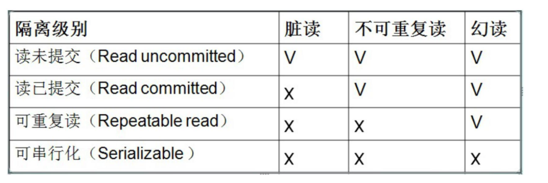
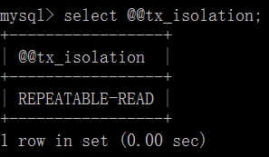
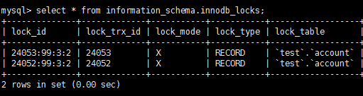
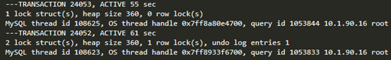
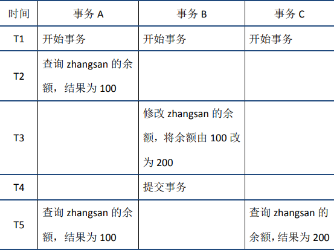
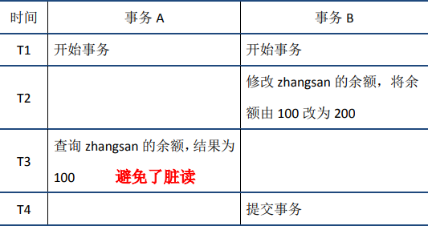
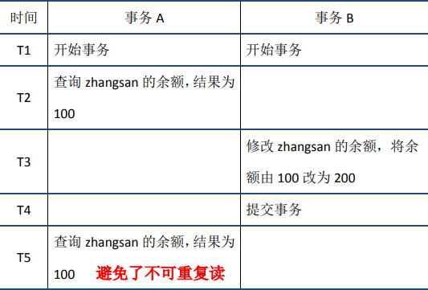
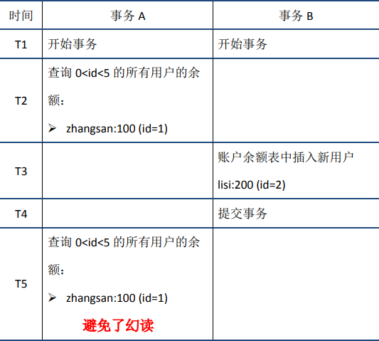
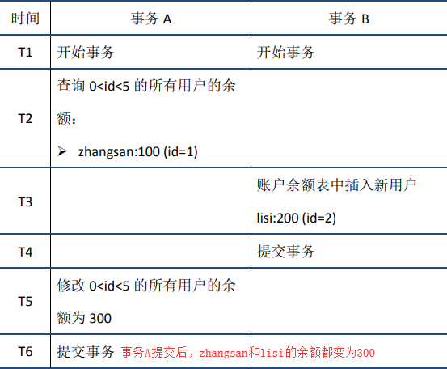

:::tip
本章内容简单的介绍，各类知识的详细介绍请移步：[MySQL是怎么运行的？](/数据库/书籍鉴赏/MySQL是怎样运行的/字符集和比较规则/字符集和比较规则简介)

相关知识书籍请移步：[MySQL海量数据存储与优化](/书籍下载/数据库/数据库#mysql)
:::

## 1、什么是数据库的事务？

数据库的事务是一个不可分割的数据库操作序列，也是数据库并发控制的基本单位，其执行的结果必须使数据库从一种一致性状态变到另一种一致性状态。事务是逻辑上的一组操作，要么都执行，要么都不执行。

事务的典型应用场景，如转账。

## 2、什么是事务的四大特性（ACID）？

`原子性`： 事务是最小的执行单位，不允许分割。事务的原子性确保动作要么全部完成，要么完全不起作用
`一致性`： 事务执行前后，数据保持一致，多个事务对同一个数据读取的结果是相同的
`隔离性`： 并发访问数据库时，一个用户的事务不被其他事务所干扰，各并发事务之间数据库是独立的
`持久性`： 一个事务被提交之后。它对数据库中数据的改变是持久的，即使数据库发生故障也不应该对其有任何影响。

## 3、事务的并发问题？

相对于串行处理来说，并发事务处理能大大增加数据库资源的利用率，提高数据库系统的事务吞吐量，从而可以支持可以支持更多的用户。但并发事务处理也会带来一些问题，主要包括以下几种情况。

* **更新丢失**（`Lost Update`）：当两个或多个事务选择同一行，然后基于最初选定的值更新该行时，由于每个事务都不知道其他事务的存在，就会发生丢失更新问题——最后的更新覆盖了其他事务所做的更新。
例如，两个编辑人员制作了同一文档的电子副本。每个编辑人员独立地更改其副本，然后保存更改后的副本，这样就覆盖了原始文档。最后保存其更改保存其更改副本的编辑人员覆盖另一个编辑人员所做的修改。
如果在一个编辑人员完成并提交事务之前，另一个编辑人员不能访问同一文件，则可避免此问题

* **脏读**（`Dirty Reads`）：一个事务正在对一条记录做修改，在这个事务并提交前，这条记录的数据就处于不一致状态；这时，另一个事务也来读取同一条记录，如果不加控制，第二个事务读取了这些“脏”的数据，并据此做进一步的处理，就会产生未提交的数据依赖关系。这种现象被形象地叫做“脏读”。

* **不可重复读**（`Non-Repeatable Reads`）：一个事务在读取某些数据已经发生了改变、或某些记录已经被删除了！这种现象叫做“不可重复读”。

* **幻读**（`Phantom Reads`）：一个事务按相同的查询条件重新读取以前检索过的数据，却发现其他事务插入了满足其查询条件的新数据，这种现象就称为“幻读”。
  * 产生幻读的原因是，行锁只能锁住行，但是新插入记录这个动作，要更新的是记录之间的“间隙”。因此，为了解决幻读问题，`InnoDB`只好引入新的锁，也就是间隙锁(`Gap Lock`)，这个后文会继续介绍。

## 4、什么是脏读、幻读和不可重复度？

**脏读**：一个事务读取到另一个事务尚未提交的数据。 事务 `A` 读取事务 `B` 更新的数据，然后 `B` 回滚操作，那么 `A` 读取到的数据是脏数据。

**不可重复读**：一个事务中两次读取的数据的内容不一致。 事务 `A` 多次读取同一数据，事务 `B` 在事务 `A` 多次读取的过程中，对数据作了`更新`并提交，导致事务 `A` 多次读取同一数据时，结果不一致。

**幻读**：一个事务中两次读取的数据量不一致。 系统管理员 `A` 将数据库中所有学生的成绩从具体分数改为 `ABCDE` 等级，但是系统管理员 `B` 就在这个时候插入了一条具体分数的记录，当系统管理员 `A` 改结束后发现还有一条记录没有改过来，就好像发生了幻觉一样，这就叫幻读。

不可重复读的和幻读很容易混淆，**不可重复读侧重于修改，幻读侧重于新增或删除**。解决不可重复读的问题只需锁住满足条件的行，解决幻读需要锁表。

## 5、事务的隔离级别有哪些？



串行化的隔离级别最高，读未提交的级别最低，级别越高，则执行效率就越低，所以在选择隔离级别时应该结合实际情况。

`MySQL` 支持以上四种隔离级别，默认为 `Repeatable read` (可重复读)；而 `Oracle` 只支持 `Serializeble`(串行化) 级别和 `Read committed`(读已提交) 两种，其中默认为读已提交。

`mysql`默认的事务隔离级别为`repeatable-read`:



[详解](https://www.cnblogs.com/huanongying/p/7021555.html)

## 6、ACID 特性是如何实现的？

分四个维度去理解，如原子性是 `undo` 日志，持久性是 `redo` 日志。（PS 日志具体原理在后续章节讲述。）

### 原子性

#### 1. 定义
   
原子性是指一个事务是一个不可分割的工作单位，其中的操作要么都做，要么都不做；如果事务中一个`sql`语句执行失败，则已执行的语句也必须回滚，数据库退回到事务前的状态。

#### 2. 实现原理：undo log

在说明原子性原理之前，首先介绍一下`MySQL`的事务日志。`MySQL`的日志有很多种，如`二进制日志`、`错误日志`、`查询日志`、`慢查询日志`等，此外`InnoDB`存储引擎还提供了两种事务日志：
`redo log`(重做日志)和`undo log`(回滚日志)。其中`redo log`用于保证事务持久性；`undo log`则是事务原子性和隔离性实现的基础。

下面说回`undo log`。实现原子性的关键，是当事务回滚时能够撤销所有已经成功执行的`sql`语句。**`InnoDB`实现回滚，靠的是`undo log`：当事务对数据库进行修改时，
`InnoDB`会生成对应的`undo log`；如果事务执行失败或调用了`rollback`，导致事务需要回滚，便可以利用`undo log`中的信息将数据回滚到修改之前的样子。**

`undo log`属于`逻辑日志`，它记录的是`sql`执行相关的信息。当发生回滚时，`InnoDB`会根据`undo log`的内容做与之前相反的工作：对于每个`insert`，回滚时会执行`delete`；对于每个`delete`，回滚时会执行`insert`；对于每个`update`，回滚时会执行一个相反的`update`，把数据改回去。

以`update`操作为例：当事务执行`update`时，其生成的`undo log`中会包含被修改行的主键(以便知道修改了哪些行)、修改了哪些列、这些列在修改前后的值等信息，回滚时便可以使用这些信息将数据还原到`update`之前的状态。

### 持久性

#### 1. 定义
   
持久性是指事务一旦提交，它对数据库的改变就应该是永久性的。接下来的其他操作或故障不应该对其有任何影响。

#### 2. 实现原理：redo log

`redo log`和`undo log`都属于`InnoDB`的事务日志。下面先聊一下`redo log`存在的背景。

`InnoDB`作为`MySQL`的存储引擎，数据是存放在磁盘中的，但如果每次读写数据都需要磁盘`IO`，效率会很低。为此，`InnoDB`提供了缓存(`Buffer Pool`)，
`Buffer Pool`中包含了磁盘中部分数据页的映射，作为访问数据库的缓冲：当从数据库读取数据时，会首先从`Buffer Pool`中读取，如果`Buffer Pool`中没有，
则从磁盘读取后放入`Buffer Pool`；当向数据库写入数据时，会首先写入`Buffer Pool`，`Buffer Pool`中修改的数据会定期刷新到磁盘中（这一过程称为`刷脏`）。

`Buffer Pool`的使用大大提高了读写数据的效率，但是也带了新的问题：如果`MySQL`宕机，而此时`Buffer Pool`中修改的数据还没有刷新到磁盘，就会导致数据的丢失，事务的持久性无法保证。

于是，`redo log`被引入来解决这个问题：当数据修改时，除了修改`Buffer Pool`中的数据，还会在`redo log`记录这次操作；当事务提交时，会调用`fsync`接口对`redo log`进行刷盘。
如果`MySQL`宕机，重启时可以读取`redo log`中的数据，对数据库进行恢复。`redo log`采用的是`WAL（Write-ahead logging，预写式日志）`，所有修改先写入日志，再更新到`Buffer Pool`，
保证了数据不会因`MySQL`宕机而丢失，从而满足了持久性要求。

既然`redo log`也需要在事务提交时将日志写入磁盘，为什么它比直接将`Buffer Pool`中修改的数据写入磁盘(即刷脏)要快呢？主要有以下两方面的原因：

（1）刷脏是`随机IO`，因为每次修改的数据位置随机，但写`redo log`是追加操作，属于`顺序IO`。

（2）刷脏是以数据页（`Page`）为单位的，`MySQL`默认页大小是`16KB`，一个`Page`上一个小修改都要整页写入；而`redo log`中只包含真正需要写入的部分，无效`IO`大大减少。

#### 3. redo log与binlog

我们知道，在`MySQL`中还存在`binlog`(二进制日志)也可以记录写操作并用于数据的恢复，但二者是有着根本的不同的：

（1）作用不同：`redo log`是用于`crash recovery`的，保证`MySQL`宕机也不会影响持久性；`binlog`是用于`point-in-time recovery`的，保证服务器可以基于`时间点恢复数据`， 此外`binlog`还用于`主从复制`。

（2）层次不同：`redo log`是`InnoDB`存储引擎实现的，而`binlog`是`MySQL`的服务器层(可以参考文章前面对`MySQL`逻辑架构的介绍)实现的，同时支持`InnoDB`和其他存储引擎。

（3）内容不同：`redo log`是`物理日志`，内容基于磁盘的`Page`；`binlog`的内容是`二进制`的，根据`binlog_format`参数的不同，可能基于`sql`语句、基于数据本身或者二者的混合。

（4）写入时机不同：`binlog`在事务`提交`时写入；`redo log`的`写入`时机相对多元：

* 前面曾提到：当事务提交时会调用`fsync`对`redo log`进行刷盘；这是默认情况下的策略，修改`innodb_flush_log_at_trx_commit`参数可以改变该策略，但事务的持久性将无法保证。

* 除了事务提交时，还有其他刷盘时机：如`master thread`每秒刷盘一次`redo log`等，这样的好处是不一定要等到`commit`时刷盘，`commit`速度大大加快。

### 隔离性

#### 1. 定义

与原子性、持久性侧重于研究事务本身不同，隔离性研究的是不同事务之间的相互影响。隔离性是指，`事务内部的操作与其他事务是隔离的，并发执行的各个事务之间不能互相干扰`。严格的隔离性，
对应了事务隔离级别中的`Serializable` (可串行化)，但实际应用中出于性能方面的考虑很少会使用可串行化。

隔离性追求的是并发情形下事务之间互不干扰。简单起见，我们主要考虑最简单的读操作和写操作(加锁读等特殊读操作会特殊说明)，那么隔离性的探讨，主要可以分为两个方面：

* (一个事务)写操作对(另一个事务)写操作的影响：`锁机制`保证隔离性
* (一个事务)写操作对(另一个事务)读操作的影响：`MVCC`保证隔离性

#### 2. 锁机制
   
首先来看两个事务的写操作之间的相互影响。隔离性要求同一时刻只能有一个事务对数据进行写操作，`InnoDB`通过锁机制来保证这一点。

锁机制的基本原理可以概括为：**事务在修改数据之前，需要先获得相应的锁；获得锁之后，事务便可以修改数据；该事务操作期间，这部分数据是锁定的，其他事务如果需要修改数据，需要等待当前事务提交或回滚后释放锁。**

**行锁与表锁**

按照粒度，锁可以分为`表锁`、`行锁`以及其他`位于二者之间的锁`。

* 表锁在操作数据时会锁定整张表，并发性能较差；
* 行锁则只锁定需要操作的数据，并发性能好。但是由于加锁本身需要消耗资源(获得锁、检查锁、释放锁等都需要消耗资源)，因此在锁定数据较多情况下使用表锁可以节省大量资源。

`MySQL`中不同的存储引擎支持的锁是不一样的，例如`MyIsam`只支持表锁，而`InnoDB`同时支持表锁和行锁，且出于性能考虑，绝大多数情况下使用的都是行锁。

**如何查看锁信息**

有多种方法可以查看`InnoDB`中锁的情况，例如：

```sql
select * from information_schema.innodb_locks; #锁的概况
show engine innodb status; #InnoDB整体状态，其中包括锁的情况
```

下面来看一个例子：

```sql
#在事务A中执行：
start transaction;
update account SET balance = 1000 where id = 1;
#在事务B中执行：
start transaction;
update account SET balance = 2000 where id = 1;
```

此时查看锁的情况：



`show engine innodb status`查看锁相关的部分：



通过上述命令可以查看事务`24052`和`24053`占用锁的情况；其中`lock_type`为`RECORD`，代表锁为行锁(记录锁)；`lock_mode`为`X`，代表排它锁(写锁)。

除了排它锁(写锁)之外，`MySQL`中还有共享锁(读锁)的概念。

#### 3. MVCC

`RR`解决脏读、不可重复读、幻读等问题，使用的是`MVCC`：`MVCC`全称`Multi-Version Concurrency Control`，即多版本的并发控制协议。
下面的例子很好的体现了`MVCC`的特点：在同一时刻，不同的事务读取到的数据可能是不同的(即多版本)——在`T5`时刻，`事务A`和`事务C`可以读取到不同版本的数据。



`MVCC`最大的优点是读不加锁，因此读写不冲突，并发性能好。`InnoDB`实现`MVCC`，多个版本的数据可以共存，主要基于以下技术及数据结构：

1）隐藏列：`InnoDB`中每行数据都有隐藏列，隐藏列中包含了本行数据的`事务id`、指向`undo log`的指针等。

2）基于`undo log`的版本链：前面说到每行数据的隐藏列中包含了指向`undo log`的指针，而每条`undo log`也会指向更早版本的`undo log`，从而形成一条`版本链`。

3）`ReadView`：通过隐藏列和版本链，`MySQL`可以将数据恢复到指定版本；但是具体要恢复到哪个版本，则需要根据`ReadView`来确定。所谓`ReadView`，
是指事务（记做`事务A`）在某一时刻给整个事务系统（`trx_sys`）打快照，之后再进行读操作时，会将读取到的数据中的`事务id`与`trx_sys`快照比较，从而判断数据对该`ReadView`是否可见，
即对`事务A`是否可见。

`trx_sys`中的主要内容，以及判断可见性的方法如下：

* `low_limit_id`：表示生成`ReadView`时系统中应该分配给下一个事务的`id`。如果数据的`事务id`大于等于`low_limit_id`，则对该`ReadView`不可见。
* `up_limit_id`：表示生成`ReadView`时当前系统中活跃的读写事务中最小的`事务id`。如果数据的`事务id`小于`up_limit_id`，则对该`ReadView`可见。
* `rw_trx_ids`：表示生成`ReadView`时当前系统中活跃的读写事务的`事务id`列表。如果数据的`事务id`在`low_limit_id`和`up_limit_id`之间，
则需要判断`事务id`是否在`rw_trx_ids`中：如果在，说明生成`ReadView`时事务仍在活跃中，因此数据对`ReadView`不可见；如果不在，说明生成`ReadView`时事务已经提交了，
因此数据对`ReadView`可见。


下面以`RR`隔离级别为例，结合前文提到的几个问题分别说明。

（1）脏读



当`事务A`在`T3`时刻读取`zhangsan`的余额前，会生成`ReadView`，由于此时`事务B`没有提交仍然活跃，因此其`事务id`一定在`ReadView`的`rw_trx_ids`中，因此根据前面介绍的规则，`事务B`的修改对`ReadView`不可见。
接下来，`事务A`根据指针指向的`undo log`查询上一版本的数据，得到`zhangsan`的余额为`100`。这样`事务A`就避免了脏读。

（2）不可重复读



当`事务A`在`T2`时刻读取`zhangsan`的余额前，会生成`ReadView`。此时`事务B`分两种情况讨论，一种是如图中所示，事务已经开始但没有提交，此时其`事务id`在`ReadView`的`rw_trx_ids`中；
一种是`事务B`还没有开始，此时其`事务id`大于等于`ReadView`的`low_limit_id`。无论是哪种情况，根据前面介绍的规则，`事务B`的修改对`ReadView`都不可见。

当`事务A`在`T5`时刻再次读取`zhangsan`的余额时，会根据`T2`时刻生成的`ReadView`对数据的可见性进行判断，从而判断出`事务B`的修改不可见；因此`事务A`根据指针指向的`undo log`查询上一版本的数据，
得到`zhangsan`的余额为`100`，从而避免了不可重复读。

（3）幻读




`MVCC`避免幻读的机制与避免不可重复读非常类似。

当`事务A`在`T2`时刻读取`0<id<5`的用户余额前，会生成`ReadView`。此时`事务B`分两种情况讨论，一种是如图中所示，事务已经开始但没有提交，此时其`事务id`在`ReadView`的`rw_trx_ids`中；
一种是`事务B`还没有开始，此时其`事务id`大于等于`ReadView`的`low_limit_id`。无论是哪种情况，根据前面介绍的规则，`事务B`的修改对`ReadView`都不可见。

当`事务A`在`T5`时刻再次读取`0<id<5`的用户余额时，会根据`T2`时刻生成的`ReadView`对数据的可见性进行判断，从而判断出`事务B`的修改不可见。因此对于新插入的数据`lisi(id=2)`，
`事务A`根据其指针指向的`undo log`查询上一版本的数据，发现该数据并不存在，从而避免了幻读。

#### 4. 扩展

前面介绍的`MVCC`，是`RR`隔离级别下“非加锁读”实现隔离性的方式。下面是一些简单的扩展。

（1）读已提交（`RC`）隔离级别下的非加锁读

`RC`与`RR`一样，都使用了`MVCC`，其主要区别在于：

* `RR`是在事务开始后第一次执行`select`前创建`ReadView`，直到事务提交都不会再创建。根据前面的介绍，`RR`可以避免脏读、不可重复读和幻读。

* `RC`每次执行`select`前都会重新建立一个新的`ReadView`，因此如果`事务A`第一次`select`之后，`事务B`对数据进行了修改并提交，那么`事务A`第二次`select`时会重新建立新的`ReadView`，
因此`事务B`的修改对`事务A`是可见的。因此`RC`隔离级别可以避免脏读，但是无法避免不可重复读和幻读。

（2）加锁读与`next-key lock`

按照是否加锁，`MySQL`的读可以分为两种：

* 一种是`非加锁读`，也称作快照读、一致性读，使用普通的`select`语句，这种情况下使用`MVCC`避免了脏读、不可重复读、幻读，保证了隔离性。

* 另一种是加锁读，查询语句有所不同，如下所示：

```sql
#共享锁读取
select...lock in share mode
#排它锁读取
select...for update
```

加锁读在查询时会对查询的数据加锁（共享锁或排它锁）。由于锁的特性，当某事务对数据进行加锁读后，其他事务无法对数据进行写操作，因此可以避免脏读和不可重复读。而避免幻读，
则需要通过`next-key lock`。`next-key lock`是行锁的一种，实现相当于`record lock`(记录锁) + `gap lock`(间隙锁)；其特点是不仅会锁住记录本身(`record lock`的功能)，
还会锁定一个范围(`gap lock`的功能)。因此，加锁读同样可以避免脏读、不可重复读和幻读，保证隔离性。

#### 5. 总结
   
概括来说，`InnoDB`实现的`RR`，通过锁机制（包含`next-key loc`k）、`MVCC`（包括数据的隐藏列、基于`undo log`的版本链、`ReadView`）等，实现了一定程度的隔离性，可以满足大多数场景的需要。

不过需要说明的是，`RR`虽然避免了幻读问题，但是毕竟不是`Serializable`，不能保证完全的隔离，下面是两个例子：

* 第一个例子，如果在事务中第一次读取采用非加锁读，第二次读取采用加锁读，则如果在两次读取之间数据发生了变化，两次读取到的结果不一样，因为加锁读时不会采用`MVCC`。

* 第二个例子，如下所示，大家可以自己验证一下。



### 一致性

#### 1. 基本概念

一致性是指事务执行结束后，数据库的完整性约束没有被破坏，事务执行的前后都是合法的数据状态。数据库的完整性约束包括但不限于：实体完整性（如行的主键存在且唯一）、
列完整性（如字段的类型、大小、长度要符合要求）、外键约束、用户自定义完整性（如转账前后，两个账户余额的和应该不变）。

#### 2. 实现

可以说，一致性是事务追求的最终目标：前面提到的原子性、持久性和隔离性，都是为了保证数据库状态的一致性。此外，除了数据库层面的保障，一致性的实现也需要`应用层`面进行保障。

实现一致性的措施包括：

* 保证原子性、持久性和隔离性，如果这些特性无法保证，事务的一致性也无法保证
* 数据库本身提供保障，例如不允许向整形列插入字符串值、字符串长度不能超过列的限制等
* 应用层面进行保障，例如如果转账操作只扣除转账者的余额，而没有增加接收者的余额，无论数据库实现的多么完美，也无法保证状态的一致