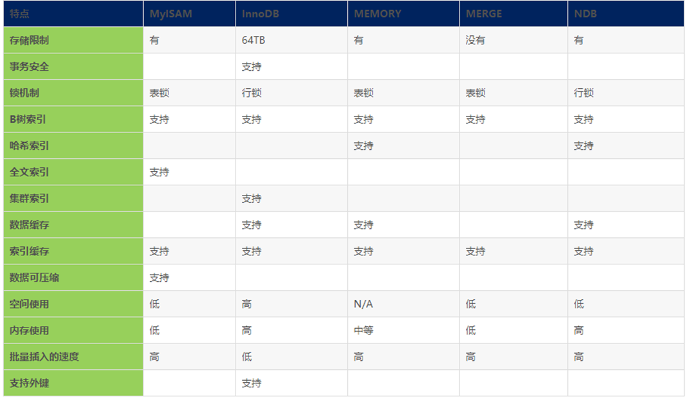
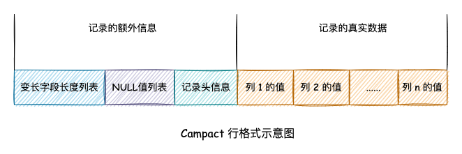

:::tip
本章内容简单的介绍，各类知识的详细介绍请移步：[MySQL是怎么运行的？](/数据库/书籍鉴赏/MySQL是怎样运行的/字符集和比较规则/字符集和比较规则简介)

相关知识书籍请移步：[MySQL海量数据存储与优化](/书籍下载/数据库/数据库#mysql)
:::

## 一、 存储引擎

### 1、有哪些常见的存储引擎？

* 常用引擎区别

* 怎么选择引擎

### 2、MyISAM 和 InnoDB 的区别？

1. `InnoDB`支持事务，`MyISAM`不支持，对于`InnoDB`每一条`SQL`语言都默认封装成事务，自动提交，这样会影响速度，所以最好把多条`SQL`语言放在`begin`和`commit`之间，组成一个事务；

2. `InnoDB`支持外键，而`MyISAM`不支持。对一个包含外键的`InnoDB`表转为`MYISAM`会失败；

3. `InnoDB`是聚集索引，使用`B+Tree`作为索引结构，数据文件是和（主键）索引绑在一起的（表数据文件本身就是按`B+Tree`组织的一个索引结构），必须要有主键，通过主键索引效率很高。但是辅助索引需要两次查询，先查询到主键，然后再通过主键查询到数据。
因此，主键不应该过大，因为主键太大，其他索引也都会很大。
   * `MyISAM`是非聚集索引，也是使用`B+Tree`作为索引结构，索引和数据文件是分离的，索引保存的是数据文件的指针。主键索引和辅助索引是独立的。 也就是说：`InnoDB`的`B+树`主键索引的叶子节点就是数据文件，辅助索引的叶子节点是主键的值；而`MyISAM`的`B+树`主键索引和辅助索引的叶子节点都是数据文件的地址指针。

4. `InnoDB`不保存表的具体行数，执行`select count(*) from table`时需要全表扫描。而`MyISAM`用一个变量保存了整个表的行数，执行上述语句时只需要读出该变量即可，速度很快（注意不能加有任何`WHERE`条件）；

>那么为什么`InnoDB`没有了这个变量呢？
>
>  因为`InnoDB`的事务特性，在同一时刻表中的行数对于不同的事务而言是不一样的，因此`count`统计会计算对于当前事务而言可以统计到的行数，而不是将总行数储存起来方便快速查询。`InnoDB`会尝试遍历一个尽可能小的索引除非优化器提示使用别的索引。如果二级索引不存在，`InnoDB`还会尝试去遍历其他聚簇索引。
>如果索引并没有完全处于`InnoDB`维护的缓冲区（`Buffer Poo`l）中，`count`操作会比较费时。可以建立一个记录总行数的表并让你的程序在`INSERT/DELETE`时更新对应的数据。和上面提到的问题一样，如果此时存在多个事务的话这种方案也不太好用。如果得到大致的行数值已经足够满足需求可以尝试`SHOW TABLE STATUS`

5. `Innodb`不支持全文索引，而`MyISAM`支持全文索引，在涉及全文索引领域的查询效率上`MyISAM`速度更快高；`PS`：`5.7`以后的`InnoDB`支持全文索引了

6. `MyISAM`表格可以被压缩后进行查询操作

7. `InnoDB`支持表、行(默认)级锁，而`MyISAM`支持表级锁

> `InnoDB`的行锁是实现在索引上的，而不是锁在物理行记录上。潜台词是，如果访问没有命中索引，也无法使用行锁，将要退化为表锁。

8. `InnoDB`表必须有唯一索引（如主键）（用户没有指定的话会自己找/生产一个隐藏列`Row_id`来充当默认主键），而`Myisam`可以没有

9. `Innodb`存储文件有`frm`、`ibd`，而`Myisam`是`frm`、`MYD`、`MYI`

* `Innodb`：`frm`是表定义文件，`ibd`是数据文件

* `Myisam`：`frm`是表定义文件，`myd`是数据文件，`myi`是索引文件

**如何选择：**

1. 是否要支持事务，如果要请选择`innodb`，如果不需要可以考虑`MyISAM`；

2. 如果表中绝大多数都只是读查询，可以考虑`MyISAM`，如果既有读也有写，请使用`InnoDB`。

3. 系统奔溃后，`MyISAM`恢复起来更困难，能否接受；

4. `MySQL5.5`版本开始`Innodb`已经成为`Mysql`的默认引擎(之前是`MyISAM`)，说明其优势是有目共睹的，如果你不知道用什么，那就用`InnoDB`，至少不会差。

### 3、InnoDB 的四大特性?

* 插入缓冲(`insert buffer`)

* 二次写(`double write`)

* 自适应哈希索引(`ahi`)

* 预读(`read ahead`)

### 4、InnoDB 为何推荐使用自增主键？

`自增ID` 可以保证每次插入时 `B+树` 索引是从右边扩展的，因此相比自定义 `ID` （如 `UUID`）可以避免 `B+树`的频繁合并和分裂。如果使用字符串主键和随机主键，会使得数据随机插入，效率比较差。

### 5、如何选择存储引擎？

默认使用 `InnoDB`，`MyISAM` 适用以插入为主的程序，比如博客系统、新闻门户。

## 二、 存储结构

### 1、什么是 InnoDB 的页、区、段？

* 页（`Page`）

首先，`InnoDB` 将物理磁盘划分为页（`page`），每页的大小默认为 `16 KB`，页是最小的存储单位。页根据上层应用的需要，如索引、日志等，分为很多的格式。我们主要说数据页，也就是存储实际数据的页。

* 区（`Extent`）

如果只有页这一个层次的话，页的个数是非常多的，存储空间的分配和回收都会很麻烦，因为要维护这么多的页的状态是非常麻烦的。

所以，`InnoDB` 又引入了区（`Extent`) 的概念。一个区默认是 `64` 个连续的页组成的，也就是 `1MB`。通过 `Extent` 对存储空间的分配和回收就比较容易了。

* 段（`Segment`）

为什么要引入段呢，这要从索引说起。我们都知道索引的目的是为了加快查找速度，是一种典型的用空间换时间的方法。

`B+树` 的叶子节点存放的是我们的具体数据，非叶子结点是索引页。所以 `B+树` 将数据分为了两部分，叶子节点部分和非叶子节点部分，也就我们要介绍的段 `Segment`，也就是说 `InnoBD` 中每一个索引都会创建两个 `Segment` 来存放对应的两部分数据。

`Segment` 是一种逻辑上的组织，其层次结构从上到下一次为 `Segment`、`Extent`、`Page`。

### 2、页由哪些数据组成？

首先看数据页的基本格式，如下图：

* File Header

用于描述数据页的外部信息，比如属于哪一个表空间、前后页的页号等。

* Page Header

用来描述数据页中的具体信息，比如存在多少条纪录，第一条纪录的位置等。

* infimum 和 supremum 纪录

`infimum` 和 `supremum` 是系统生成的纪录，分别为最小和最大纪录值，`infimum` 的下一条是用户纪录中键值最小的纪录，`supremum` 的上一条是用户纪录中键值最大的纪录，通过 `next_record` 字段来相连。

* User Records

用户纪录，也就是数据库表中对应的数据，这里我们说常用的 `Compact` 格式:

`InnoDB` 除了我们插入的数据外，还有一些隐藏列，`transaction_id`（`事务ID`）、`roll_pointer`（`回滚指针`）是一定添加的。

`row_id` 则不一定，根据以下策略生成：优先使用用户建表时指定的主键，若用户没有指定主键，则使用`unique`键。若`unique`键都没有，则系统自动生成`row_id`，为隐藏列。

* Free Space

页中目前空闲的存储，可以插入纪录。

* Page Dictionary

类似于字典的目录结构，根据主键大小，每隔 `4-8` 个纪录设置一个槽，用来纪录其位置，当根据主键查找数据时，首先一步到位找到数据所在的槽，然后在槽中线性搜素。
这种方法比从前到后遍历页的链表的效率更快。

* Page Tailer

`File Header`存储刷盘前内存的校验和，`Page Tailer`储存刷盘后的校验和。当刷盘的时候，出现异常，`Page Tailer`和`File Header`中的校验和不一致，则说明出现刷盘错误。

### 3、页中插入记录的过程？

1）如果 `Free Space` 的空间足够的话，直接分配空间来添加纪录，并将插入前最后一条纪录的 `next_record` 指向当前插入的纪录，将当前插入纪录的 `next_record` 指向 `supremum` 纪录。

2）如果 `Free Space` 的空间不够的话，则首先将之前删除造成的碎片重新整理之后，按照上述步骤插入纪录。

3）如果当前页空间整理碎片之后仍然不足的话，则重新申请一个页，将页初始化之后，按照上述步骤插入纪录

### 4、什么是 Buffer Pool？

`Buffer Pool` 是 `InnoDB` 存储引擎层的`缓冲池`，不属于 `MySQL` 的 `Server` 层，注意跟 `8.0` 删掉的“查询缓存”功能区分。

内存中以页（`page`）为单位缓存磁盘数据，减少磁盘`IO`，提升访问速度。缓冲池大小默认 `128M`，独立的 `MySQL` 服务器推荐设置缓冲池大小为总内存的 `80%`。主要存储数据页、索引页更新缓冲（`change buffer`）等。

* 预读机制

`Buffer Pool` 有一项特技叫预读，存储引擎的接口在被 `Server` 层调用时，会在响应的同时进行预判，将下次可能用到的数据和索引加载到 `Buffer Pool`。

预读策略有两种，为线性预读（`linear read-ahead`）和随机预读（`random read-ahead`），其中 `InnoDB` 默认使用线性预读，随机预读已经基本废弃。

线性预读认为如果前面的请求顺序访问当前区（`extent`）的页，那么接下来的若干请求也会顺序访问下一个区的页，并将下一个区加载到 `Buffer Pool`。在 `5.4` 版本以后默认开启，默认值为 `56`，最大不能超过 `64`，
表示顺序访问 `N` 个页后触发预读（一个页`16K`，一个区`1M`，一个区最多`64`个页，所以最大值`64`）。

* 换页算法

与传统的 `LRU` 算法不同，因为面临两个问题：

1）预读失效：由于提前把页放入了缓冲池，但最终 `MySQL` 并没有从页中读取数据。

要优化预读失效，则让预读失败的页停留在缓冲池里的时间尽可能短，预读成功的页停留时间尽可能长。具体将 `LRU` 链分代实现，即新生代和老年代（`old subList`），预读的页加入缓冲池时只加入到老年代头部，只有真正被预读成功，则再加入新生代。

2）缓冲池污染：当批量扫描大量数据时，可能导致把缓冲池的所有页都替换出去，导致大量热数据被换出，`MySQL` 性能急剧下降。

`InnoDB` 缓冲池加入了一个老生代停留时间窗口的机制，只有满足预读成功并且在老生代停留时间大于该窗口才会被放入新生代头部。

[详见](https://blog.csdn.net/wuhenyouyuyouyu/article/details/93377605)

### 5、什么是 Change Buffer？

如果每次写操作，数据库都直接更新磁盘中的数据，会很占磁盘`IO`。为了减少磁盘`IO`，`InnoDB`在`Buffer Pool`中开辟了一块内存，用来存储变更记录，为了防止异常宕机丢失缓存，当事务提交时会将变更记录持久化到磁盘（`redo log`），等待时机更新磁盘的数据文件（刷脏），用来缓存写操作的内存，就是`Change Buffer`

`Change Buffer`默认占`Buffer Pool`的`25%`，最大设置占用`50%`。

[详见](https://www.modb.pro/db/112469)