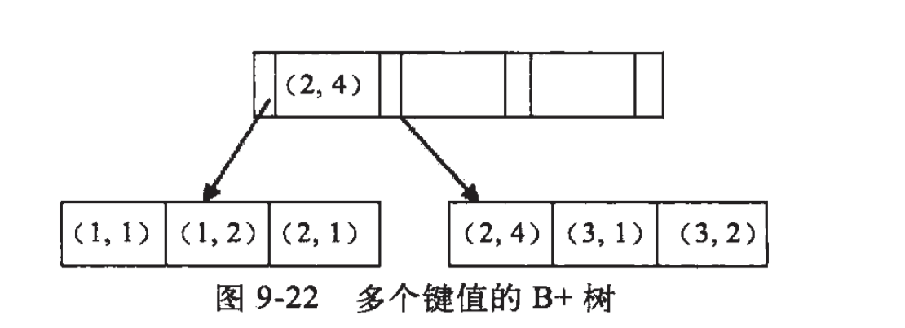

:::tip
本章内容简单的介绍，各类知识的详细介绍请移步：[MySQL是怎么运行的？](/数据库/书籍鉴赏/MySQL是怎样运行的/字符集和比较规则/字符集和比较规则简介)

相关知识书籍请移步：[MySQL海量数据存储与优化](/书籍下载/数据库/数据库#mysql)
:::

首先了解一下什么是索引，`索引`是对数据库表中一列或多列的值进行排序的数据结构，用于快速访问数据库表中的特定信息。

## 1、索引的几种类型或分类？

1）从`物理结构`上可以分为聚集索引和非聚集索引两类：

* `聚簇索引`指索引的键值的逻辑顺序与表中相应行的物理顺序一致，即每张表只能有一个聚簇索引，也就是我们常说的`主键索引`；

* `非聚簇索引`的逻辑顺序则与数据行的物理顺序不一致。

2）从`应用`上可以划分为一下几类：

* `普通索引`：`MySQL` 中的基本索引类型，没有什么限制，允许在定义索引的列中插入重复值和空值，纯粹为了提高查询效率。通过 `ALTER TABLE table_name ADD INDEX index_name (column)` 创建；

* `唯一索引`：索引列中的值必须是唯一的，但是允许为空值。通过 `ALTER TABLE table_name ADD UNIQUE index_name (column)` 创建；

* `主键索引`：特殊的唯一索引，也成聚簇索引，不允许有空值，并由数据库帮我们自动创建；

* `组合索引`：组合表中多个字段创建的索引，遵守最左前缀匹配规则；

* `全文索引`：只有在 `MyISAM` 引擎上才能使用，同时只支持 `CHAR`、`VARCHAR`、`TEXT` 类型字段上使用。

## 2、索引的优缺点？

先来说说优点：

* 创建索引可以大大提高系统的性能。

* 通过创建唯一性索引，可以保证数据库表中每一行数据的唯一性。

* 可以大大加快数据的检索速度，这也是创建索引的最主要的原因。

* 可以加速表和表之间的连接，特别是在实现数据的参考完整性方面特别有意义。

* 在使用分组和排序子句进行数据检索时，同样可以显著减少查询中分组和排序的时间。

* 通过使用索引，可以在查询的过程中，使用优化隐藏器，提高系统的性能。

既然增加索引有如此多的优点，为什么不对表中的每一个列都创建一个索引呢？这是因为索引也是有缺点的：

* 创建和维护索引需要耗费时间，这种时间随着数据量的增加而增加，这样就降低了数据的维护速度。

* 索引需要占物理空间，除了数据表占数据空间之外，每一个索引还要占一定的物理空间。如果要建立聚簇索引，那么需要的空间就会更大。

## 3、索引设计原则？

* 选择唯一性索引；

唯一性索引的值是唯一的，可以更快速的通过该索引来确定某条记录。

* 为常作为查询条件的字段建立索引；

如果某个字段经常用来做查询条件，那么该字段的查询速度会影响整个表的查询速度。因此，为这样的字段建立索引，可以提高整个表的查询速度。

* 为经常需要排序、分组和联合操作的字段建立索引；

经常需要 `ORDER BY`、`GROUP BY`、`DISTINCT` 和 `UNION` 等操作的字段，排序操作会浪费很多时间。如果为其建立索引，可以有效地避免排序操作。

* 限制索引的数目；

每个索引都需要占⽤用磁盘空间，索引越多，需要的磁盘空间就越大，修改表时，对索引的重构和更新很麻烦。

* 小表不建议索引（如数量级在百万以内）；

由于数据较小，查询花费的时间可能比遍历索引的时间还要短，索引可能不会产生优化效果。

* 尽量使用数据量少的索引；

如果索引的值很长，那么查询的速度会受到影响。此时尽量使用前缀索引。

* 删除不再使用或者很少使用的索引。

## 4、索引的数据结构？

索引的数据结构和具体存储引擎的实现有关，`MySQL` 中常用的是 `Hash` 和 `B+树`索引。

* `Hash索引`底层就是 `Hash表`，进行查询时调用 `Hash函数`获取到相应的键值（对应地址），然后回表查询获得实际数据.

* `B+树`索引底层实现原理是`多路平衡查找树`，对于每一次的查询都是从根节点出发，查询到叶子节点方可以获得所查键值，最后查询判断是否需要回表查询.

## 5、Hash 和 B+ 树索引的区别？

**Hash**

1）`Hash` 进行等值查询更快，但无法进行范围查询。因为经过 `Hash函数` 建立索引之后，索引的顺序与原顺序无法保持一致，故不能支持范围查询。同理，也不支持使用索引进行排序。

2）`Hash` 不支持模糊查询以及多列索引的最左前缀匹配,因为 `Hash函数` 的值不可预测，如 `AA` 和 `AB` 的算出的值没有相关性。

3）`Hash` 任何时候都避免不了回表查询数据.

4）虽然在等值上查询效率高，但性能不稳定，因为当某个键值存在大量重复时，产生 `Hash` 碰撞，此时查询效率反而可能降低。

**B+ Tree**

1）`B+树` 本质是一棵查找树，自然支持范围查询和排序。

2）在符合某些条件（聚簇索引、覆盖索引等）时候可以只通过索引完成查询，不需要回表。

3）查询效率比较稳定，因为每次查询都是从根节点到叶子节点，且为树的高度。

## 6、为何使用 B+ 树而非二叉查找树做索引？

我们知道二叉树的查找效率为 `O(logn)`，当树过高时，查找效率会下降。另外由于我们的索引文件并不小，所以是存储在磁盘上的。

文件系统需要从磁盘读取数据时，一般以页为单位进行读取，假设一个页内的数据过少，那么操作系统就需要读取更多的页，涉及磁盘 `随机I/O` 访问的次数就更多。将数据从磁盘读入内存涉及 `随机I/O` 的访问，是数据库里面成本最高的操作之一。

因而这种树高会随数据量增多急剧增加，每次更新数据又需要通过左旋和右旋维护平衡的二叉树，不太适合用于存储在磁盘上的索引文件。

## 7、为何使用 B+ 树而非 B 树做索引？

在此之前，先来了解一下 `B+树` 和 `B树` 的区别：

* `B树` 非叶子结点和叶子结点都存储数据，因此查询数据时，时间复杂度最好为 `O(1)`，最坏为 `O(log n)`。而 `B+树` 只在叶子结点存储数据，非叶子结点存储关键字，且不同非叶子结点的关键字可能重复，因此查询数据时，时间复杂度固定为 `O(log n)`。

* `B+树` 叶子结点之间用链表相互连接，因而只需扫描叶子结点的链表就可以完成一次遍历操作，`B树` 只能通过中序遍历。

## 8、为什么 B+树 比 B树 更适合应用于数据库索引？

* `B+树` 减少了 `IO` 次数。

由于索引文件很大因此索引文件存储在磁盘上，`B+树` 的非叶子结点只存关键字不存数据，因而单个页可以存储更多的关键字，即一次性读入内存的需要查找的关键字也就越多，磁盘的 `随机I/O` 读取次数相对就减少了。

* `B+树` 查询效率更稳定

由于数据只存在在叶子结点上，所以查找效率固定为 `O(log n)`，所以 `B+树` 的查询效率相比 `B树` 更加稳定。

* `B+树` 更加适合范围查找

`B+树` 叶子结点之间用链表有序连接，所以扫描全部数据只需扫描一遍叶子结点，利于扫库和范围查询；`B树` 由于非叶子结点也存数据，所以只能通过中序遍历按序来扫。也就是说，对于范围查询和有序遍历而言，`B+树` 的效率更高。

## 9、什么是最左匹配原则？

顾名思义，最左优先，以最左边为起点任何连续的索引都能匹配上。同时遇到范围查询（`>、<、between、like`）就会停止匹配。

如建立 `(a,b,c,d)` 索引，查询条件 `b = 2` 是匹配不到索引的，但是如果查询条件是 `a = 1 and b = 2` 或` a=1` 又或 `b = 2 and a = 1` 就可以，因为优化器会自动调整 `a,b` 的顺序。

再比如 `a = 1 and b = 2 and c > 3 and d = 4`，其中 `d` 是用不到索引的，因为 `c` 是一个范围查询，它之后的字段会停止匹配。

**最左匹配的原理:**

上图可以看出 `a` 是有顺序的（`1、1、2、2、3、3`），而 `b` 的值是没有顺序的（`1、2、1、4、1、2`）。所以 `b = 2` 这种查询条件无法利用索引。

同时我们还可以发现在 `a` 值相等的情况下（`a = 1`），`b` 又是顺序排列的，所以最左匹配原则遇上范围查询就会停止，剩下的字段都无法使用索引。

## 9、什么是覆盖索引？

覆盖索引是`select`的数据列只用从索引中就能够取得，不必读取数据行，换句话说查询列要被所建的索引覆盖。

在 `B+树` 的索引中，叶子节点可能存储了当前的键值，也可能存储了当前的键值以及整行的数据，这就是聚簇索引和非聚簇索引。 在 `InnoDB` 中，只有主键索引是聚簇索引，如果没有主键，则挑选一个唯一键建立聚簇索引。如果没有唯一键，则隐式的生成一个键来建立聚簇索引。

当查询使用聚簇索引时，在对应的叶子节点，可以获取到整行数据，因此不用再次进行回表查询。

## 10、什么是索引下推？

索引下推（`Index condition pushdown`） 简称 `ICP`，在 `Mysql 5.6` 版本上推出的一项用于优化查询的技术。

在不使用索引下推的情况下，在使用非主键索引进行查询时，存储引擎通过索引检索到数据，然后返回给 `MySQL` 服务器，服务器判断数据是否符合条件。

而有了索引下推之后，如果存在某些被索引列的判断条件时，`MySQL` 服务器将这一部分判断条件传递给存储引擎，然后由存储引擎通过判断索引是否符合 `MySQL` 服务器传递的条件，只有当索引符合条件时才会将数据检索出来返回给 `MySQL` 服务器。

索引条件下推优化可以减少存储引擎查询基础表的次数，也可以减少 `MySQL` 服务器从存储引擎接收数据的次数。