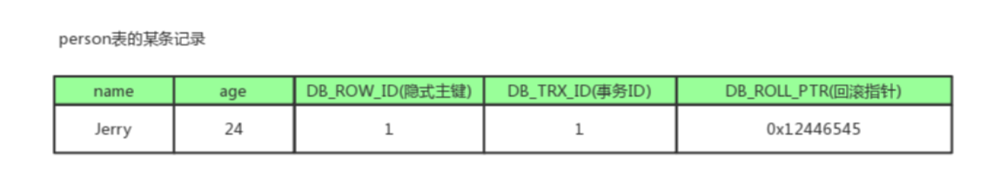

:::tip
本章内容简单的介绍，各类知识的详细介绍请移步：[MySQL是怎么运行的？](/数据库/书籍鉴赏/MySQL是怎样运行的/字符集和比较规则/字符集和比较规则简介)

相关知识书籍请移步：[MySQL海量数据存储与优化](/书籍下载/数据库/数据库#mysql)
:::

## 1、数据库锁的作用以及有哪些锁？

当数据库有并发事务的时候，可能会产生数据的不一致，这时候需要一些机制来保证访问的次序，锁机制就是这样的一个机制。即锁的作用是解决并发问题。

1) `从锁的粒度划分`，可以将锁分为表锁、行锁以及页锁。

* **行级锁**：是锁定粒度最细的一种锁，表示只针对当前操作的行进行加锁。行级锁能大大减少数据库操作的冲突。其加锁粒度最小，但加锁的开销也最大。

行级锁开销大，加锁慢，且会出现死锁。但锁定粒度最小，发生锁冲突的概率最低，并发度也最高。

* **表级锁**：是粒度最大的一种锁，表示对当前操作的整张表加锁，它实现简单，资源消耗较少，被大部分`MySQL`引擎支持。

* **页级锁**：是粒度介于行级锁和表级锁中间的一种锁。表级锁速度快，但冲突多，行级冲突少，但速度慢。所以取了折中的页级，一次锁定相邻的一组记录。

开销和加锁时间界于表锁和行锁之间，会出现死锁。锁定粒度界于表锁和行锁之间，并发度一般。

2) `从使用性质划分`，可以分为共享锁、排它锁以及更新锁。

* **共享锁（Share Lock）**：`S锁`，又称读锁，用于所有的只读数据操作。

`S锁` 并非独占，允许多个并发事务对同一资源加锁，但加 `S锁` 的同时不允许加 `X锁` ，即资源不能被修改。`S锁` 通常读取结束后立即释放，无需等待事务结束。

* **排他锁（Exclusive Lock）**：`X锁`，又称写锁，表示对数据进行写操作。

`X锁` 仅允许一个事务对同一资源加锁，且直到事务结束才释放，其他任何事务必须等到 `X锁` 被释放才能对该页进行访问。

使用 `select * from table_name for update;` 语句产生 `X锁`。

* **更新锁**：`U锁`，用来预定要对资源施加 `X锁`，允许其他事务读，但不允许再施加 `U锁` 或 `X锁`。

当被读取的页将要被更新时，则升级为 `X锁`，`U锁` 一直到事务结束时才能被释放。故 `U锁` 用来避免使用共享锁造成的`死锁`现象。

3) `从主观上划分`，又可以分为乐观锁和悲观锁。

* **乐观锁（Optimistic Lock）**：顾名思义，从主观上认定资源是不会被修改的，所以不加锁读取数据，仅当更新时用版本号机制等确认资源是否被修改。

乐观锁适用于多读的应用类型，可以系统提高吞吐量。

* **悲观锁（Pessimistic Lock）**：正如其名，具有强烈的独占和排它特性，每次读取数据时都会认为会被其它事务修改，所以每次操作都需要加上锁。

## 2、隔离级别和锁的关系？

1）在 `Read Uncommitted` 级别下，读取数据不需要加共享锁，这样就不会跟被修改的数据上的排他锁冲突；

2）在 `Read Committed` 级别下，读操作需要加共享锁，但是在语句执行完以后释放共享锁；

3）在 `Repeatable Read` 级别下，读操作需要加共享锁，但是在事务提交之前并不释放共享锁，也就是必须等待事务执行完毕以后才释放共享锁；

4）在 `SERIALIZABLE` 级别下，限制性最强，因为该级别锁定整个范围的键，并一直持有锁，直到事务完成。

## 3、InnoDB 中的锁算法？

* **Record lock**：单个行记录上的锁
* **Gap lock**：间隙锁，锁定一个范围，不包括记录本身
* **Next-key lock**：`record + gap` 锁定一个范围，包含记录本身

ref 锁机制与InnoDB锁算法

## 4、什么是快照读和当前读？

* 当前读

像`select lock in share mode`(共享锁), `select for update` ; `update`, `insert` ,`delete`(排他锁)这些操作都是一种当前读，为什么叫当前读？
就是它读取的是记录的最新版本，读取时还要保证其他并发事务不能修改当前记录，会对读取的记录进行加锁

* 快照读

像不加锁的`select`操作就是快照读，即不加锁的非阻塞读；快照读的前提是隔离级别不是串行级别，串行级别下的快照读会退化成当前读；之所以出现快照读的情况，是基于提高并发性能的考虑，
快照读的实现是基于多版本并发控制，即`MVCC`,可以认为`MVCC`是行锁的一个变种，但它在很多情况下，避免了加锁操作，降低了开销；既然是基于多版本，即快照读可能读到的并不一定是数据的最新版本，
而有可能是之前的历史版本

说白了`MVCC`就是为了实现`读-写冲突不加锁`，而这个读指的就是`快照读`, 而非当前读，当前读实际上是一种加锁的操作，是悲观锁的实现

## 5、什么是 MVCC 以及实现？

`MVCC` 的英文全称是 `Multiversion Concurrency Control`，中文意思是多版本并发控制，可以做到读写互相不阻塞，主要用于解决不可重复读和幻读问题时提高并发效率。

`MVCC`的目的就是多版本并发控制，在数据库中的实现，就是为了解决读写冲突，它的实现原理主要是依赖记录中的 `3`个隐式字段，`undo日志` ，`Read View` 来实现的。所以我们先来看看这个三个`point`的概念

**隐式字段**

每行记录除了我们自定义的字段外，还有数据库隐式定义的`DB_TRX_ID`,`DB_ROLL_PTR`,`DB_ROW_ID`等字段

* **DB_TRX_ID**: `6byte`，最近修改(修改/插入)事务`ID`：记录创建这条记录/最后一次修改该记录的事务`ID`
* **DB_ROLL_PTR**: `7byte`，回滚指针，指向这条记录的上一个版本（存储于`rollback segment`里）
* **DB_ROW_ID**: `6byte`，隐含的`自增ID`（隐藏主键），如果数据表没有主键，`InnoDB`会自动以`DB_ROW_ID`产生一个聚簇索引
* 实际还有一个删除`flag`隐藏字段, 既记录被更新或删除并不代表真的删除，而是删除`flag`变了

如上图，`DB_ROW_ID`是数据库默认为该行记录生成的唯一隐式主键，`DB_TRX_ID`是当前操作该记录的`事务ID`,而`DB_ROLL_PTR`是一个回滚指针，用于配合`undo日志`，指向上一个`旧版本`