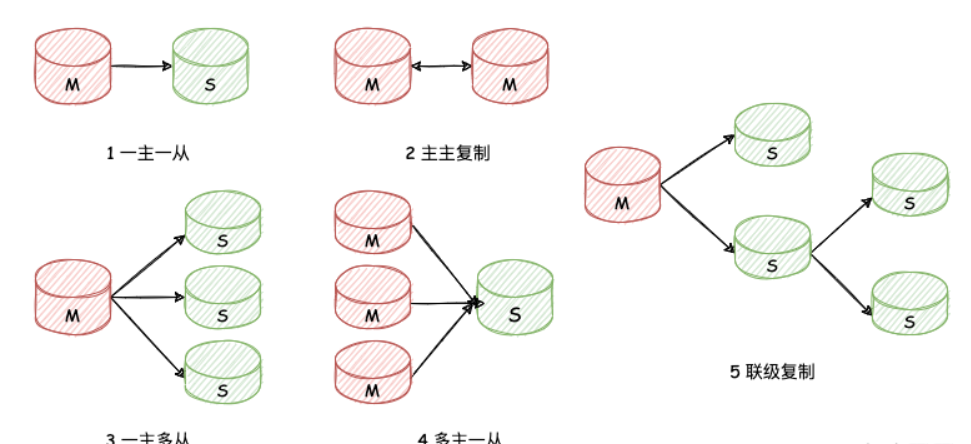
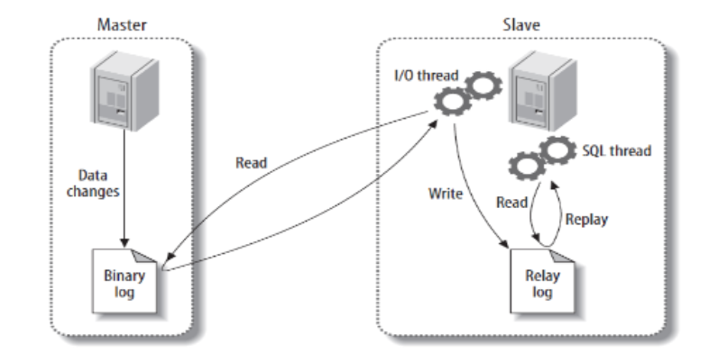

:::tip
本章内容简单的介绍，各类知识的详细介绍请移步：[MySQL是怎么运行的？](/数据库/书籍鉴赏/MySQL是怎样运行的/字符集和比较规则/字符集和比较规则简介)

相关知识书籍请移步：[MySQL海量数据存储与优化](/书籍下载/数据库/数据库#mysql)
:::

## 一、 日志

### 1、MySQL 中有哪些常见日志？

* **重做日志（redo log）**：物理日志。作用是确保事务的持久性。 `redo` 日志记录事务执行后的状态，用来恢复未写入 `data file` 的已提交事务数据。

* **回滚日志（undo log）**：逻辑日志。作用是保证数据的原子性。 保存了事务发生之前的数据的一个版本，可以用于回滚，同时可以提供多版本并发控制下的读（`MVCC`），也即非锁定读。

* **二进制日志（binlog）**：逻辑日志。常用于主从同步或数据同步中，也可用于数据库基于时间点的还原。

* **错误日志（errorlog）**：记录着 `MySQL` 启动和停止，以及服务器在运行过程中发生的错误的相关信息。在默认情况下，系统记录错误日志的功能是关闭的，错误信息被输出到标准错误输出。

* **普通查询日志（general query log）**：记录了服务器接收到的每一个命令，无论命令语句是否正确，因此会带来不小开销，所以也是默认关闭的。

* **慢查询日志（slow query log）**：记录执行时间过长和没有使用索引的查询语句（默认 `10s`），同时只会记录执行成功的语句。

* **中继日志（relay log）**：在从节点中存储接收到的 `binlog` 日志内容，用于主从同步。

## 二、 主从复制

### 1、什么是主从复制？

主从复制是用来建立一个与主数据库完全一样的数据库环境，即从数据库。主数据库一般是准实时的业务数据库。

### 2、主从复制的作用？

* 读写分离，使数据库能支撑更大的并发。
* 高可用，做数据的热备，作为后备数据库，主数据库服务器故障后，可切换到从数据库继续工作，避免数据丢失。

### 3、主从复制的架构？

* **一主一从或一主多从**：在主库的请求压力非常大时，可通过配置一主多从复制架构实现读写分离，把大量对实时性要求不是很高的请求通过负载均衡分发到多个从库上去读取数据，降低主库的读取压力。
而且在主库出现宕机时，可将一个从库切换为主库继续提供服务。

* **主主复制**： 双主复制架构适用于需要进行主从切换的场景。 两个数据库互为主从，当主库宕机恢复后，由于它还是原来从库（现在主库）的从机，所以它还是会复制新的主库上的数据。
那么无论主库的角色怎么切换，原来的主库都不会脱离复制环境。

* **多主一从（5.7 开始支持）**

* **联级复制**： 因为每个从库在主库上都会有一个独立的 `Binlog Dump` 线程来推送 `binlog` 日志，所以随着从库数量的增加，主库的 `IO` 压力和网络压力也会随之增加，这时，联级复制架构应运而生。

联级复制架构只是在一主多从的基础上，再主库和各个从库之间增加了一个二级主库 `Master2`，这个二级主库仅仅用来将一级主库推送给它的 `Binlog` 日志再推送给各个从库，以此来减轻一级主库的推送压力。

### 4、主从复制的原理？

1. 数据库有个`bin-log`二进制文件，记录了所有`sql`语句。
2. 我们的目标就是把主数据库的`bin-log`文件的`sql`语句复制过来。
3. 让其在从数据的r`elay-log`重做日志文件中再执行一次这些`sql`语句即可。
4. 下面的主从配置就是围绕这个原理配置
5. 具体需要三个线程来操作：
   * **binlog输出线程**:每当有从库连接到主库的时候，主库都会创建一个线程然后发送`binlog`内容到从库。在从库里，当复制开始的时候，从库就会创建两个线程进行处理: `从库I/O线程` 和 `从库的SQL线程`
   * **从库I/O线程**:当`START SLAVE`语句在从库开始执行之后，从库创建一个`I/O`线程，该线程连接到主库并请求主库发送`binlog`里面的更新记录到从库上。`从库I/O线程`读取主库的`binlog`输出线程发送的更新并拷贝这些更新到本地文件，其中包括`relay log`文件。 
   * **从库的SQL线程**:从库创建一个`SQL`线程，这个线程读取`从库I/O线程`写到`relay log`的更新事件并执行。

步骤一：主库`db`的更新事件(`update`、`insert`、`delete`)被写到`binlog`

步骤二：从库发起连接，连接到主库

步骤三：此时主库创建一个`binlog dump thread`线程，把`binlog`的内容发送到从库

步骤四：从库启动之后，创建一个`I/O线程`，读取主库传过来的`binlog`内容并写入到`relay log`.

步骤五：还会创建一个`SQL线程`，从`relay log`里面读取内容，从`Exec_Master_Log_Pos`位置开始执行读取到的更新事件，将更新内容写入到`slave`的`db`.

### 5、什么是异步复制和半同步？

`MySQL` 的主从复制有两种复制方式，分别是`异步复制`和`半同步复制`：

* **异步复制** : `MySQL` 默认的主从复制方式就是异步复制，因为 `Master` 根本不考虑数据是否达到了 `Slave`，或 `Slave` 是否成功执行。

如过需要实现完全同步方式，即 `Master` 需要等待一个或所有 `Slave` 执行成功后才响应成功，那集群效率可想而知。故 `MySQL 5.6` 之后出现了一种折中的方式——半同步。

* **半同步复制** : 一主一从，一主多从情况下，`Master` 节点只要确认至少有一个 `Slave` 接受到了事务，即可向发起请求的客户端返回执行成功的操作。同时 `Master` 是不需要等待 `Slave` 成功执行完这个事务，`Slave` 节点接受到这个事务，并成功写入到本地 `relay` 日志中就算成功。

另外，在半同步复制时，如果主库的一个事务提交成功了，在推送到从库的过程当中，从库宕机了或网络故障，导致从库并没有接收到这个事务的Binlog，此时主库会等待一段时间（这个时间由`rpl_semi_sync_master_timeout`的毫秒数决定），
如果这个时间过后还无法推送到从库，那 `MySQL` 会自动从半同步复制切换为异步复制，当从库恢复正常连接到主库后，主库又会自动切换回半同步复制。

半同步复制的“半”体现在，虽然主从库的`Binlog`是同步的，但主库不会等待从库执行完`Relay-log`后才返回，而是确认从库接收到`Binlog`，达到主从`Binlog`同步的目的后就返回了，
所以从库的数据对于主库来说还是有延时的，这个延时就是从库执行`Relay-log`的时间。所以只能称为半同步。

### 6、主从中常见问题以及解决？

#### 问题

1）主库宕机后，数据可能丢失。

2）从库只有一个`sql Thread`，主库写压力大，复制很可能延时。

#### 解决

1）半同步复制：确保事务提交后 `binlog` 至少传输到一个从库 ，解决数据丢失的问题。

2）并行复制：从库多线程`apply binlog`，解决从库复制延迟的问题