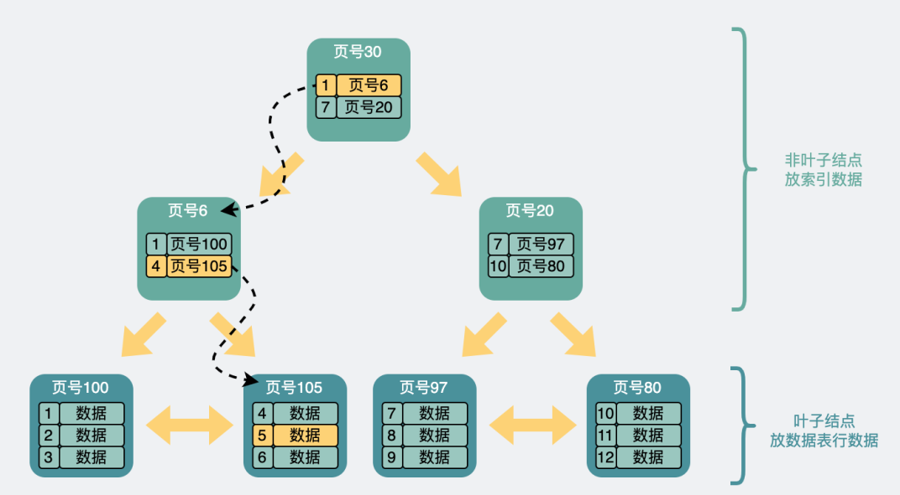
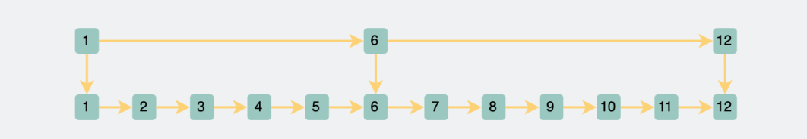
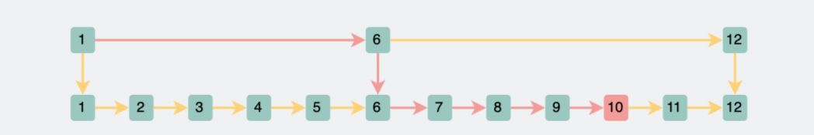
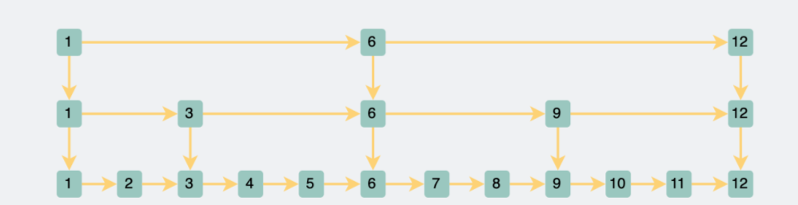
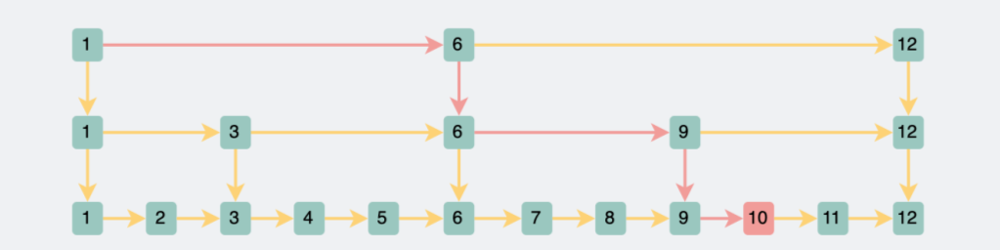
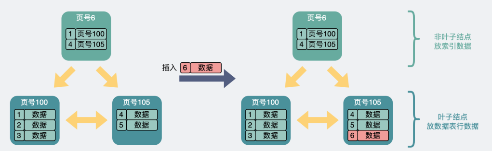
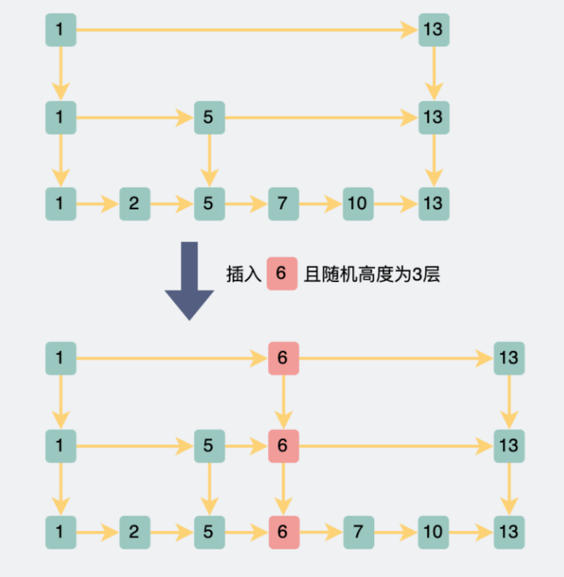

> 查询数据性能在 lg(n) 级别的数据结构有很多，比如redis的zset里用到的跳表，也是lg(n)，并且实现还贼简单。那为什么MySQL的索引，不使用跳表呢?

在我们的印象中，`mysql`数据表里无非就是存储一行行的数据。跟个`excel`似的。直接遍历这一行行数据，性能就是`O(n)`，比较慢。为了加速查询，使用了`B+树`来做索引，将查询性能优化到了`O(lg(n))`。但问题就来了，查询数据性能在 `lg(n)` 级别的数据结构有很多，
比如`redis`的`zset`里用到的`跳表`，也是`lg(n)`，并且实现还贼简单。那为什么`mysql`的索引，不使用跳表呢?我们今天就来聊聊这个话题。

## B+树的结构

在这里，为了混点字数，我简单总结下`B+树`的结构:

如上图，一般`B+树`是由多个页组成的多层级结构，每个页`16Kb`，对于主键索引来说，最末级的叶子结点放行数据，非叶子结点放的则是索引信息(主键id和页号)，用于加速查询。

比方说我们想要查找行数据`5`:

1. 会先从顶层页的`record`们入手。`record`里包含了主键id和页号(页地址)。关注黄色的箭头，向左最小`id`是`1`，向右最小`id`是`7`。那`id=5`的数据如果存在，那必定在左边箭头。于是顺着的`record`的页地址就到了`6`号数据页里，再判断`id=5>4`，所以肯定在右边的数据页里，于是加载`105`号数据页。

2. 在`105`号数据页里，虽然有多行数据，但也不是挨个遍历的，数据页内还有个页目录的信息，它可以通过二分查找的方式加速查询行数据，于是找到`id=5`的数据行，完成查询。

从上面可以看出，`B+树`利用了空间换时间的方式(构造了一批非叶子结点用于存放索引信息)，将查询时间复杂度从`O(n)`优化为`O(lg(n))`。

## 跳表的结构

看完`B+树`，我们再来看下`跳表`是怎么来的。同样的，还是为了存储一行行的数据。我们可以将它们用链表串起来:

想要查询链表中的其中一个结点，时间复杂度是`O(n)`，这谁顶得住，于是将部分链表结点提出来，再构建出一个新的链表。

这样当我想要查询一个数据的时候，我先查上层的链表，就很容易知道数据落在哪个范围，然后跳到下一个层级里进行查询。这样就把搜索范围一下子缩小了一大半。

比如查询`id=10`的数据:

1. 我们先在上层遍历，依次判断`1,6,12`，很快就可以判断出`10`在`6`到`12`之间
2. 然后往下一跳，就可以在遍历`6,7,8,9,10`之后，确定`id=10`的位置。
3. 直接将查询范围从原来的`1`到`10`，变成现在的`1,6,7,8,9,10`，算是砍半了。

既然两层链表就直接将查询范围砍半了，那我多加几层，岂不妙哉? 于是跳表就这样变成了多层。

如果还是查询`id=10`的数据，就只需要查询`1,6,9,10`就能找到，比两层的时候更快一些。

可以看出，跳表也是通过牺牲空间换取时间的方式提升查询性能。时间复杂度都是`lg(n)`。

## B+树和跳表的区别

从上面可以看到，`B+树`和`跳表`的最下面一层，都包含了所有的数据，且都是顺序的，适合用于范围查询。往上的层级都是构建出来用于提升搜索性能的。这两者实在是太像了。但他们两者在新增和删除数据时，还是有些区别的。下面我们以新增数据为例聊一下。

## B+树新增数据会怎么样

`B+树`本质上是一种`多叉平衡二叉树`。关键在于`"平衡"`这两个字，对于多叉树结构来说，它的含义是子树们的高度层级尽量一致(一般最多差一个层级)，这样在搜索的时候，不管是到哪个子树分支，搜索次数都差不了太多。当数据库表不断插入新的数据时，为了维持`B+树`的平衡，
`B+树`会不断分裂调整数据页。我们知道`B+树`分为叶子结点和非叶子结点。当插入一条数据时，叶子结点和它上层的索引结点(非叶子结点)最大容量都是`16k`，它们都有可能会满。为了简化问题，我们假设一个数据页只能放三条行数据或索引。加入一条数据，根据数据页会不会满，分为三种情况。

* 叶子结点和索引结点都没满。这种情况最简单，直接插入到叶子结点中就好了。

* 叶子结点满了，但索引结点没满。此时需要拆分叶子结点，同时索引结点要增加新的索引信息。

* 叶子结点满了，且索引结点也满了。叶子和索引结点都要拆分，同时往上还要再加一层索引。

从上面可以看到，只有在叶子和索引结点都满了的情况下，`B+`树才会考虑加入一层新的结点。要把三层`B+树`塞满，那大概需要`2kw`左右的数据。

## 跳表新增数据

`跳表`同样也是很多层，新增一个数据时，最底层的链表需要插入数据。此时，是否需要在上面的几层中加入数据做索引呢?这个就纯靠随机函数了。理论上为了达到二分的效果，每一层的结点数需要是下一层结点数的二分之一。也就是说现在有一个新的数据插入了，
它有`50%`的概率需要在第二层加入索引，有`25%`的概率需要在第三层加个索引，以此类推，直到最顶层。

举个例子，如果跳表中插入数据`id=6`，且随机函数返回第三层(有`25%`的概率)，那就需要在跳表的最底层到第三层都插入数据。

如果这个随机函数设计成上面这样，当数据量样本足够大的时候，数据的分布就符合我们理想中的"二分"。跟上面B+树不一样，跳表是否新增层数，纯粹靠随机函数，根本不关心前后上下结点。

## Mysql的索引为什么使用B+树而不使用跳表?

`B+树`是多叉树结构，每个结点都是一个`16k`的数据页，能存放较多索引信息，所以`扇出`很高。三层左右就可以存储`2kw`左右的数据(知道结论就行，想知道原因可以看之前的文章)。也就是说查询一次数据，如果这些数据页都在磁盘里，那么最多需要查询三次磁盘`IO`。

`跳表`是链表结构，一条数据一个结点，如果最底层要存放`2kw`数据，且每次查询都要能达到二分查找的效果，`2kw`大概在`2`的`24`次方左右，所以，跳表大概高度在`24`层左右。最坏情况下，这`24`层数据会分散在不同的数据页里，也即是查一次数据会经历`24`次磁盘`IO`。

**因此存放同样量级的数据，B+树的高度比跳表的要少，如果放在mysql数据库上来说，就是磁盘IO次数更少，因此B+树查询更快。**

而针对写操作，`B+树`需要拆分合并索引数据页，跳表则独立插入，并根据随机函数确定层数，没有旋转和维持平衡的开销，**因此跳表的写入性能会比B+树要好**。

其实，`mysql`的存储引擎是可以换的，以前是`myisam`，后来才有的`innodb`，它们底层索引用的都是`B+树`。也就是说，你完全可以造一个索引为跳表的存储引擎装到`mysql`里。事实上，`facebook`造了个`rocksDB`的存储引擎，里面就用了跳表。直接说结论，
它的写入性能确实是比`innodb`要好，但读性能确实比`innodb`要差不少。

## Redis为什么使用跳表而不使用B+树或二叉树呢?

`redis`支持多种数据结构，里面有个有序集合，也叫`ZSET`。内部实现就是`跳表`。那为什么要用`跳表`而不用`B+树`等结构呢?这个几乎每次面试都要被问一下。虽然已经很熟了，但每次都要装作之前没想过，现场思考一下才知道答案。真的，很考验演技。

大家知道，`redis` 是纯纯的内存数据库。进行读写数据都是操作内存，跟磁盘没啥关系，因此也不存在磁盘`IO`了，所以层高就不再是跳表的劣势了。并且前面也提到`B+树`是有一系列合并拆分操作的，换成`红黑树`或者其他`AVL树`的话也是各种旋转，目的也是为了保持树的平衡。
而跳表插入数据时，只需要随机一下，就知道自己要不要往上加索引，根本不用考虑前后结点的感受，也就**少了旋转平衡的开销**。

因此，`redis`选了跳表，而不是`B+树`。

## 总结

* `B+树`是多叉平衡搜索树，扇出高，只需要3层左右就能存放`2kw`左右的数据，同样情况下跳表则需要`24`层左右，假设层高对应磁盘`IO`，那么`B+树`的读性能会比`跳表`要好，因此`mysql`选了`B+树`做索引。

* `redis`的读写全在内存里进行操作，不涉及磁盘`IO`，同时跳表实现简单，相比`B+树`、`AVL树`、少了旋转树结构的开销，因此`redis`使用`跳表`来实现`ZSET`，而不是树结构。

* 存储引擎`RocksDB`内部使用了`跳表`，对比使用`B+树`的`innodb`，虽然写性能更好，但读性能属实差了些。