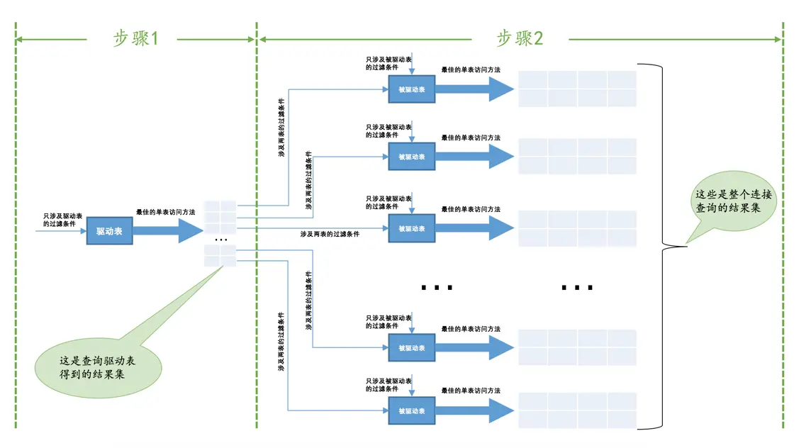
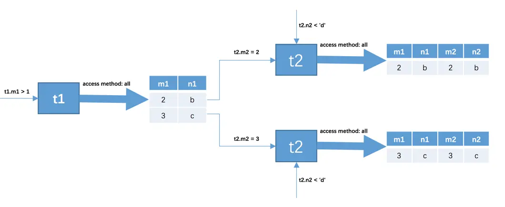
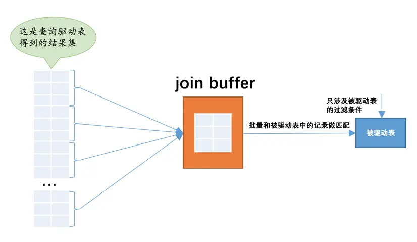

# 连接的原理

上边贼啰嗦的介绍都只是为了唤醒大家对`连接`、`内连接`、`外连接`这些概念的记忆，这些基本概念是为了真正进入本章主题做的铺垫。真正的重点是MySQL采用了什么样的算法来进行表与表之间的连接，
了解了这个之后，大家才能明白为啥有的连接查询运行的快如闪电，有的却慢如蜗牛。

## 嵌套循环连接（Nested-Loop Join）

我们前边说过，对于两表连接来说，驱动表只会被访问一遍，但被驱动表却要被访问到好多遍，具体访问几遍取决于对驱动表执行单表查询后的结果集中的记录条数。对于内连接来说，选取哪个表为驱动表都没关系，
而外连接的驱动表是固定的，也就是说左（外）连接的驱动表就是左边的那个表，右（外）连接的驱动表就是右边的那个表。我们上边已经大致介绍过`t1`表和`t2`表执行内连接查询的大致过程，我们温习一下：

* 步骤1：选取驱动表，使用与驱动表相关的过滤条件，选取代价最低的单表访问方法来执行对驱动表的单表查询。

* 步骤2：对上一步骤中查询驱动表得到的结果集中每一条记录，都分别到被驱动表中查找匹配的记录。

通用的两表连接过程如下图所示：



如果有`3`个表进行连接的话，那么`步骤2`中得到的结果集就像是新的`驱动表`，然后第三个表就成为了`被驱动表`，重复上边过程，也就是`步骤2`中得到的结果集中的每一条记录都需要到`t3`表中找一找有没有匹配的记录，
用伪代码表示一下这个过程就是这样：

```java
for each row in t1 {   #此处表示遍历满足对t1单表查询结果集中的每一条记录
    
    for each row in t2 {   #此处表示对于某条t1表的记录来说，遍历满足对t2单表查询结果集中的每一条记录
    
        for each row in t3 {   #此处表示对于某条t1和t2表的记录组合来说，对t3表进行单表查询
            if row satisfies join conditions, send to client
        }
    }
}

```

这个过程就像是一个嵌套的循环，所以这种驱动表只访问一次，但被驱动表却可能被多次访问，访问次数取决于对驱动表执行单表查询后的结果集中的记录条数的连接执行方式称之为`嵌套循环连接`（`Nested-Loop Join`），
这是最简单，也是最笨拙的一种连接查询算法。

## 使用索引加快连接速度

我们知道在嵌套循环连接的步骤2中可能需要访问多次被驱动表，如果访问被驱动表的方式都是全表扫描的话，妈呀，那得要扫描好多次呀～～～ 但是别忘了，查询`t2`表其实就相当于一次单表扫描，
我们可以利用索引来加快查询速度哦。回顾一下最开始介绍的`t1`表和`t2`表进行内连接的例子：

```sql
SELECT * FROM t1, t2 WHERE t1.m1 > 1 AND t1.m1 = t2.m2 AND t2.n2 < 'd';
```

我们使用的其实是嵌套循环连接算法执行的连接查询，再把上边那个查询执行过程表拉下来给大家看一下：



查询驱动表`t1`后的结果集中有两条记录，嵌套循环连接算法需要对被驱动表查询`2`次：

* 当`t1.m1 = 2`时，去查询一遍`t2`表，对`t2`表的查询语句相当于：

```sql
SELECT * FROM t2 WHERE t2.m2 = 2 AND t2.n2 < 'd';
```

* 当`t1.m1 = 3`时，再去查询一遍`t2`表，此时对`t2`表的查询语句相当于：

```sql
SELECT * FROM t2 WHERE t2.m2 = 3 AND t2.n2 < 'd';
```

可以看到，原来的`t1.m1 = t2.m2`这个涉及两个表的过滤条件在针对`t2`表做查询时关于`t1`表的条件就已经确定了，所以我们只需要单单优化对`t2`表的查询了，
上述两个对`t2`表的查询语句中利用到的列是`m2`和`n2`列，我们可以：

* 在`m2`列上建立索引，因为对`m2`列的条件是等值查找，比如`t2.m2 = 2`、`t2.m2 = 3`等，所以可能使用到`ref`的访问方法，假设使用`ref`的访问方法去执行对`t2`表的查询的话，
需要`回表`之后再判断`t2.n2 < d`这个条件是否成立。

这里有一个比较特殊的情况，就是假设`m2`列是`t2`表的主键或者唯一二级索引列，那么使用`t2.m2 = 常数值`这样的条件从`t2`表中查找记录的过程的代价就是常数级别的。
我们知道在单表中使用主键值或者唯一二级索引列的值进行等值查找的方式称之为`const`，而设计MySQL的大叔把在连接查询中对被驱动表使用主键值或者唯一二级索引列的值进行等值查找的查询执行方式称之为：
`eq_ref`。

* 在`n2`列上建立索引，涉及到的条件是`t2.n2 < 'd'`，可能用到`range`的访问方法，假设使用`range`的访问方法对`t2`表的查询的话，需要`回表`之后再判断在`m2`列上的条件是否成立。

假设`m2`和`n2`列上都存在索引的话，那么就需要从这两个里边儿挑一个代价更低的去执行对`t2`表的查询。当然，建立了索引不一定使用索引，只有在`二级索引 + 回表`的代价比全表扫描的代价更低时才会使用索引。

另外，有时候连接查询的查询列表和过滤条件中可能只涉及被驱动表的部分列，而这些列都是某个索引的一部分，这种情况下即使不能使用`eq_ref`、`ref`、`ref_or_null`或者`range`这些访问方法执行对被驱动表的查询的话，
也可以使用索引扫描，也就是`index`的访问方法来查询被驱动表。所以我们建议在真实工作中最好不要使用`*`作为查询列表，最好把真实用到的列作为查询列表。

## 基于块的嵌套循环连接（Block Nested-Loop Join）


扫描一个表的过程其实是先把这个表从`磁盘`上加载到`内存`中，然后从内存中比较匹配条件是否满足。现实生活中的表可不像`t1`、`t2`这种只有`3`条记录，成千上万条记录都是少的，
几百万、几千万甚至几亿条记录的表到处都是。内存里可能并不能完全存放的下表中所有的记录，所以在扫描表前边记录的时候后边的记录可能还在磁盘上，等扫描到后边记录的时候可能内存不足，
所以需要把前边的记录从内存中释放掉。我们前边又说过，采用嵌套循环连接算法的两表连接过程中，被驱动表可是要被访问好多次的，如果这个被驱动表中的数据特别多而且不能使用索引进行访问，
那就相当于要从磁盘上读好几次这个表，这个`I/O`代价就非常大了，所以我们得想办法：尽量减少访问被驱动表的次数。

当`被驱动表`中的数据非常多时，每次访问`被驱动表`，`被驱动表`的记录会被加载到`内存`中，在内存中的每一条记录只会和驱动表结果集的一条记录做匹配，之后就会被从内存中清除掉。
然后再从驱动表结果集中拿出另一条记录，再一次把被驱动表的记录加载到内存中一遍，周而复始，驱动表结果集中有多少条记录，就得把被驱动表从磁盘上加载到内存中多少次。
所以我们可不可以在把被驱动表的记录加载到内存的时候，一次性和多条驱动表中的记录做匹配，这样就可以大大减少重复从磁盘上加载被驱动表的代价了。所以设计MySQL的大叔提出了一个`join buffer`的概念，
`join buffer`就是**执行连接查询前申请的一块固定大小的内存，先把若干条驱动表结果集中的记录装在这个`join buffer`中**，然后开始扫描被驱动表，
每一条被驱动表的记录一次性和`join buffer`中的多条驱动表记录做匹配，因为匹配的过程都是在内存中完成的，所以这样可以显著减少被驱动表的`I/O`代价。使用`join buffer`的过程如下图所示：



最好的情况是`join buffer`足够大，能容纳驱动表结果集中的所有记录，这样只需要访问一次`被驱动表`就可以完成连接操作了。设计MySQL的大叔把这种加入了`join buffer`的嵌套循环连接算法称之为`基于块的嵌套连接`（`Block Nested-Loop Join`）算法。

这个`join buffer`的大小是可以通过启动参数或者系统变量`join_buffer_size`进行配置，默认大小为`262144`字节（也就是`256KB`），最小可以设置为`128`字节。当然，
对于优化被驱动表的查询来说，最好是为`被驱动表`加上效率高的索引，如果实在不能使用索引，并且自己的机器的内存也比较大可以尝试调大`join_buffer_size`的值来对连接查询进行优化。

另外需要注意的是，`驱动表`的记录并不是所有列都会被放到`join buffer`中，只有查询列表中的列和过滤条件中的列才会被放到`join buffer`中，所以再次提醒我们，
最好不要把`*`作为查询列表，只需要把我们关心的列放到查询列表就好了，这样还可以在`join buffer`中放置更多的记录呢哈。


