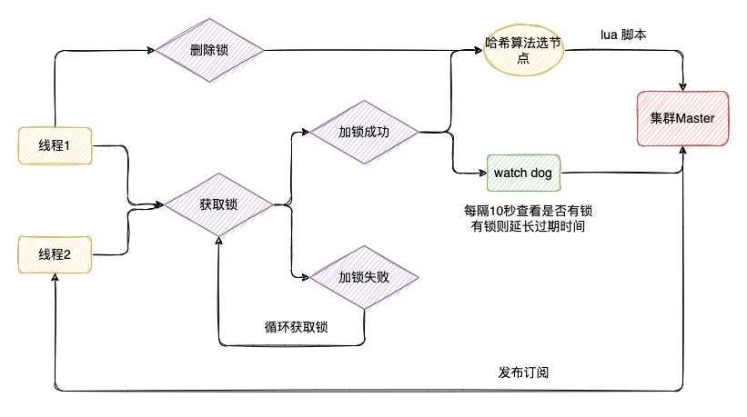

## 1、如何设置 Key 当天失效？

* `expireAt`

* `key` 值带上时间戳

## 2、如何实现分布式锁？

* **「互斥性」**: 任意时刻，只有一个客户端能持有锁
* **「锁超时释放」**：持有锁超时，可以释放，防止不必要的资源浪费，也可以防止死锁
* **「可重入性」**: 一个线程如果获取了锁之后,可以再次对其请求加锁
* **「高性能和高可用」**：加锁和解锁需要开销尽可能低，同时也要保证高可用，避免分布式锁失效
* **「安全性」**：锁只能被持有的客户端删除，不能被其他客户端删除

**Redison 底层原理：**



**RedLock 加锁步骤：**

1）按顺序向集群中所有 `master` 节点请求加锁；

2）根据设置的超时时间来判断，是不是要跳过该 `master` 节点；

3）如果大于等于半数节点`（ N/2+1 ）`加锁成功，并且使用的时间小于锁的有效期，即可认定加锁成功啦；

4）如果获取锁失败，解锁！

详情移步：[Redis实现分布式锁的7种方案](/数据库/Redis/进阶问题/Redis实现分布式锁的7种方案)

## 3、 如何实现排行榜功能？

活动运营中经常会有这样的需求：

1）Value 值排序 

2）Value 相同按时间排序。

* 使用 `MySQL`：

```mysql
EXPLAIN SELECT
    *
FROM
    (
        SELECT
            @rank := @rank + 1 AS rank,
            s.uid AS uid,
            s.coin AS coin
        FROM
            `user` s,
            (SELECT @rank := 0) r
        ORDER BY
            coin DESC,
            create_time
    ) q
WHERE
    q.uid = 'xxx';
```

* 使用 `Redis`：

```redis
# 插入或者更新数据
Long zadd(final String key, final double score, final String member)
key : 排行榜的名字
memeber : 用户
score : 用户的分数
# 获取用户分数
Double zscore(String key, final String member)
# 获取用户的排名
Long zrevrank(final String key, final String member)：（score从大到小，从0开始，所以需要加1）
Long zrank(final String key, final String member)：（score从小到大，从0开始，所以需要加1）
# 获取某个范围内的用户排名
Set<Tuple> zrevrangeWithScoresBytes(String key, final long start, final long end) （从大到小）
Set<Tuple> zrangeWithScoresBytes(String key, final long start, final long end) （从小到大）
start ： 开始排名
end ： 结束排名
Tuple :
```

同时为了实现先到先得，`zset` 中的 `score` 并不能仅仅是排序的 `Value` 值，还需加入时间戳因子：`score = (value * 10000000000(十次方)) + (100000000000(十一次方) - ts)`。

由于时间戳相同一个月的时间内，头三位是相等的，即我们还可以进一步压缩时间位数以提高排序值的精度。

详情移步：[Redis实现排行榜](/数据库/Redis/进阶问题/Redis实现排行榜)