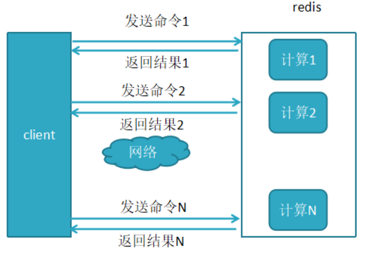
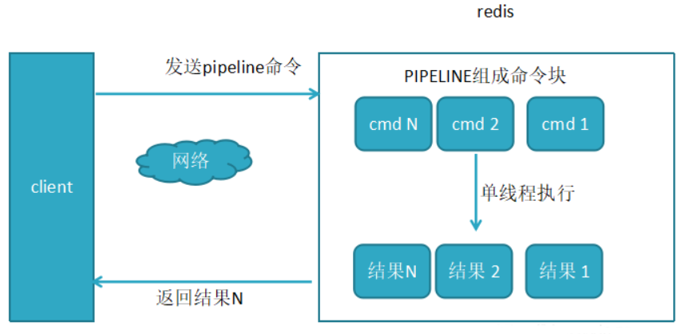
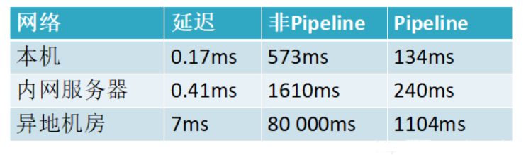

## 一、 常见考点

### 1、Redis 为何这么快？

1）基于内存；

2）单线程减少上下文切换，同时保证原子性；

3）`IO`多路复用；

4）高级数据结构（如 `SDS`、`Hash`以及`跳表`等）。

### 2、为何使用单线程？

* 官方答案

因为 `Redis` 是基于内存的操作，`CPU` 不会成为 `Redis` 的瓶颈，而最有可能是机器内存的大小或者网络带宽。既然单线程容易实现，而且 `CPU` 不会成为瓶颈，那就顺理成章地采用单线程的方案了。

* 详细原因

1）不需要各种锁的性能消耗

`Redis` 的数据结构并不全是简单的 `Key-Value`，还有 `List`，`Hash` 等复杂的结构，这些结构有可能会进行很细粒度的操作，比如在很长的列表后面添加一个元素，在`hash`当中添加或者删除一个对象。
这些操作可能就需要加非常多的锁，导致的结果是同步开销大大增加。

2）单线程多进程集群方案

单线程的威力实际上非常强大，每核心效率也非常高，多线程自然是可以比单线程有更高的性能上限，但是在今天的计算环境中，即使是单机多线程的上限也往往不能满足需要了，需要进一步摸索的是多服务器集群化的方案，这些方案中多线程的技术照样是用不上的。

**所以单线程、多进程的集群不失为一个时髦的解决方案。**

### 3、缓存三大问题以及解决方案？

* **缓存穿透**：查询数据不存在

1）缓存空值

2）`key` 值校验，如`布隆筛选器`

* **缓存击穿**：缓存过期，伴随大量对该 `key` 的请求

1）互斥锁

2）热点数据永不过期

3）熔断降级

* **缓存雪崩**：同一时间大批量的 `key` 过期

1）热点数据不过期

2）随机分散过期时间

### 4、先删后写还是先写后删？

* **先删缓存后写 DB**

产生脏数据的概率较大（若出现脏数据，则意味着再不更新的情况下，查询得到的数据均为旧的数据）。

比如两个并发操作，一个是更新操作，另一个是查询操作，更新操作删除缓存后，查询操作没有命中缓存，先把老数据读出来后放到缓存中，然后更新操作更新了数据库。于是，在缓存中的数据还是老的数据，
导致缓存中的数据是脏的，而且还一直这样脏下去了。

* **先写 DB 再删缓存**

产生脏数据的概率较小，但是会出现一致性的问题；若更新操作的时候，同时进行查询操作并命中，则查询得到的数据是旧的数据。但是不会影响后面的查询。

比如一个是读操作，但是没有命中缓存，然后就到数据库中取数据，此时来了一个写操作，写完数据库后，让缓存失效，然后之前的那个读操作再把老的数据放进去，所以会造成脏数据。

**解决方案**

1）缓存设置过期时间，实现最终一致性；

2）使用 `Cannel` 等中间件监听 `binlog` 进行异步更新；

3）通过 `2PC` 或 `Paxos` 协议保证一致性。

### 5、如何保证 Redis 的高并发、高可用？

`Redis` 保证高可用主要有三种方式：`主从`、`哨兵`、`集群`。

* 机器宕机，数据丢失 -> **Redis 持久化机制**；

* 并发量激增 -> **Redis 主从模式**；

* 主从稳定性 -> **Redis Sentinel 哨兵模式**；

* 单节点的写能力、存储能力、动态扩容出现瓶颈 -> **Redis Cluster 集群模式**。

如果系统在 `365` 天内，有 `99.99%` 的时间，都是可以对外提供服务的，那么就说系统是高可用的。

一个 `slave` 挂掉了，是不会影响可用性的，还有其它的 `slave` 在提供相同数据下的相同的对外的查询服务。

但是，如果 `master node` 死掉了，会怎么样？没法写数据了，写缓存的时候，全部失效了。`slave node` 还有什么用呢，没有 `master` 给它们复制数据了，系统相当于不可用了。

`redis` 的`高可用架构`，叫做 `failover` 故障转移，也可以叫做`主备切换`。

**`master node` 在故障时，自动检测，并且将某个 `slave node` 自动切换位 `master node` 的过程，叫做`主备切换`**。这个过程，实现了 `redis` 的主从架构下的`高可用`。

`redis` 实现`高并发`主要依靠`主从架构`，一主多从，一般来说，很多项目其实就足够了，单主用来写入数据，单机几万 `QPS`，多从用来查询数据，多个从实例可以提供每秒 `10w` 的 `QPS`。

如果想要在实现`高并发`的同时，容纳大量的数据，那么就需要 `redis 集群`，使用 `redis` 集群之后，可以提供每秒几十万的读写并发。

`redis` 高可用，如果是做主从架构部署，那么加上哨兵就可以了，就可以实现，任何一个实例宕机，可以进行主备切换。

[详解](https://www.cnblogs.com/mengchunchen/p/10044603.html)

### 6、Redis 如何保证原子性？

因为 `Redis` 是单线程的，所以 `Redis` 提供的 `API` 也是原子操作。

但我们业务中常常有先 `get` 后 `set` 的业务常见，在并发下会导致数据不一致的情况。

**如何解决**

1）使用 `incr`、`decr`、`setnx` 等原子操作；

2）客户端加锁；

3）使用 `Lua` 脚本实现 `CAS` 操作。

### 7、有哪些应用场景？

`Redis` 在互联网产品中使用的场景实在是太多太多，这里分别对 `Redis` 几种数据类型做了整理：

1）`String`：缓存、限流、分布式锁、计数器、分布式 Session 等。

2）`Hash`：用户信息、用户主页访问量、组合查询等。

3）`List`：简单队列、关注列表时间轴。

4）`Set`：赞、踩、标签等。

5）`ZSet`：排行榜、好友关系链表。


## 二、 常用命令

### 1、Redis 有哪些常用操作？

[详见](/开发技巧/常用命令/Redis/Redis常用命令)

## 三、 Pipeline

### 1、什么是 Redis 的 Pipeline？

在出现 `Pipeline` 之前，我们梳理一下 `Redis` 客户端执行一条命令需要经过哪些步骤： 

```redis
发送命令 －〉命令排队 －〉命令执行 －〉返回结果
```

这个过程称为 `Round trip time`(简称`RTT`, 往返时间)，`mget` 和 `mset` 有效节约了 `RTT`，但大部分命令（如 `hgetall` 并没有 `mhgetall`）不支持批量操作，需要消耗 `N` 次 `RTT` ，这个时候需要 `pipeline` 来解决这个问题。

**1、未使用pipeline执行N条命令**



**2、使用了pipeline执行N条命令**



**3、两者性能对比**



### 2、原生批命令 (mset, mget) 与 Pipeline 区别?

1）原生批命令是原子性的，而 `pipeline` 是非原子操作。

2）原生批命令一命令多个 `key`, 但 `pipeline` 支持多命令（存在事务），非原子性。

3）原生批命令是服务端实现，而 `pipeline` 需要服务端与客户端共同完成。

