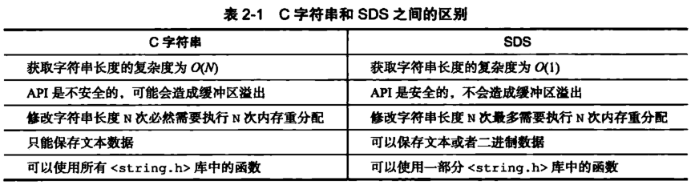
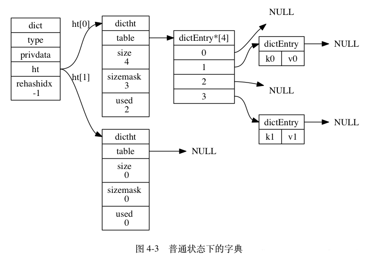
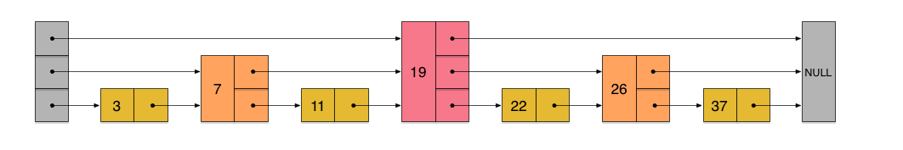
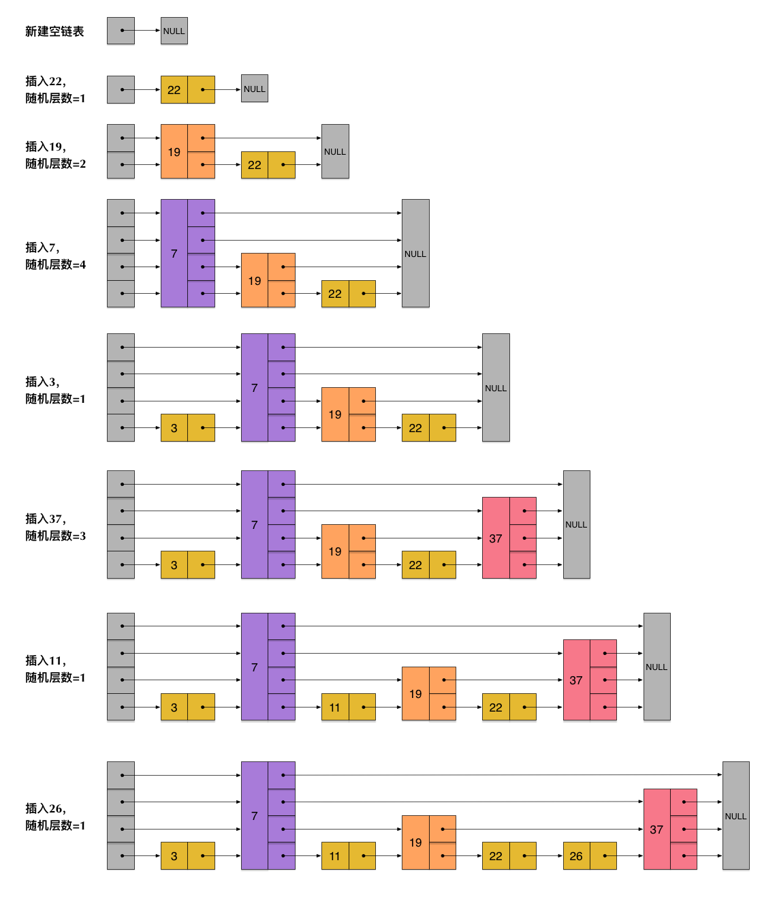
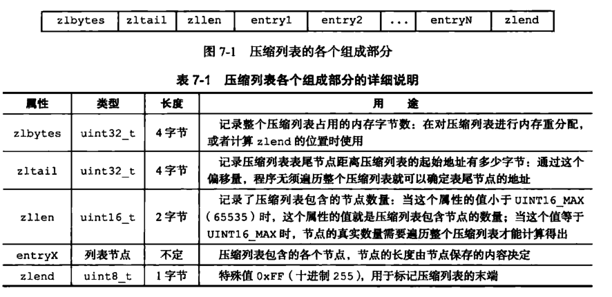

## 一、 常见考点

### 1、Redis 为何这么快？

1）基于内存；

2）单线程减少上下文切换，同时保证原子性；

3）`IO`多路复用；

4）高级数据结构（如 `SDS`、`Hash`以及`跳表`等）。

### 2、为何使用单线程？

* 官方答案

因为 `Redis` 是基于内存的操作，`CPU` 不会成为 `Redis` 的瓶颈，而最有可能是机器内存的大小或者网络带宽。既然单线程容易实现，而且 `CPU` 不会成为瓶颈，那就顺理成章地采用单线程的方案了。

* 详细原因

1）不需要各种锁的性能消耗

`Redis` 的数据结构并不全是简单的 `Key-Value`，还有 `List`，`Hash` 等复杂的结构，这些结构有可能会进行很细粒度的操作，比如在很长的列表后面添加一个元素，在`hash`当中添加或者删除一个对象。
这些操作可能就需要加非常多的锁，导致的结果是同步开销大大增加。

2）单线程多进程集群方案

单线程的威力实际上非常强大，每核心效率也非常高，多线程自然是可以比单线程有更高的性能上限，但是在今天的计算环境中，即使是单机多线程的上限也往往不能满足需要了，需要进一步摸索的是多服务器集群化的方案，这些方案中多线程的技术照样是用不上的。

**所以单线程、多进程的集群不失为一个时髦的解决方案。**

### 3、缓存三大问题以及解决方案？

* **缓存穿透**：查询数据不存在

1）缓存空值

2）`key` 值校验，如`布隆筛选器`

* **缓存击穿**：缓存过期，伴随大量对该 `key` 的请求

1）互斥锁

2）热点数据永不过期

3）熔断降级

* **缓存雪崩**：同一时间大批量的 `key` 过期

1）热点数据不过期

2）随机分散过期时间

### 4、先删后写还是先写后删？

* **先删缓存后写 DB**

产生脏数据的概率较大（若出现脏数据，则意味着再不更新的情况下，查询得到的数据均为旧的数据）。

比如两个并发操作，一个是更新操作，另一个是查询操作，更新操作删除缓存后，查询操作没有命中缓存，先把老数据读出来后放到缓存中，然后更新操作更新了数据库。于是，在缓存中的数据还是老的数据，
导致缓存中的数据是脏的，而且还一直这样脏下去了。

* **先写 DB 再删缓存**

产生脏数据的概率较小，但是会出现一致性的问题；若更新操作的时候，同时进行查询操作并命中，则查询得到的数据是旧的数据。但是不会影响后面的查询。

比如一个是读操作，但是没有命中缓存，然后就到数据库中取数据，此时来了一个写操作，写完数据库后，让缓存失效，然后之前的那个读操作再把老的数据放进去，所以会造成脏数据。

**解决方案**

1）缓存设置过期时间，实现最终一致性；

2）使用 `Cannel` 等中间件监听 `binlog` 进行异步更新；

3）通过 `2PC` 或 `Paxos` 协议保证一致性。

### 5、如何保证 Redis 的高并发？

`Redis` 通过主从加集群架构，实现读写分离，主节点负责写，并将数据同步给其他从节点，从节点负责读，从而实现高并发。

[详解](https://www.cnblogs.com/mengchunchen/p/10044603.html)

### 6、Redis 如何保证原子性？

因为 `Redis` 是单线程的，所以 `Redis` 提供的 `API` 也是原子操作。

但我们业务中常常有先 `get` 后 `set` 的业务常见，在并发下会导致数据不一致的情况。

**如何解决**

1）使用 `incr`、`decr`、`setnx` 等原子操作；

2）客户端加锁；

3）使用 `Lua` 脚本实现 `CAS` 操作。

### 7、有哪些应用场景？

`Redis` 在互联网产品中使用的场景实在是太多太多，这里分别对 `Redis` 几种数据类型做了整理：

1）`String`：缓存、限流、分布式锁、计数器、分布式 Session 等。

2）`Hash`：用户信息、用户主页访问量、组合查询等。

3）`List`：简单队列、关注列表时间轴。

4）`Set`：赞、踩、标签等。

5）`ZSet`：排行榜、好友关系链表。


## 二、 常用命令

### 1、Redis 有哪些常用操作？

[详见](/开发技巧/常用命令/Redis/Redis常用命令)

## 三、 数据结构

### 1、Redis 有哪些数据结构？

* 字符串 `String`
* 字典 `Hash`
* 列表 `List`
* 集合 `Set`
* 有序集合 `Zset`

### 2、String 类型的底层实现？

为了将性能优化到极致，`Redis` 作者为每种数据结构提供了不同的实现方式，以适应特定应用场景。以最常用的 `String` 为例，其底层实现就可以分为 `int`、`embstr` 以及 `raw` 这三种类型。
这些特定的底层实现在 `Redis` 中被称为编码（`Encoding`），可以通过 `OBJECT ENCODING [key]` 命令查看。

`Redis` 中所有的 `key` 都是字符串，这些字符串是通过一个名为**简单动态字符串**（`SDS`） 的抽象数据类型实现的。

```C
struct sdshdr{
     //记录buf数组中已使用字节的数量
     //等于 SDS 保存字符串的长度
     int len;
     //记录 buf 数组中未使用字节的数量
     int free;
     //字节数组，用于保存字符串
     char buf[];
}
```
### 3、说说 SDS 带来的好处？

我们知道 `Redis` 是使用 `C` 语言写的，那么相比使用 `C` 语言中的字符串（即以空字符 `\0` 结尾的字符数组），自己实现一个 `SDS` 的好处是什么？

1）**常数复杂度获取字符串长度**

由于 `len` 属性的存在，我们获取 `SDS` 字符串的长度只需要读取 `len` 属性，时间复杂度为 `O(1)`。

2）**杜绝缓冲区溢出**

3）**减少修改字符串的内存重新分配次数**

4）**二进制安全**

5）**兼容部分 `C` 字符串函数**



一般来说，`SDS` 除了保存数据库中的字符串值以外，还可以作为缓冲区（`Buffer`）：包括 `AOF` 模块中的 `AOF` 缓冲区以及客户端状态中的输入缓冲区。

### 4、Redis 实现的链表有哪些特性？

链表是一种常用的数据结构，`C` 语言内部是没有内置这种数据结构的实现，所以 `Redis` 自己构建了链表的实现:

```C
typedef struct list{
     //表头节点
     listNode *head;
     //表尾节点
     listNode *tail;
     //链表所包含的节点数量
     unsigned long len;
     //节点值复制函数
     void (*free) (void *ptr);
     //节点值释放函数
     void (*free) (void *ptr);
     //节点值对比函数
     int (*match) (void *ptr,void *key);
}list;

typedef  struct listNode{
       //前置节点
       struct listNode *prev;
       //后置节点
       struct listNode *next;
       //节点的值
       void *value;  
}listNode
```

* 1）**双端**：链表具有前置节点和后置节点的引用，获取这两个节点时间复杂度都为 `O(1)`。

* 2）**无环**：表头节点的 `prev` 指针和表尾节点的 `next` 指针都指向 `NULL`,对链表的访问都是以 `NULL` 结束。

* 3）**带长度计数器**：通过 `len` 属性获取链表长度的时间复杂度为 `O(1)`。

* 4）**多态**：链表节点使用指针来保存节点值，可以保存各种不同类型的值。

### 5、Redis 是如何实现字典的？

字典又称为符号表或者关联数组、或映射（`Map`），是一种用于**保存键值对的抽象数据结构**。

`Redis` 的字典使用哈希表作为底层实现，一个哈希表里面有多个哈希节点，而每个哈希表节点就保存了字典中的一个键值对，`Redis`的字典可以参照`Java`中的`HashMap`。

```C
typedef struct dictht{
     //哈希表数组
     dictEntry **table;
     //哈希表大小
     unsigned long size;
     //哈希表大小掩码，用于计算索引值
     //总是等于 size-1
     unsigned long sizemask;
     //该哈希表已有节点的数量
     unsigned long used;
 
}dictht
```
* 哈希表节点

```C
typedef struct dictEntry{
     //键
     void *key;
     //值
     union{
          void *val;
          uint64_tu64;
          int64_ts64;
     }v;

     //指向下一个哈希表节点，形成链表
     struct dictEntry *next;
}dictEntry；
```
`Redis`的字典结构：



### 6、 如何解决哈希冲突

**1. 哈希冲突**

提到的哈希冲突，解决他的办法有两种，`开放寻址法`和`拉链法`，`Redis` 很明显采用的是后者，后者很明显更加清晰，存取更加方便，第一种数据不多还好，如果数据量特别大的时候，插入，查找，删除，修改都是一件很困难的事情，时间复杂度太高。

**2. rehash**

随着操作的不断执行，哈希表保存的键值会逐渐地增多或者减少，为了让哈希表的负载因子维持在一个范围之内，当哈希表存储的键值对太多或者太少，程序要对哈希表的大小进行相应的扩展或者收缩。这就是我们要说的 `rehash`。

**3. 那么什么时候才会 rehash 呢？**

* 服务器目前没有执行的 `BGSAVE` 命令或者 `BGREWRUTEAOF` 命令，并且哈希表的负载因子大于等于 `1`；

* 服务器目前正在执行 `BGSAVE` 命令或者 `BGREWRUTEAOF` 命令，并且哈希表的负载因子大于等于 `5`；

> 负载因子 = 哈希表以保存的节点数量 / 哈希表的大小

`BGSAVE`，这个命令是 `redis` 进行 `RDB` 持久化时所用到的命令；`BGREWRUTEAOF` 就是另一种 `AOF` 持久化方式的工作方式，也就是在 `Redis` 进行持久化的时候，可能会触发 `rehash`。

**4. rehash 的实现原理**

既然要进行重新散列，那么原来的表肯定是不适合了，所以要重新开辟一张表，这就是上面我们所说的 `ht [1]`, 之所以维持两张表就是这个原因，如果需要扩容，那么扩容后的长度也就是 `ht [1].size=ht [0].used*2` 的 `2^n`， 
缩小的话就是 `ht [1].size=ht [0].used` 的 `2^n`, 准备条件好了就要开始移动了，直到 `0` 号哈希表中没有保存的节点，这时候释放空表的空间，将 `ht [1]` 更名为 `ht [0]`，然后将 `ht [1]` 置为空，就完成了 `rehash`。

**5. 渐进式 rehash**

如果像这样 `rehash` 的话，如果你的字典中存储这几万条，几十万条，几百万条的数据时，如果我们一次性的，集中式的把这些数据 `rehash`，那估计服务器就不能再进行其它服务了，高性能的 `Redis` 是绝对不允许这种事情发生的。所以`Redis`是通过渐进式`rehash`来保证性能的。

`hash`表有一个字段 `rehashidx`，索引计数器，记录了 `rehash` 的进度。

以下是哈希表 `渐进式rehash` 的详细步骤：

* 1）为 `ht [1]` 分配空间， 让字典同时持有 `ht [0]` 和 `ht [1]` 两个哈希表。

* 2）在字典中维持一个索引计数器变量 `rehashidx` ， 并将它的值设置为 `0` ， 表示 `rehash` 工作正式开始。

* 3）在 `rehash` 进行期间， 每次对字典执行添加、删除、查找或者更新操作时， 程序除了执行指定的操作以外， 还会顺带将 `ht [0]` 哈希表在 `rehashidx` 索引上的所有键值对 `rehash` 到 `ht [1]` ， 当 `rehash` 工作完成之后， 程序将 `rehashidx` 属性的值增一。

* 4）随着字典操作的不断执行， 最终在某个时间点上， `ht [0]` 的所有键值对都会被 `rehash` 至 `ht [1]` ， 这时程序将 `rehashidx` 属性的值设为 `-1` ， 表示 `rehash` 操作已完成。

**6. 注意**

因为在进行 `rehash` 的时候，两个表中都有值，所以不能确定具体在哪个表中，所以要在两个表中进行 字典的删除（`delete`）、查找（`find`）、更新（`update`）等操作，如果是查找的话，就会现在 `ht [0]` 中查找，没有就去 `ht [1]` 中找，但是如果是增加的话，
就会一律保存到 `ht [1]` 中，不会再像 `ht [0]` 中进行任何添加操作，不会多此一举，保证 `ht [0]` 中的数据只减不增，直到他变成一个空表。

### 7、有序集合 Zset 的底层实现？

`zset` 是 `Redis` 中一个非常重要的数据结构，其底层是基于跳表（`skip list`） 实现的。

`跳表`是一种随机化的数据结构，基于并联的链表，实现简单，插入、删除、查找的复杂度均为 `O(logN)`。简单说来跳表也是链表的一种，只不过它在链表的基础上增加了跳跃功能，正是这个跳跃的功能，使得在查找元素时，跳表能够提供 `O(logN)` 的时间复杂度。



跳表为了避免每次插入或删除带来的额外操作，**不要求上下相邻两层链表之间的节点个数有严格的对应关系，而是为每个节点随机出一个层数（level）**。而且新插入一个节点不会影响其它节点的层数。因此，插入操作只需要修改插入节点前后的指针，而不需要对很多节点都进行调整。



### 8、Zset 为何不使用红黑树等平衡树？

1）跳跃表范围查询比平衡树操作简单。 因为平衡树在查询到最小值的时还需要采用中序遍历去查询最大值。 而跳表只需要在找到最小值后，对第一层的链表遍历即可。

2）平衡树的删除和插入需要对子树进行相应的调整，而跳表只需要修改相邻的节点即可。

3）跳表和平衡树的查询操作都是`O（logN）`的时间复杂度。

4）从整体上来看，跳表算法实现的难度要低于平衡树。

相同的问题可以详见 : [MySQL的索引为什么使用B+树而不是用跳表？](/数据库/MySQL/进阶问题/MySQL的索引为什么使用B+树而不是用跳表)

### 9、什么是 Redis 的 intset？

整数集合（`intset`） 是 `Redis` 用于保存整数值的集合抽象数据类型，它可以保存类型为 `int16_t`、`int32_t` 或者 `int64_t` 的整数值，并且保证集合中不会出现重复元素。

```C
typedef struct intset{
     //编码方式
     uint32_t encoding;
     //集合包含的元素数量
     uint32_t length;
     //保存元素的数组
     int8_t contents[];

}intset;
```

整数集合的每个元素都是 `contents` 数组的一个数据项，它们按照从小到大的顺序排列，并且不包含任何重复项。需要注意的是虽然 `contents` 数组声明为 `int8_t` 类型，**但是实际上 `contents` 数组并不保存任何 `int8_t` 类型的值，其真正类型有 `encoding` 来决定**。

* 集合升级过程

当我们新增的元素类型比原集合元素类型的长度要大时，需要对整数集合进行升级，才能将新元素放入整数集合中。 

具体步骤：

1. 根据新元素类型，扩展整数集合底层数组的大小，并为新元素分配空间。

2. 将底层数组现有的所有元素都转成与新元素相同类型的元素，并将转换后的元素放到正确的位置，放置过程中，维持整个元素顺序都是有序的。

3. 将新元素添加到整数集合中（保证有序）。

* 集合是否降级

整数集合不支持降级操作，一旦对数组进行了升级，编码就会一直保持升级后的状态。

### 10、说说什么是压缩列表？

压缩列表（`ziplist`） 是 `Redis` 为了节省内存而开发的，是由一系列特殊编码的连续内存块组成的顺序型数据结构，一个压缩列表可以包含任意多个节点（`entry`），每个节点可以保存一个字节数组或者一个整数值。

**压缩列表并不是对数据利用某种算法进行压缩，而是将数据按照一定规则编码在一块连续的内存区域，目的是节省内存。**



压缩列表的每个节点构成如下：


* **revious_entry_ength**: 记录压缩列表前一个字节的长度。`previous_entry_ength` 的长度可能是 `1` 个字节或者是 `5` 个字节，如果上一个节点的长度小于 `254`，则该节点只需要一个字节就可以表示前一个节点的长度了，如果前一个节点的长度大于等于 `254`，
则 `previous_length` 的第一个字节为`254`，后面用四个字节表示当前节点前一个节点的长度。利用此原理即当前节点位置减去上一个节点的长度即得到上一个节点的起始位置，压缩列表可以从尾部向头部遍历。这么做很有效地减少了内存的浪费。

* **encoding**: 节点的 `encoding` 保存的是节点的 `content` 的内容类型以及长度,`encoding` 类型一共有两种，一种字节数组一种是整数，`encoding` 区域长度为 `1` 字节、`2` 字节或 `5` 字节。

* **content**: `content` 区域用于保存节点的内容，节点内容类型和长度由 `encoding` 决定。

### 11、什么是 RedisObject？

我们知道，`Redis` 底层实现了很多高级数据结构，如`简单动态字符串`、`双端链表`、`字典`、`压缩列表`、`跳跃表`、`整数集合`等。然而 `Redis` 并没有直接使用这些数据结构来实现键值对的数据库，
而是在这些数据结构之上又包装了一层 `RedisObject`（对象），也就是我们常说的五种数据结构：字符串对象、列表对象、哈希对象、集合对象和有序集合对象。

```C
typedef struct redisObject {
    // 类型
    unsigned type:4;
    // 编码，即对象的底层实现数据结构
    unsigned encoding:4;
    // 对象最后一次被访问的时间
    unsigned lru:REDIS_LRU_BITS;
    // 引用计数
    int refcount;
    // 指向实际值的指针
    void *ptr;
} robj;
```

这样做有两个好处：

1）通过不同类型的对象，`Redis` 可以在执行命令之前，根据对象的类型来判断一个对象是否可以执行该的命令。

2）可以针对不同的使用场景，为对象设置不同的实现，从而优化内存或查询速度。

### 12、五种类型分别对于哪种实现？

* **字符串（String）**

字符串对象的 `encoding` 有三种，分别是：`int`、`raw`、`embstr`。

1）如果一个字符串对象保存的是整数值，并且这个整数值可以用 `long` 类型标识，那么字符串对象会讲整数值保存在 `ptr` 属性中，并将 `encoding` 设置为 `int`。比如 `set number 10086` 命令。

2）如果字符串对象保存的是一个字符串值，并且这个字符串的长度大于 `44` 字节，那么字符串对象将使用一个简单动态字符串（`SDS`）来保存这个字符串值，并将对象的编码设置为 `raw`。

3）如果字符串对象保存的是一个字符串值，并且这个字符串的长度小于等于 `44` 字节，那么字符串对象将使用 `embstr` 编码的方式来保存这个字符串。

**`embstr` 的编码方式的一些优点：**

`embstr` 存储形式是这样一种存储形式，它将 `RedisObject` 对象头和 `SDS` 对象连续存在一起，使用 `malloc` 方法一次分配。`embstr` 最小占用空间为 `19（16+3）`，而 `64-19-1（结尾的\0）=44`，所以 `embstr` 只能容纳 `44` 字节。

1）`embstr` 编码将创建字符串对象所需的内存分配次数从 `raw` 编码的两次降低为一次。

2）释放 `embstr` 编码的字符串对象只需要调用一次内存释放函数，而释放 `raw` 编码的字符串对象需要调用两次内存释放函数。

3）因为 `embstr` 编码的字符串对象的所有数据都保存在一块连续的内存里面，所以这种编码的字符串对象比起 `raw` ，编码的字符串对象能够更好地利用缓存带来的优势。

* **哈希对象（hash）**

哈希对象的编码有 `ziplist` 和 `hashtable` 两种。当哈希对象保存的键值对数量小于 `512`，并且所有键值对的长度都小于 `64` 字节时，使用压缩列表存储；否则使用 `hashtable` 存储。

* **列表对象（list）**

列表对象的编码有 `ziplist` 和 `linkedlist` 两种。当列表的长度小于 `512`，并且所有元素的长度都小于 `64` 字节时，使用压缩列表存储，否则使用 `linkedlist` 存储。

* **集合对象（set）**

列表对象的编码有 `intset` 和 `hashtable` 两种。当集合的长度小于 `512`，并且所有元素都是整数时，使用整数集合存储；否则使用 `hashtable` 存储。

* **有序集合对象（sort set）**

有序集合对象的编码有 `ziplist` 和 `skiplist` 两种。当有序集合的长度小于 `128`，并且所有元素的长度都小于 `64` 字节时，使用压缩列表存储；否则使用 `skiplist` 存储。

**`intset`（整数集合）和 `ziplist`（压缩列表）主要是为节省内存而设计的内存结构，它的优点就是节省内存，但缺点就是比其他结构要消耗更多的时间，所以 `Redis` 在数据量小的时候使用整数集合存储。**

## 四、 数据存储

### 1、Redis 的数据过期策略是什么？

在回答词问题之前，首先需要回答另一个问题，就是如何设置 `Redis` 中数据的过期时间？

```redis
1）expire key time (以秒为单位)–这是最常用的方式
2）setex(String key, int seconds, String value) --字符串独有的方式
```

除了字符串自己独有设置过期时间的方法外，其他方法都需要依靠 `expire` 方法来设置时间，如果没有设置时间，那缓存就是永不过期。 如果设置了过期时间，使用 `persist key` 让缓存永不过期。

* 常见的过期策略
  * 1）定时删除 : 在设置 `key` 的过期时间的同时，为该 `key` 创建一个定时器，让定时器在 `key` 的过期时间来临时，对 `key` 进行删除。 
  * 2）惰性删除 
  * 3）定期删除 : 每隔一段时间执行一次删除（在 `redis.conf` 配置文件设置，`1s` 刷新的频率）过期 `key` 操作。

* Redis采用的过期策略

`Redis` 采用了`惰性删除+定期删除`的方式处理过期数据。

* 惰性删除的流程:
    * 1）在进行`get`或`setnx`等操作时，先检查`key`是否过期；
    * 2）若过期，删除`key`，然后执行相应操作； 
    * 3）若没过期，直接执行相应操作。

* 定期删除的流程: 其核心是对指定个数个库的每一个库随机删除小于等于指定个数个过期 `key`
  * 1）历每个数据库（就是 `redis.conf` 中配置的 `“database”` 数量，默认为`16`）； 
  * 2）检查当前库中的指定个数个 `key` （默认是每个库检查 `20` 个，相当于该循环执行 `20` 次）： 
    * 2.1）如果当前库中没有一个 `key` 设置了过期时间，直接执行下一个库的遍历； 
    * 2.2）随机获取一个设置了过期时间的 `key`，检查是否过期，如果过期则删除； 
    * 2.3）判断定期删除操作是否已经达到指定时长，若已经达到，直接退出定期删除。


### 2、持久化文件对过期策略的处理？

过期 `key` 是不会写入 `RDB` 和 `AOF` 文件，同时数据恢复时也会做过期验证。

### 3、Redis 有哪些内存淘汰机制？

`Redis` 作为一个内存数据库，在内存空间不足的时候，为了保证命中率，就会和我们操作系统中的页面置换算法类似，选择一定的数据淘汰策略。

* **volatile（设置过期时间的数据集）**

1）`volatile-lru`：从已设置过期时间的数据集中挑选最近最少使用的数据淘汰。

2）`volatile-ttl`：从已设置过期时间的数据集中挑选将要过期的数据淘汰。

3）`volatile-random`：从已设置过期时间的数据集中任意选择数据淘汰。

4）`volatile-lfu`：从已设置过期时间的数据集挑选使用频率最低的数据淘汰。

* **allkeys（所以数据集）**

5）`allkeys-lru`：从数据集中挑选最近最少使用的数据淘汰

6）`allkeys-lfu`：从数据集中挑选使用频率最低的数据淘汰。

7）`allkeys-random`：从数据集（`server.db[i].dict`）中任意选择数据淘汰

* **no-enviction**

8）`no-enviction（驱逐）`：禁止驱逐数据，这也是默认策略。

意思是当内存不足以容纳新入数据时，新写入操作就会报错，请求可以继续进行，线上任务也不能持续进行，采用 `no-enviction` 策略可以保证数据不被丢失。

:::tip PS 
在 `redis.config` 文件中，我们可以设置 `maxmemory` 的值来配置 `Redis` 的最大占用内存字节数。
:::

### 4、Redis 有哪些持久化机制？

`RDB` 和 `AOF`。

### 5、说说 Redis 的 RDB？

`RDB` 持久化是指在指定的时间间隔内将内存中的数据集快照写入磁盘。也是默认的持久化方式。也就是将内存中数据以快照的方式写入到二进制文件中，默认的文件名为 `dump.rdb`。

`RDB` 支持 同步（`save` 命令）、后台异步（`bgsave`）以及自动配置三种方式触发。


**优点**

* `RDB` 文件紧凑，全量备份，非常适合用于进行备份和灾难恢复
* 生成 `RDB` 文件时支持异步处理，主进程不需要进行任何磁盘`IO`操作
* `RDB` 在恢复大数据集时的速度比 `AOF` 的恢复速度要快

**缺点**

* `RDB` 快照是一次`全量备份`，存储的是内存数据的二进制序列化形式，存储上非常紧凑。且在快照持久化期间修改的数据不会被保存，可能丢失数据。

### 6、说说 Redis 的 AOF？

全量备份总是耗时的，有时候我们提供一种更加高效的方式 `AOF`，其工作机制更加简单：会将每一个收到的写命令追加到文件中。


随着时间推移，`AOF` 持久化文件也会变的越来越大。为了解决此问题，`Redis` 提供了 `bgrewriteaof` 命令，作用是 `fork` 出一条新进程将内存中的数据以命令的方式保存到临时文件中，完成对 `AOF` 文件的重写。

`AOF` 也有三种触发方式：

1）每修改同步 `always` 

2）每秒同步 `everysec` 

3）不同`no`：从不同步。

**优点**

* `AOF` 可以更好的保护数据不丢失，一般 `AOF` 隔 `1` 秒通过一个后台线程执行一次 `fsync` 操作
* `AOF` 日志文件没有任何磁盘寻址的开销，写入性能非常高，文件不容易破损
* `AOF` 日志文件即使过大的时候，出现后台重写操作，也不会影响客户端的读写
* `AOF` 日志文件的命令通过非常可读的方式进行记录，这个特性非常适合做灾难性的误删除的紧急恢复

**缺点**

* 对于同一份数据来说，`AOF` 日志文件通常比 `RDB` 数据快照文件更大

* `AOF`开启后，支持的写 `QPS` 会比`RDB`支持的写 `QPS` 低，因为 `AOF` 一般会配置成每秒 `fsync` 一次日志文件，当然，每秒一次 `fsync`，性能也还是很高的

### 7、RDB 和 AOF 该如何选择？

通过前面章节我们已经明白了两种机制的原理，接下来就该结合具体需求进行机制的选择，通常情况我们是二者结合使用的。

|命令	|	RDB	|	AOF	|
|	--	|	--	|	--	|
|	启动优先级	|	低	|	高	|
|	体积	|	小	|	大	|
|	恢复速度	|	快	|	慢	|
|	数据安全性	|	丢数据	|	取决于刷盘策略	|
|	轻重	|	重	|	轻	|

