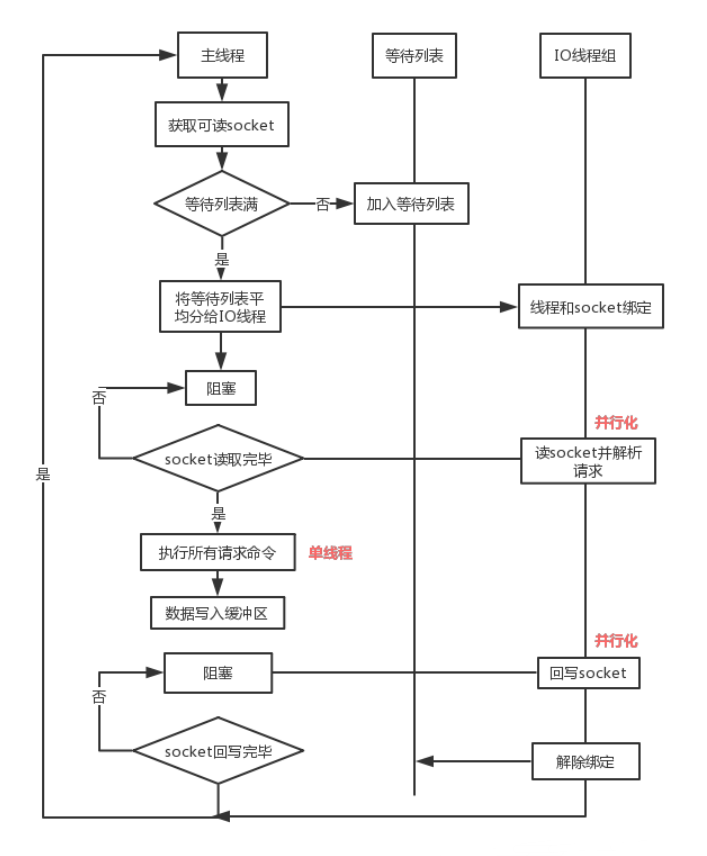
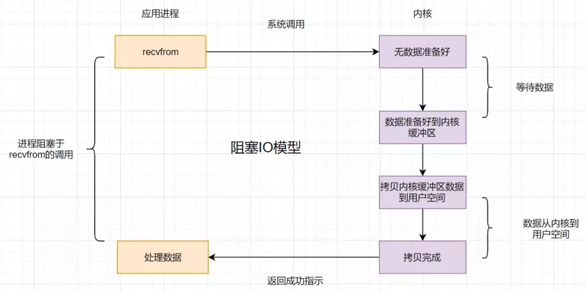
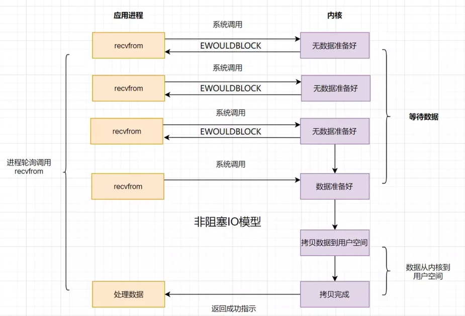
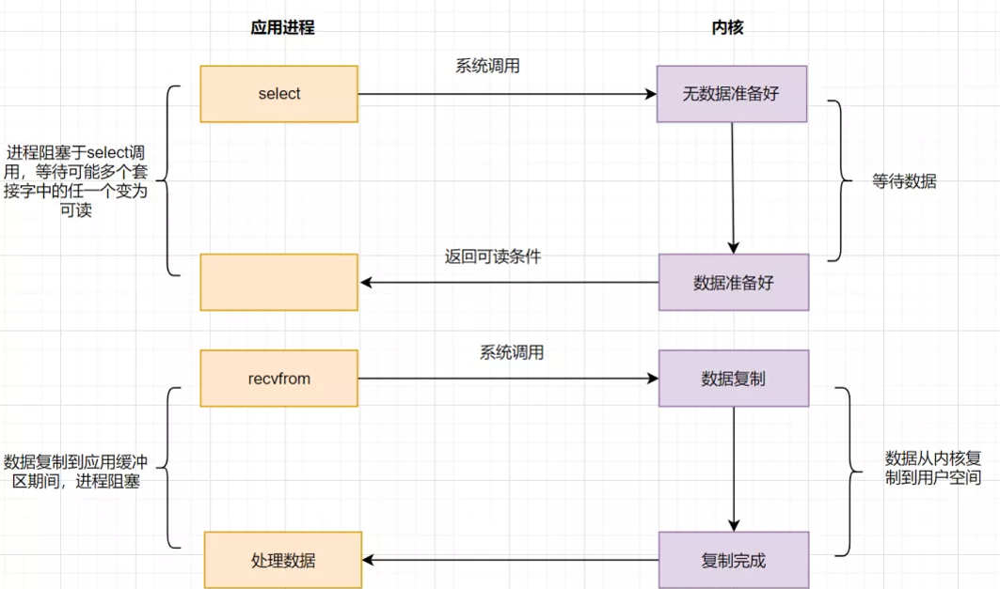
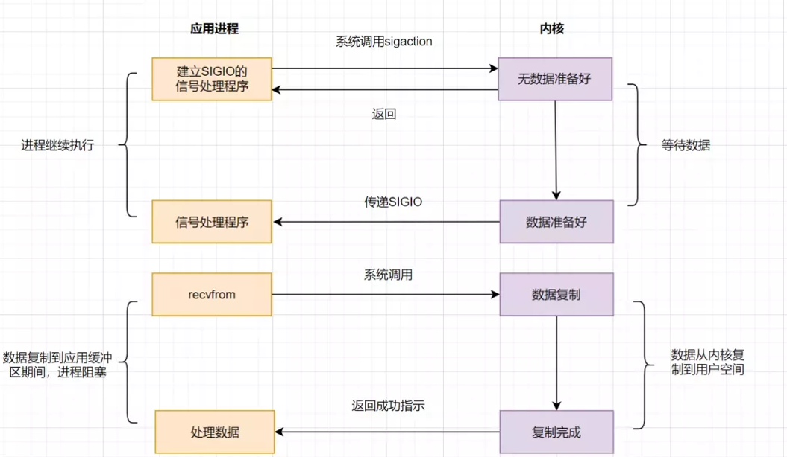
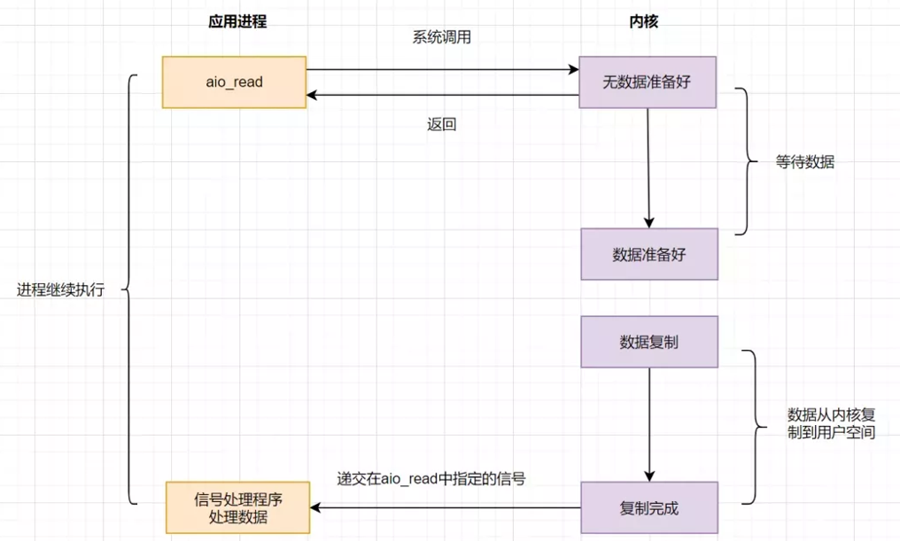

## 1、Redis 6 之前真的是单线程吗？

`Redis` 在处理客户端的请求时，包括`获取` (`socket` 读)、`解析`、`执行`、`内容返回` (`socket` 写) 等都由一个顺序串行的主线程处理，这就是所谓的单线程。
但如果严格来讲从 `Redis 4` 之后并不是单线程，除了主线程外，它也有后台线程在处理一些较为缓慢的操作，例如`清理脏数据`、`无用连接的释放`、`大 key 的删除`等等。

## 2、Redis 6 之前为什么使用单线程？

官方曾做过类似问题的回复：使用`Redis`时，几乎不存在`CPU`成为瓶颈的情况， `Redis`主要受限于`内存和网络`。例如在一个普通的`Linux`系统上，`Redis`通过使用`pipelining`每秒可以处理`100`万个请求，
所以如果应用程序主要使用`O(N)`或`O(log(N))`的命令，它几乎不会占用太多`CPU`。

使用了单线程后，可维护性高。多线程模型虽然在某些方面表现优异，但是它却引入了程序执行顺序的不确定性，带来了并发读写的一系列问题，增加了系统复杂度、同时可能存在线程切换、甚至加锁解锁、死锁造成的性能损耗。

同时 `Redis` 通过 `AE 事件模型`以及 `IO 多路复用`等技术，即使单线程处理性能也非常高，因此没有必要使用多线程。单线程机制使得 `Redis` 内部实现的复杂度大大降低，`Hash` 的`惰性 Rehash`、`Lpush` 等等 “线程不安全” 的命令都可以无锁进行。

## 3、Redis 6 为何引入多线程？

随着目前行业内越来越复杂的业务场景，有些公司动不动就上亿的交易量，因此需要更大的 `QPS`。常见的解决方案是在分布式架构中对数据进行分区并采用多个服务器，但该方案有非常大的缺点，比如：

1）要管理的 `Redis` 服务器太多，维护代价大；

2）某些适用于单个 `Redis` 服务器的命令不适用于数据分区；

3）数据分区无法解决热点读/写问题；

4）数据偏斜，重新分配和放大/缩小变得更加复杂等等。

从 `Redis` 自身角度来说，因为读写网络的 `read/write` 系统调用占用了 `Redis` 执行期间大部分 `CPU` 时间，瓶颈主要在于网络的 `IO` 消耗, 优化主要有两个方向:

1）提高网络 `IO` 性能，典型的实现比如使用 `DPDK` 来替代内核网络栈的方式；

2）使用多线程充分利用多核，典型的实现比如 `Memcached`。

协议栈优化的这种方式跟 `Redis` 关系不大，支持多线程是一种最有效最便捷的操作方式。所以总结起来，`Redis` 支持多线程主要就是两个原因：

* 可以充分利用服务器 `CPU` 资源，目前主线程只能利用一个核；
* 多线程任务可以分摊 `Redis` 同步 `IO` 读写负荷。

## 4、多线程如何开启以及配置？

`Redis 6` 的多线程默认是禁用的，只使用主线程。如需开启需要修改 `redis.conf` 配置文件中的 `io-threads-do-reads yes`。
    
开启多线程后，还需要设置线程数，否则是不生效的。同样修改 `redis.conf` 文件中的 `io-threads [n]` 配置。

关于线程数的设置，官方有一个建议：`4` 核的机器建议设置为 `2` 或 `3` 个线程，`8` 核的建议设置为 `6` 个线程，线程数一定要小于机器核数。还需要注意的是，线程数并不是越大越好，官方认为超过了 `8` 个基本就没什么意义了。

## 5、Redis 多线程的实现机制？

大致流程如下：

1）主线程负责接收建立连接请求，获取 `socket` 放入全局等待读处理队列；

2）主线程处理完读事件之后，通过 `RR(Round Robin)` 将这些连接分配给这些 `IO` 线程；

3）主线程阻塞等待 `IO` 线程读取 `socket` 完毕；

4）主线程通过单线程的方式执行请求命令，请求数据读取并解析完成，但并不执行；

5）主线程阻塞等待 `IO` 线程将数据回写 `socket` 完毕；

6）解除绑定，清空等待队列。

该设计的特点：

1）`IO` 线程要么同时在读 `socket`，要么同时在写，不会同时读或写。

2）`IO` 线程只负责读写 `socket` 解析命令，不负责命令处理。

## 6、多线程是否会导致线程安全问题？

从上面的实现机制可以看出，`Redis` 的多线程部分只是用来处理网络数据的读写和协议解析，执行命令仍然是单线程顺序执行。所以我们不需要去考虑控制 `key`、`lua`、`事务`，`LPUSH/LPOP` 等等的并发及线程安全问题。

## 7、Redis 和 Memcached 多线程区别？

* 相同点：都采用了 `master 线程 - worker 线程`的模型。

* 不同点：`Memcached` 执行主逻辑也是在 `worker` 线程里，模型更加简单，实现了真正的线程隔离，符合我们对线程隔离的常规理解。而 `Redis` 把处理逻辑交还给 `master` 线程，虽然一定程度上增加了模型复杂度，但也解决了线程并发安全等问题。

## 8、Redis线程中经常提到IO多路复用，如何理解？

### IO模型

用户态与内核态：用户态运行的用户程序，内核区运行的是系统程序。用户程序不能直接访问内核内存，每次数据要先放在内核缓冲区，然后系统调用复制到用户空间，用户程序才能使用。

* **阻塞 IO**

在应用调用`recvfrom`读取数据时，如果用户空间中数据没复制完成，一直等待。在这时候，线程是一直阻塞的，但是`cpu`不会阻塞。

为什么大型系统不使用阻塞 `IO` 呢？

大型系统中，请求会很多，使用阻塞`IO`导致线程数会大量累积，然后线程切换也会导致性能下降。

* **非阻塞 IO**

在应用调用`recvfrom`读取数据时，如果内核缓冲区的数据没复制完成，会返回一个错误码，不需要一直阻塞，但是需要不断调用请求 `recvfrom`，会加剧消耗`CPU` 。

* **IO 多路复用**

当在并发的情况下，每个线程都会自己调用 `recvfrom` 去读取数据。

* **信号驱动模型**

`IO 多路复用`已经做出了较多的优化，但是`select`、`poll`、`epoll`都需要轮询，那么我们该多久轮询一圈？联想到推拉结合方案，为什么不让系统主动通知你哪个文件描述符已经准备好了呢？

* **异步 IO**

上面的方案，都需要两阶段读取，首先询问数据是否准备好，然后调用 `recvfrom` 读取，有没有一种方案，程序说我要读数据，然后系统将数据准备好，并把数据复制到用户空间，然后告诉你数据准备完成，你直接使用就可以。

### Redis的IO多路复用模型是什么？

`I/O多路复用`模型是什么？就是很多网络连接(多路)，共(复)用少数几个(甚至是一个)线程。

`Redis`采用`I/O多路复用`机制，使得`Redis`在单线程模式下依然可以高效的处理多个`I/O流`。

其核心思想是，先通过 `select / poll / epoll` 等系统调用查询监听的文件描述符是否准备就绪，这个操作可阻塞也可立即返回（具体看参数和对应规则），
当其中一个或者多个文件描述符`IO`事件准备就绪才开始下一步，即 `read` 或者 `write` 等系统调用，这里才是真正的读或者写。

详情移步：[100%Redis网络模型-IO多路复用](https://blog.csdn.net/mqq2502513332/article/details/127613245)