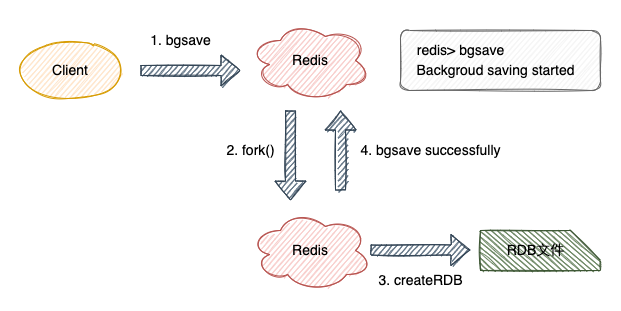
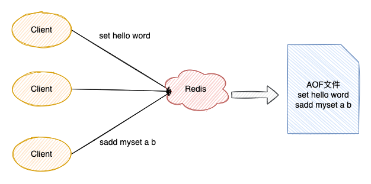

## 1、Redis 的数据过期策略是什么？

在回答词问题之前，首先需要回答另一个问题，就是如何设置 `Redis` 中数据的过期时间？

```shell
1）expire key time (以秒为单位)–这是最常用的方式
2）setex(String key, int seconds, String value) --字符串独有的方式
```

除了字符串自己独有设置过期时间的方法外，其他方法都需要依靠 `expire` 方法来设置时间，如果没有设置时间，那缓存就是永不过期。 如果设置了过期时间，使用 `persist key` 让缓存永不过期。

* 常见的过期策略
    * 1）**定时删除** : 在设置 `key` 的过期时间的同时，为该 `key` 创建一个定时器，让定时器在 `key` 的过期时间来临时，对 `key` 进行删除。
    * 2）**惰性删除**
    * 3）**定期删除** : 每隔一段时间执行一次删除（在 `redis.conf` 配置文件设置，`1s` 刷新的频率）过期 `key` 操作。

* Redis采用的过期策略

`Redis` 采用了`惰性删除+定期删除`的方式处理过期数据。

* 惰性删除的流程:
    * 1）在进行`get`或`setnx`等操作时，先检查`key`是否过期；
    * 2）若过期，删除`key`，然后执行相应操作；
    * 3）若没过期，直接执行相应操作。

* 定期删除的流程: 其核心是对指定个数个库的每一个库随机删除小于等于指定个数个过期 `key`
    * 1）历每个数据库（就是 `redis.conf` 中配置的 `“database”` 数量，默认为`16`）；
    * 2）检查当前库中的指定个数个 `key` （默认是每个库检查 `20` 个，相当于该循环执行 `20` 次）：
        * 2.1）如果当前库中没有一个 `key` 设置了过期时间，直接执行下一个库的遍历；
        * 2.2）随机获取一个设置了过期时间的 `key`，检查是否过期，如果过期则删除；
        * 2.3）判断定期删除操作是否已经达到指定时长，若已经达到，直接退出定期删除。


## 2、持久化文件对过期策略的处理？

过期 `key` 是不会写入 `RDB` 和 `AOF` 文件，同时数据恢复时也会做过期验证。

## 3、Redis 有哪些内存淘汰机制？

`Redis` 作为一个内存数据库，在内存空间不足的时候，为了保证命中率，就会和我们操作系统中的页面置换算法类似，选择一定的数据淘汰策略。

* **volatile（设置过期时间的数据集）**

1）`volatile-lru`：从已设置过期时间的数据集中挑选最近最少使用的数据淘汰。

2）`volatile-ttl`：从已设置过期时间的数据集中挑选将要过期的数据淘汰。

3）`volatile-random`：从已设置过期时间的数据集中任意选择数据淘汰。

4）`volatile-lfu`：从已设置过期时间的数据集挑选使用频率最低的数据淘汰。

* **allkeys（所以数据集）**

5）`allkeys-lru`：从数据集中挑选最近最少使用的数据淘汰

6）`allkeys-lfu`：从数据集中挑选使用频率最低的数据淘汰。

7）`allkeys-random`：从数据集（`server.db[i].dict`）中任意选择数据淘汰

* **no-enviction**

8）`no-enviction（驱逐）`：禁止驱逐数据，这也是默认策略。

意思是当内存不足以容纳新入数据时，新写入操作就会报错，请求可以继续进行，线上任务也不能持续进行，采用 `no-enviction` 策略可以保证数据不被丢失。

:::tip PS
在 `redis.config` 文件中，我们可以设置 `maxmemory` 的值来配置 `Redis` 的最大占用内存字节数。
:::

## 4、Redis 有哪些持久化机制？

`RDB` 和 `AOF`。

## 5、说说 Redis 的 RDB？

`RDB` 持久化是指在指定的时间间隔内将内存中的数据集快照写入磁盘。也是默认的持久化方式。也就是将内存中数据以快照的方式写入到二进制文件中，默认的文件名为 `dump.rdb`。

`RDB` 支持 同步（`save` 命令）、后台异步（`bgsave`）以及自动配置三种方式触发。



**优点**

* `RDB` 文件紧凑，全量备份，非常适合用于进行备份和灾难恢复
* 生成 `RDB` 文件时支持异步处理，主进程不需要进行任何磁盘`IO`操作
* `RDB` 在恢复大数据集时的速度比 `AOF` 的恢复速度要快

**缺点**

* `RDB` 快照是一次`全量备份`，存储的是内存数据的二进制序列化形式，存储上非常紧凑。且在快照持久化期间修改的数据不会被保存，可能丢失数据。

## 6、说说 Redis 的 AOF？

全量备份总是耗时的，有时候我们提供一种更加高效的方式 `AOF`，其工作机制更加简单：会将每一个收到的写命令追加到文件中。



随着时间推移，`AOF` 持久化文件也会变的越来越大。为了解决此问题，`Redis` 提供了 `bgrewriteaof` 命令，作用是 `fork` 出一条新进程将内存中的数据以命令的方式保存到临时文件中，完成对 `AOF` 文件的重写。

`AOF` 也有三种触发方式：

1）每修改同步 `always`

2）每秒同步 `everysec`

3）不同`no`：从不同步。

**优点**

* `AOF` 可以更好的保护数据不丢失，一般 `AOF` 隔 `1` 秒通过一个后台线程执行一次 `fsync` 操作
* `AOF` 日志文件没有任何磁盘寻址的开销，写入性能非常高，文件不容易破损
* `AOF` 日志文件即使过大的时候，出现后台重写操作，也不会影响客户端的读写
* `AOF` 日志文件的命令通过非常可读的方式进行记录，这个特性非常适合做灾难性的误删除的紧急恢复

**缺点**

* 对于同一份数据来说，`AOF` 日志文件通常比 `RDB` 数据快照文件更大

* `AOF`开启后，支持的写 `QPS` 会比`RDB`支持的写 `QPS` 低，因为 `AOF` 一般会配置成每秒 `fsync` 一次日志文件，当然，每秒一次 `fsync`，性能也还是很高的

## 7、RDB 和 AOF 该如何选择？

通过前面章节我们已经明白了两种机制的原理，接下来就该结合具体需求进行机制的选择，通常情况我们是二者结合使用的。

|命令	|	RDB	|	AOF	|
|	--	|	--	|	--	|
|	启动优先级	|	低	|	高	|
|	体积	|	小	|	大	|
|	恢复速度	|	快	|	慢	|
|	数据安全性	|	丢数据	|	取决于刷盘策略	|
|	轻重	|	重	|	轻	|
