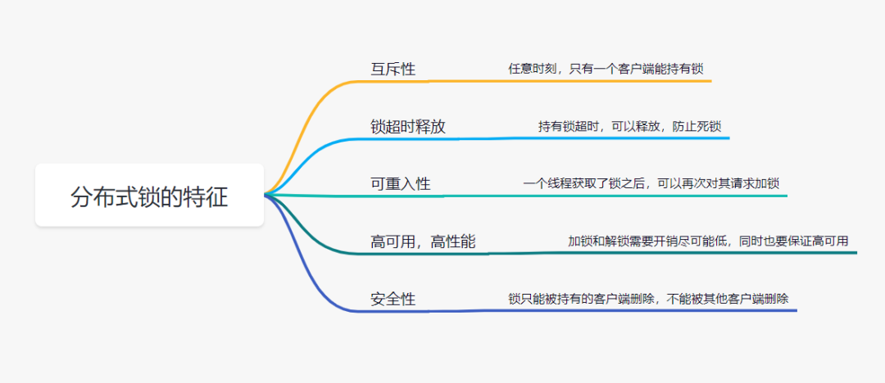
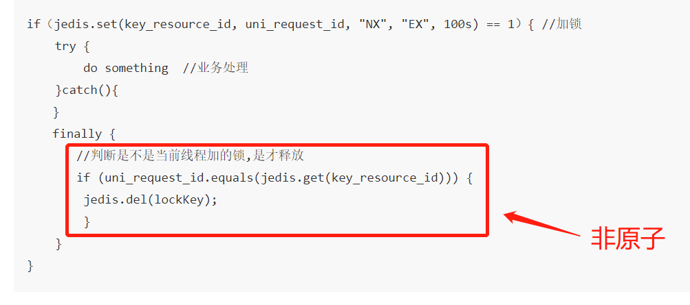
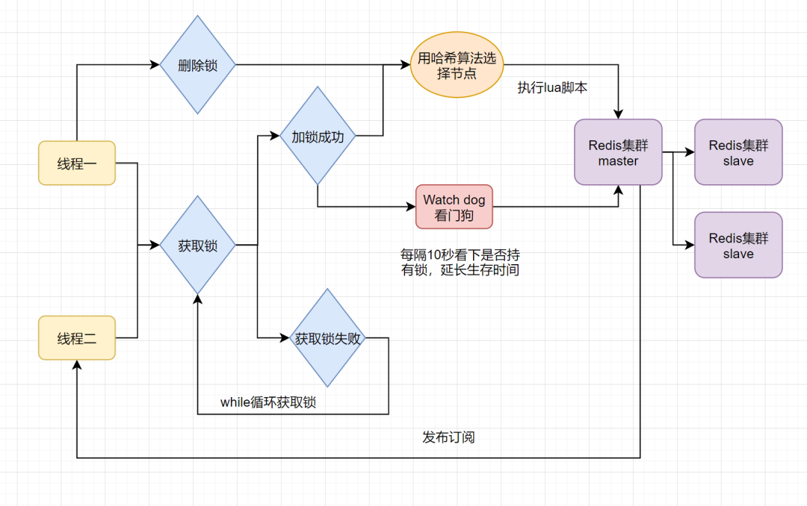
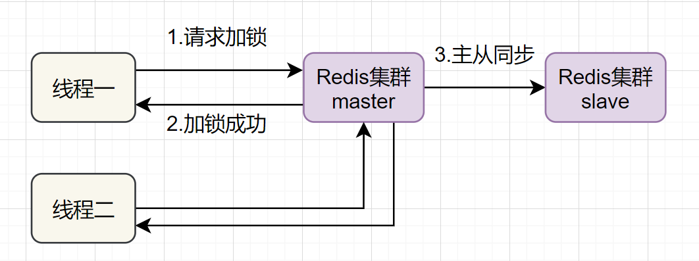
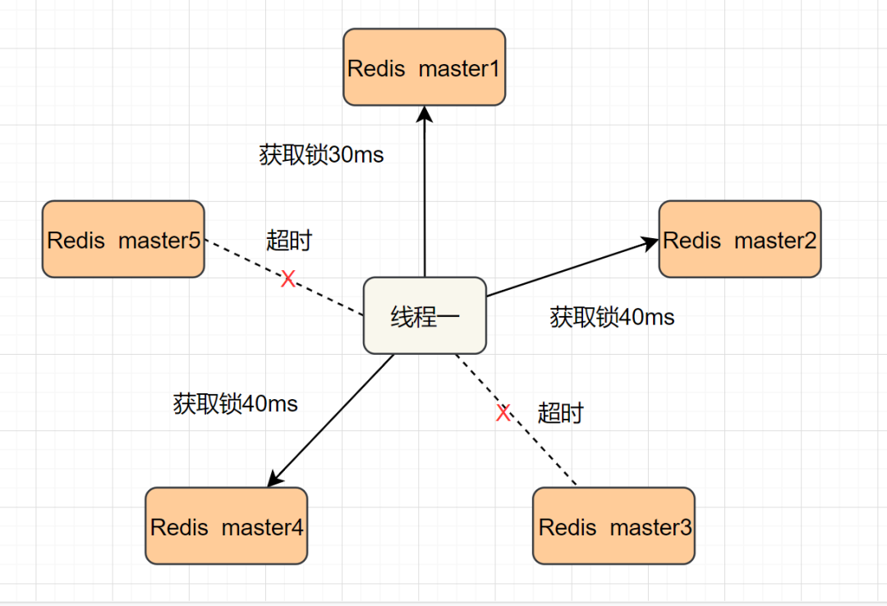

## 什么是分布式锁 ？

> 分布式锁其实就是，控制分布式系统不同进程共同访问共享资源的一种锁的实现。如果不同的系统或同一个系统的不同主机之间共享了某个临界资源，往往需要互斥来防止彼此干扰，以保证一致性。

我们先来看下，一把靠谱的分布式锁应该有哪些特征：



* **「互斥性」**: 任意时刻，只有一个客户端能持有锁
* **「锁超时释放」**：持有锁超时，可以释放，防止不必要的资源浪费，也可以防止死锁
* **「可重入性」**: 一个线程如果获取了锁之后,可以再次对其请求加锁
* **「高性能和高可用」**：加锁和解锁需要开销尽可能低，同时也要保证高可用，避免分布式锁失效
* **「安全性」**：锁只能被持有的客户端删除，不能被其他客户端删除

## Redis分布式锁方案一：SETNX + EXPIRE

提到`Redis`的分布式锁，很多小伙伴马上就会想到`setnx+ expire`命令。即先用`setnx`来抢锁，如果抢到之后，再用`expire`给锁设置一个过期时间，防止锁忘记了释放。

> `SETNX` 是`SET IF NOT EXISTS`的简写.日常命令格式是`SETNX key value`，如果 `key`不存在，则`SETNX`成功返回`1`，如果这个`key`已经存在了，则返回`0`。

假设某电商网站的某商品做秒杀活动，`key`可以设置为`key_resource_id,value`设置任意值，伪代码如下：

```java
if（jedis.setnx(key_resource_id,lock_value) == 1）{ //加锁
    expire（key_resource_id，100）; //设置过期时间
    try {
        do something  //业务请求
    }catch(){
  }
  finally {
       jedis.del(key_resource_id); //释放锁
    }
}
```

但是这个方案中，`setnx`和`expire`两个命令分开了，**「不是原子操作」**。如果执行完`setnx`加锁，正要执行`expire`设置过期时间时，进程`crash`或者要重启维护了，那么这个锁就“长生不老”了，「别的线程永远获取不到锁啦」。

## Redis分布式锁方案二：SETNX + value值是(系统时间+过期时间)

为了解决方案一，**「发生异常锁得不到释放的场景」**，有小伙伴认为，可以把过期时间放到`setnx`的`value`值里面。如果加锁失败，再拿出`value`值校验一下即可。加锁代码如下：

```java
long expires = System.currentTimeMillis() + expireTime; //系统时间+设置的过期时间
String expiresStr = String.valueOf(expires);

// 如果当前锁不存在，返回加锁成功
if (jedis.setnx(key_resource_id, expiresStr) == 1) {
    return true;
}
// 如果锁已经存在，获取锁的过期时间
String currentValueStr = jedis.get(key_resource_id);

// 如果获取到的过期时间，小于系统当前时间，表示已经过期
if (currentValueStr != null && Long.parseLong(currentValueStr) < System.currentTimeMillis()) {

   // 锁已过期，获取上一个锁的过期时间，并设置现在锁的过期时间（不了解redis的getSet命令的小伙伴，可以去官网看下哈）
   String oldValueStr = jedis.getSet(key_resource_id, expiresStr);

   if (oldValueStr != null && oldValueStr.equals(currentValueStr)) {
        // 考虑多线程并发的情况，只有一个线程的设置值和当前值相同，它才可以加锁
        return true;
   }
}
    //其他情况，均返回加锁失败
    return false;
}
```

这个方案的优点是，巧妙移除`expire`单独设置过期时间的操作，把 **「过期时间放到setnx的value值」** 里面来。解决了方案一发生异常，锁得不到释放的问题。但是这个方案还有别的缺点：

* 过期时间是客户端自己生成的（`System.currentTimeMillis()`是当前系统的时间），必须要求分布式环境下，每个客户端的时间必须同步。
* 如果锁过期的时候，并发多个客户端同时请求过来，都执行`jedis.getSet()`，最终只能有一个客户端加锁成功，但是该客户端锁的过期时间，可能被别的客户端覆盖
* 该锁没有保存持有者的唯一标识，可能被别的客户端释放/解锁。

## Redis分布式锁方案三：使用Lua脚本(包含SETNX + EXPIRE两条指令)

实际上，我们还可以使用`Lua脚本`来保证原子性（包含`setnx`和`expire`两条指令），`lua脚本`如下：

```shell
if redis.call('setnx',KEYS[1],ARGV[1]) == 1 then
   redis.call('expire',KEYS[1],ARGV[2])
else
   return 0
end;
```

加锁代码如下：

```java
 String lua_scripts = "if redis.call('setnx',KEYS[1],ARGV[1]) == 1 then" +
            " redis.call('expire',KEYS[1],ARGV[2]) return 1 else return 0 end";   
Object result = jedis.eval(lua_scripts, Collections.singletonList(key_resource_id), Collections.singletonList(values));
//判断是否成功
return result.equals(1L);
```

## Redis分布式锁方案方案四：SET的扩展命令（SET EX PX NX）

除了使用，使用`Lua脚本`，保证`SETNX + EXPIRE`两条指令的`原子性`，我们还可以巧用`Redis`的`SET`指令扩展参数！（`SET key value[EX seconds][PX milliseconds][NX|XX]`），它也是原子性的！

**SET key value[EX seconds][PX milliseconds][NX|XX]**

* **NX** :表示`key`不存在的时候，才能`set`成功，也即保证只有第一个客户端请求才能获得锁，而其他客户端请求只能等其释放锁，才能获取。
* **EX seconds** :设定`key`的过期时间，时间单位是`秒`。
* **PX milliseconds**: 设定`key`的过期时间，单位为`毫秒`
* **XX**: 仅当`key`存在时设置值

伪代码`demo`如下：

```java
if（jedis.set(key_resource_id, lock_value, "NX", "EX", 100s) == 1）{ //加锁
    try {
        do something  //业务处理
    }catch(){
  }
  finally {
       jedis.del(key_resource_id); //释放锁
    }
}
```

但是呢，这个方案还是可能存在问题：

* 问题一：**「锁过期释放了，业务还没执行完」**。假设线程`a`获取锁成功，一直在执行临界区的代码。但是`100s`过去后，它还没执行完。但是，这时候锁已经过期了，此时线程`b`又请求过来。显然线程`b`就可以获得锁成功，也开始执行临界区的代码。那么问题就来了，临界区的业务代码都不是严格串行执行的啦。
* 问题二：**「锁被别的线程误删」**。假设线程`a`执行完后，去释放锁。但是它不知道当前的锁可能是线程`b`持有的（线程`a`去释放锁时，有可能过期时间已经到了，此时线程`b`进来占有了锁）。那线程`a`就把线程`b`的锁释放掉了，但是线程`b`临界区业务代码可能都还没执行完呢。

## 方案五：SET EX PX NX  + 校验唯一随机值,再删除

既然锁可能被别的线程误删，那我们给`value`值设置一个标记当前线程唯一的随机数，在删除的时候，校验一下，不就OK了嘛。伪代码如下：

```java
if（jedis.set(key_resource_id, uni_request_id, "NX", "EX", 100s) == 1）{ //加锁
    try {
        do something  //业务处理
    }catch(){
  }
  finally {
       //判断是不是当前线程加的锁,是才释放
       if (uni_request_id.equals(jedis.get(key_resource_id))) {
        jedis.del(lockKey); //释放锁
        }
    }
}
```

在这里，**「判断是不是当前线程加的锁」**和**「释放锁」**不是一个原子操作。如果调用`jedis.del()`释放锁的时候，可能这把锁已经不属于当前客户端，会解除他人加的锁。



为了更严谨，一般也是用`lua脚本`代替。`lua脚本`如下：

```shell
if redis.call('get',KEYS[1]) == ARGV[1] then 
   return redis.call('del',KEYS[1]) 
else
   return 0
end;
```

## Redis分布式锁方案六：Redisson框架

方案五还是可能存在 **「锁过期释放，业务没执行完」** 的问题。有些小伙伴认为，稍微把锁过期时间设置长一些就可以啦。其实我们设想一下，是否可以给获得锁的线程，开启一个定时守护线程，每隔一段时间检查锁是否还存在，存在则对锁的过期时间延长，防止锁过期提前释放。

当前开源框架`Redisson`解决了这个问题。我们一起来看下`Redisson`底层原理图吧：



只要线程一加锁成功，就会启动一个`watch dog`看门狗，它是一个后台线程，会每隔`10`秒检查一下，如果线程`1`还持有锁，那么就会不断的延长锁`key`的生存时间。因此，`Redisson`就是使用`看门狗`解决了**「锁过期释放，业务没执行完」**问题。

## Redis分布式锁方案七：多机实现的分布式锁Redlock+Redisson

前面六种方案都只是基于单机版的讨论，还不是很完美。其实`Redis`一般都是集群部署的：



如果线程一在`Redis`的`master`节点上拿到了锁，但是加锁的`key`还没同步到`slave`节点。恰好这时，`master`节点发生故障，一个`slave`节点就会升级为`master`节点。线程二就可以获取同个`key`的锁啦，但线程一也已经拿到锁了，锁的安全性就没了。

为了解决这个问题，`Redis`作者 `antirez`提出一种高级的分布式锁算法：`Redlock`。`Redlock`核心思想是这样的：

* 搞多个`Redis master`部署，以保证它们不会同时宕掉。并且这些`master`节点是完全相互独立的，相互之间不存在数据同步。同时，需要确保在这多个`master`实例上，是与在`Redis`单实例，使用相同方法来获取和释放锁。

我们假设当前有`5`个`Redis master`节点，在`5`台服务器上面运行这些`Redis`实例:



`RedLock`的实现步骤如下:

* 1. 获取当前时间，以毫秒为单位。
* 2. 按顺序向`5`个`master`节点请求加锁。客户端设置网络连接和响应超时时间，并且超时时间要小于锁的失效时间。（假设锁自动失效时间为`10`秒，则超时时间一般在`5-50`毫秒之间,我们就假设超时时间是`50ms`吧）。如果超时，跳过该`master`节点，尽快去尝试下一个`master`节点。
* 3. 客户端使用当前时间减去开始获取锁时间（即`步骤1`记录的时间），得到获取锁使用的时间。当且仅当超过一半（`N/2+1`，这里是`5/2+1=3`个节点）的`Redis master`节点都获得锁，并且使用的时间小于锁失效时间时，锁才算获取成功。（如上图，`10s> 30ms+40ms+50ms+4m0s+50ms`）
* 4. 如果取到了锁，`key`的真正有效时间就变啦，需要减去获取锁所使用的时间。
* 5. 如果获取锁失败（没有在至少`N/2+1`个`master`实例取到锁，有或者获取锁时间已经超过了有效时间），客户端要在所有的`master`节点上解锁（即便有些`master`节点根本就没有加锁成功，也需要解锁，以防止有些漏网之鱼）。

简化下步骤就是：

* 1. 按顺序向`5`个`master`节点请求加锁
* 2. 根据设置的超时时间来判断，是不是要跳过该`master`节点。
* 3. 如果大于等于`3`个节点加锁成功，并且使用的时间小于锁的有效期，即可认定加锁成功啦。
* 4. 如果获取锁失败，解锁！