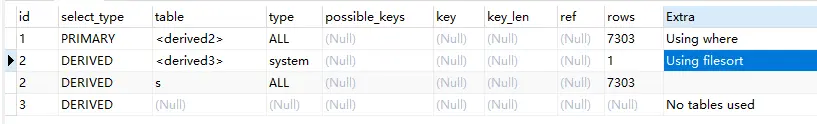

直播运营活动中经常会有这样的需求，根据用户送礼情况做排名。这个排行榜具有以下特点：

* 用户每次请求会返回用户的排名
* 送礼金额越多粉丝排名越靠前
* 相同金额送礼越早越靠前
* 排行榜会随着粉丝送礼变化而不断变化

## 排行榜的实现方式

**表结构**

```mysql
CREATE TABLE `user` (
  `id` int(10) NOT NULL COMMENT '编号',
  `uid` varchar(32) NOT NULL COMMENT '用户',
  `coin` int(10) NOT NULL COMMENT '用户送出金额',
  `create_time` datetime NOT NULL COMMENT '创建时间',
  `update_time` datetime NOT NULL COMMENT '更新时间',
  PRIMARY KEY (`id`),
  UNIQUE KEY `uid` (`uid`)
) ENGINE=InnoDB DEFAULT CHARSET=utf8 COMMENT='用户表';
```

### 1. sql查询

```mysql
EXPLAIN SELECT
    *
FROM
    (
        SELECT
            @rank := @rank + 1 AS rank,
            s.uid AS uid,
            s.coin AS coin
        FROM
            `user` s,
            (SELECT @rank := 0) r
        ORDER BY
            coin DESC,
            create_time
    ) q
WHERE
    q.uid = 'xiaoming';
```

根据 `select @rank `与 `user`表结合起来作为一张有排名的新表，然后再从中找出某个用户的排名。这种方法的优点是简单，每次用户来请求，只要用这个`SQL`查一下即可；缺点是这个算是比较复杂的`SQL`，查起来太慢，每次都要全表查询，试了几次都要`0.5s`左右。用`explain`分析如下：



### 2. user中添加rank字段

在`user`中添加`rank`字段，写个计划任务每隔`2`分钟全表扫描，然后更新`rank`名次字段。这个方法最残暴，但是也是最不可取的。首先会产生延迟，因为`2`分钟才更新一次名次，其次，每次都要更新全部数据，给数据库很大的压力，最后，计划任务更新数据的时候，用户送礼也在更新数据，
稍微不注意就会出现脏读的情况。

### 3. 用Redis的zset数据结构

**zset的相关api (PipelineCluster/Jedis) : **

```redis
插入或者更新数据
Long zadd(final String key, final double score, final String member)
key : 排行榜的名字
memeber : 用户
score : 用户的分数

获取用户分数
Double zscore(String key, final String member)

获取用户的排名
Long zrevrank(final String key, final String member)：（score从大到小，从0开始，所以需要加1）
Long zrank(final String key, final String member)：（score从小到大，从0开始，所以需要加1）

获取某个范围内的用户排名
Set<Tuple> zrevrangeWithScoresBytes(String key, final long start, final long end) （从大到小）
Set<Tuple> zrangeWithScoresBytes(String key, final long start, final long end) （从小到大）
start ： 开始排名
end ： 结束排名
Tuple :
```

```java
public class Tuple implements Comparable<Tuple> {
    // 用户
    private byte[] element;
    //分数
    private Double score;
}
```

比如我们想查`1-10`的排名，我们可以`zrevrangeWithScoresBytes(key, 0, 9)`

## 排行榜的实现

### 简单

简单的排行榜就是每次用户信息更新后，把用户uid和用户coin都更新到zset中，这个的好处是比较简单，有一点不好的就是他不能实现先到先得，即先相同金额送礼越早越靠前。

### 较复杂（可实现先到先得）

* 较复杂的`zset`和简单的不同的是`score`存的不仅仅是用户的`coin`，而是用户`coin` 和`时间戳(秒)ts`的组合。为了实现先到先得的`zset`，可设置存进去的`score = (coin * 10000000000(十次方)) + (100000000000(十一次方) - ts)`。

* 表面上好像是解决了先到先得这个难题，但是实际上这样子还不是最优解，因为存进去的`score`长度是有限的，据我所测，好像是`18`位数左右，除掉时间戳`10`位以后，只能存`8`位的`coin`了。这很明显还不够。那该怎么办呢？

* 我们缩短一下`coin`或者`ts`的长度不就OK了吗？首先`coin`是改不了的，因为这是核心数据，所以能够下手的就只有`ts`了。`ts`这个时间戳，其实包括了年月日分时秒，某一段相近时间内，他们的`ts`前几位都是相同的。比如`2018-08-01 00:00:00`的时间戳为`1533052800`, 
`2018-09-01 00:00:00` 的时间戳为`1535731200`,相隔一个月的两个时间，他们的前三位都是相同的，所以我们只需要取后面`7`位参与计算即可。取多少位取决于我们的活动要举办多久。我们根据开始时间和结束时间的时间戳，取出不同部分参与计算。

* 如果`ts`被我们压缩到了`3`位，也就是说我们的`coin`可以增加三位 `11`位的`coin`差不多人民币亿元起，我们欢迎砸钱超过`10`亿的土豪让我们的程序出现`bug`。

* 以下是对`coin`转`score`的封装：

```java
/**
 * 将coin加密成可以存在zset的值，实际上就是 coin * 10000000 + now % 10000000
 * @param coin
 * @return
 */
public static Double encrypt(Long coin){
    Long value = coin * KEY + (KEY - DateUtil.getInt() % KEY);
    return value.doubleValue();
}

/**
 * 将zset的值转成long型的coin
  * @param value
 * @return
 */
public static Long decrypt(Double value){
    Double coin = value / KEY;
    return coin.longValue();
}
```