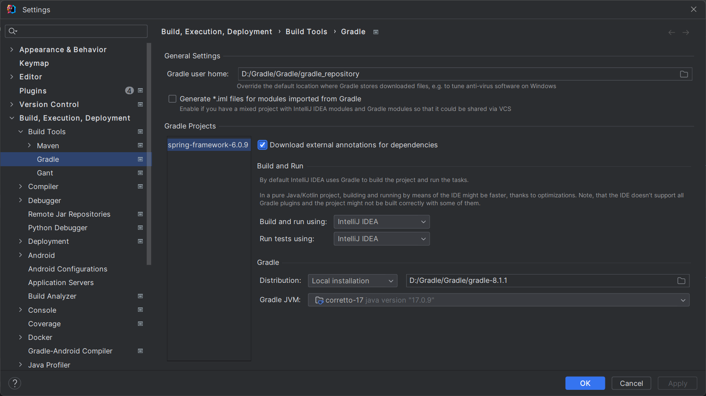
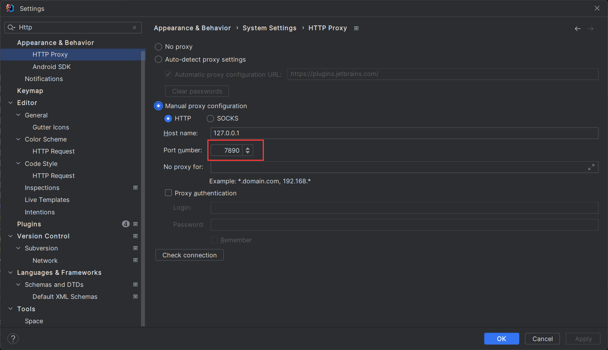
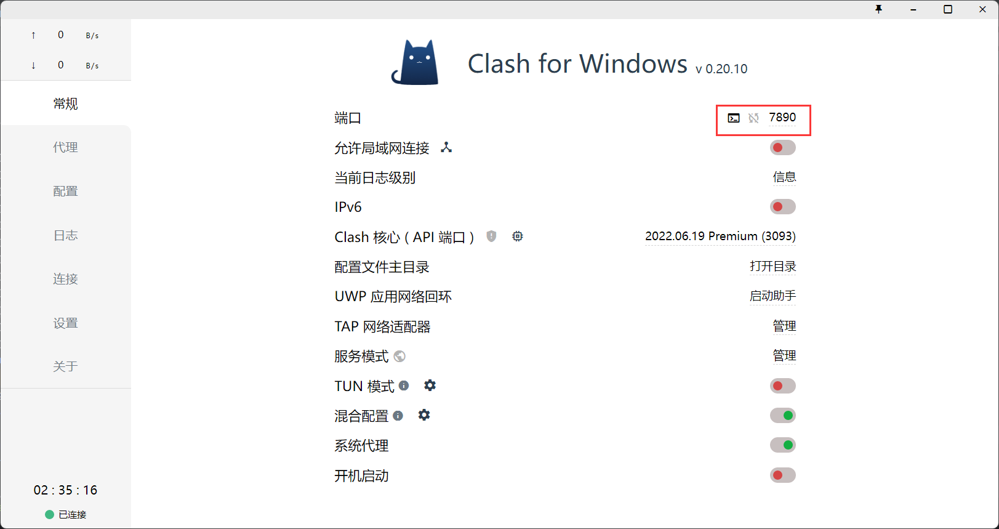
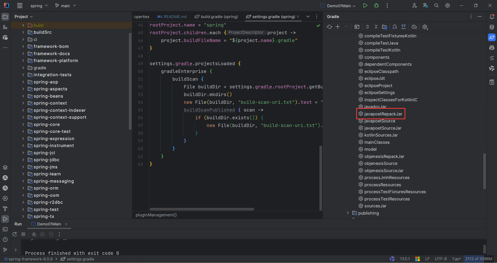
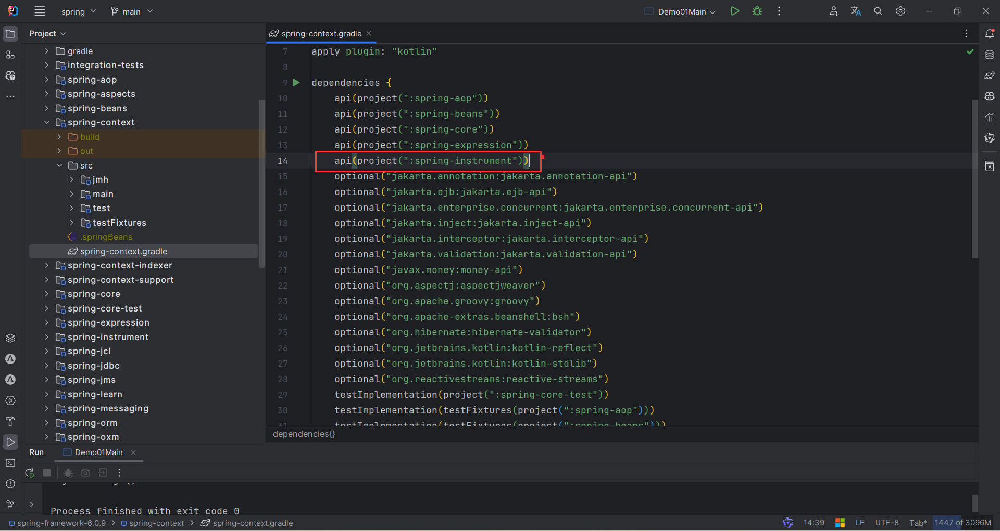
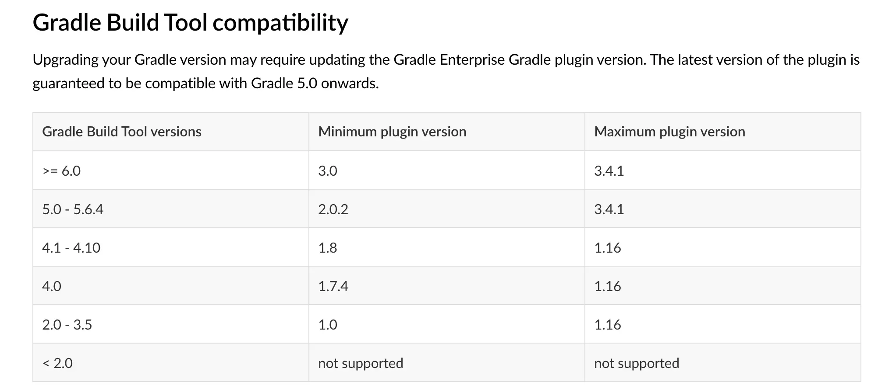

## 为何要编译 spring 源码？

我们编译 spring 源码，主要是为了调试。虽说 jar 包的形式也可调试，但是如果我们边在源码上做注释，边调试，甚至修改源码实现我们想要的功能，岂不美哉？

## 1. 在命令行中编译

关于如何编译 spring 源码，spring 项目早有说明，如果你想在命令行中构建，可以参考 [Build-from-Source](https://github.com/spring-projects/spring-framework/wiki/Build-from-Source)，
这里我将我的编译过程记录如下：

### 1.1 获取源码

```shell
$ git clone https://gitee.com/xxx/spring-framework
$ cd spring-framework
```

### 1.2 配置 gradle

Gradle配置，请移步 []()

### 1.3 运行构建命令

在 spring-framework 目录下，运行构建命令：

```shell
./gradlew build
```

接下来就是漫长的等待了。第一次构建，下载的依赖会比较多，构建时长完全取决于你的网速了。

## 2. 在 idea 中编译

上面介绍了如何在命令行中构建 spring 源码，但一般来说，这样直接构建的人并不多，绝大多数人都是在开发工具中构建，毕竟构建完成后可以用来运行自己的测试代码，多好！
由于本人是用 idea 开发，因此这里只介绍如何在 idea 中编译 spring 源码。

关于如何在 idea，spring 可以参考 [import-into-idea](https://github.com/spring-projects/spring-framework/blob/main/import-into-idea.md)，这里给出我的编译过程：

### 2.1 配置 gradle

Gradle配置，请移步 []()

### 2.2 配置 idea 中的 gradle

使用 idea 编译时，使用的是 idea 中的 gradle，因此我们也需要配置下 idea 中的 gradle，配置如下：



### 2.3 修改Spring源码中Gradle配置

根目录下：

* `build.gradle` 添加：

```shell
repositories {
        # 阿里云
		maven
		} { url "https://maven.aliyun.com/repository/public" }
		maven { url 'https://maven.aliyun.com/nexus/content/groups/public/' }
		maven { url 'https://maven.aliyun.com/nexus/content/repositories/jcenter'}
		mavenCentral()
		maven {
			url "https://repo.spring.io/milestone"
			content {
				// Netty 5 optional support
				includeGroup 'io.projectreactor.netty'
			}
		}
		maven { url "https://repo.spring.io/libs-spring-framework-build" }
		if (version.contains('-')) {
			maven { url "https://repo.spring.io/milestone" }
		}
		if (version.endsWith('-SNAPSHOT')) {
			maven { url "https://repo.spring.io/snapshot" }
		}
	}
```

* `gradle.properties` 添加 ：

```shell
version=6.0.9

# JDK
org.gradle.java.home=D:\\ideadata\\ideaconf\\.jdks\\corretto-17.0.9
org.gradle.caching=true
org.gradle.jvmargs=-Xmx2048m
org.gradle.parallel=true

kotlinVersion=1.7.21

kotlin.stdlib.default.dependency=false
```

* `settings.gradle` 添加：

```shell
pluginManagement {
	repositories {
		maven { url "https://maven.aliyun.com/repository/public" }
		mavenCentral()
		gradlePluginPortal()
		maven { url "https://repo.spring.io/release" }
	}
}
```

### 2.4 使用 idea 编译

点击 `build` 后，耐心等待即可。

初次构建，下载的依赖会很多，构建的时长取决于你的网速。

## 3 下载过慢问题

### 3.1 配置 idea proxy



注意端口，是你魔法的端口

### 3.2 使用魔法



### 3.3 重新构建


## 4 常见问题

### 4.1 javapoet 包下的类找不到

`spring-core -> Tasks -> other -> javapoetRepackJar` , 点击 `javapoetRepackJar`



类似其他找不到包的问题，先试试上面的操作。例如：缺少 `org.springframework.objenesis`，就去找 `objenesisRepackJar`

### 4.2 InstrumentationSavingAgent 包下的类找不到

修改 `spring-context.gradle`，改成 `api(project(":spring-instrument"))`



### 4.3 Gradle 版本问题

