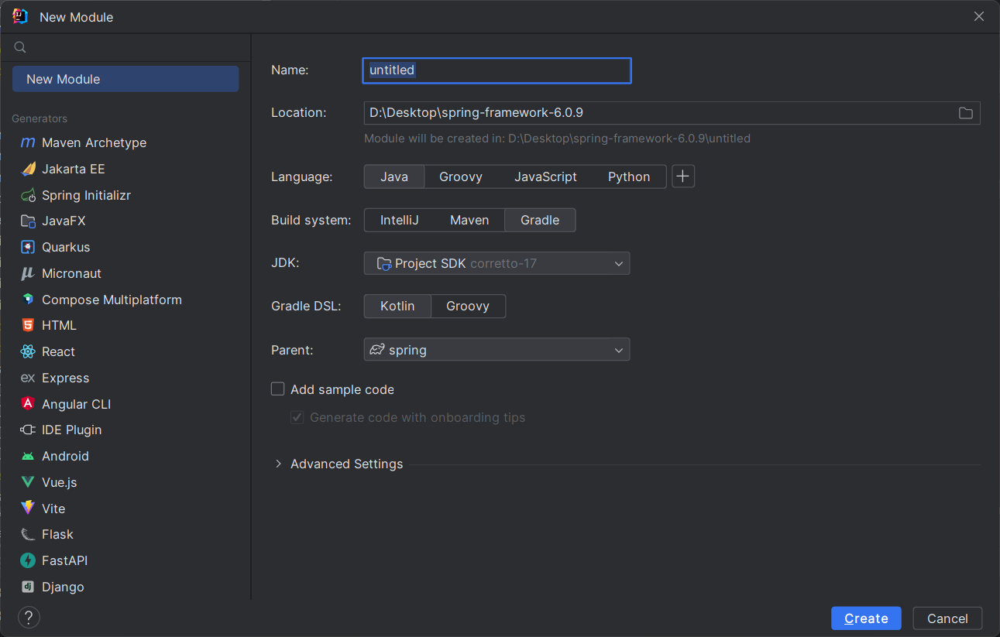
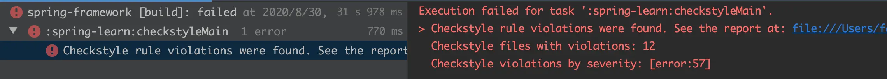
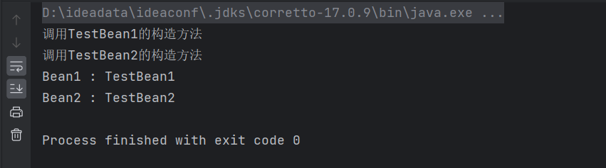

## 1. 创建调试代码模块

在进行源码调试前，我们先要创建调试代码，简单来说就是 `main()` 方法入口或 `@Test` 方法。虽然在 `spring-test` 模块下有大量的单元测试类，
在每个模块的 `src/test/java` 下也有不少测试用例，但更多的时候，我们还是希望自己写代码来调试，因此需要一个专门的模块来放置自己的测试代码。

### 1.1 新建模块 spring-learn

在 idea 中，点击 `spring-framework` 项目，右键，选择 `new-module`:



### 1.2 配置 spring-learn 模块

将自动生成的`build.gradle.kts` 改成 `spring-learn.gradle`。

调度 spring 源码，当然需求引入 spring 的其他模块，`spring-learn.gradle` 配置如下：

```shell
description = "Spring Learn"

apply plugin: "kotlin"

dependencies {
	api(project(":spring-core"))
	api(project(":spring-aop"))
	api(project(":spring-beans"))
	api(project(":spring-context"))
	optional("org.aspectj:aspectjweaver")
	testImplementation group: 'junit', name: 'junit', version: '4.12'
}
```

### 1.3 将 spring-learn 排除 check-style

spring 作为一个庞大的项目，在多人开发下，为了保证代码风格统一，使用了 `checkstyle` 插件，如果违反了代码风格，编译时就会报错：



为了避免出现这种情况，需要将 `spring-learn` 模块下的代码排除于 `check-style` 之外，需要在 `spring-framework/src/checkstyle/` 下的 `checkstyle-suppressions.xml` 文件添加这样一句：

```xml
<?xml version="1.0"?>
<!DOCTYPE suppressions PUBLIC "-//Checkstyle//DTD SuppressionFilter Configuration 1.2//EN" 
    "https://checkstyle.org/dtds/suppressions_1_2.dtd">
<suppressions>
    ...

    <!-- spring-learn -->
    <suppress files="[\\/]src[\\/]main[\\/]java[\\/]org[\\/]springframework[\\/]learn[\\/]" checks=".*" />
</suppressions>
```

如此一来，就不会再出现因代码风格而编译出错的尴尬场面了。

## 2. 第一个 Demo

在新建的module的 `src/main/java` 下创建包 `org.springframework.learn.demo01`，然后创建两个 bean，内容如下：

```java
package org.springframework.learn.demo1;

import org.springframework.stereotype.Service;

@Service
public class TestBean1 {

	public TestBean1() {
		System.out.println("调用TestBean1的构造方法");
	}

	@Override
	public String toString() {
		return "TestBean1";
	}

}
```

```java
package org.springframework.learn.demo1;

import org.springframework.stereotype.Component;

@Component
public class TestBean2 {

	public TestBean2() {
		System.out.println("调用TestBean2的构造方法");
	}

	@Override
	public String toString() {
		return "TestBean2";
	}
}
```

再写个 `main` 方法：

```java
package org.springframework.learn.demo1;

import org.springframework.context.ApplicationContext;
import org.springframework.context.annotation.AnnotationConfigApplicationContext;

public class Demo01Main {

	public static void main(String[] args) {
		// 指定扫描的包
		ApplicationContext context = new AnnotationConfigApplicationContext("org.springframework.learn.demo1");

		Object obj1 = context.getBean("testBean1");
		Object obj2 = context.getBean("testBean2");
		System.out.println("Bean1 : " +  obj1);
		System.out.println("Bean2 : " + obj2);
	}
}
```

运行，结果如下：



在以上的代码中，我们创建了两个Bean，并在这两个类上分别添加了 `@Service` 与 `@Component` 注解，在 `main()` 方法中，使用的 `ApplicationContext` 为 `AnnotationConfigApplicationContext` 
且指定包名为 `org.springframework.learn.demo01`。可以看到，最终从 spring 容器中成功获取了这两个 bean 了。

