# spring 启动流程概览

## 1.运行一下 demo

```java
ApplicationContext context = new AnnotationConfigApplicationContext("org.springframework.learn.demo1");
for (String beanDefinitionName : context.getBeanDefinitionNames()) {
    System.out.println(beanDefinitionName);
}
```

运行以上代码，结果如下：

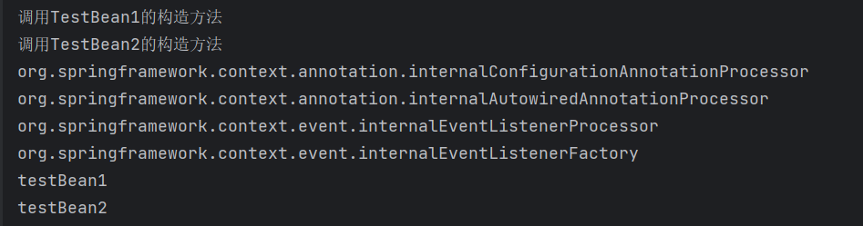

可以看到，容器中一共有6个`beanDefinition`，其中四个带`internal`的都是Spring内部自带的，`testBean1`和`testBean2`则是我们定义的。在循环打印`BeanDefinitionName`之前还调用了我们自定义两个Bean的构造方法。

下面就来逐一探究一下这些组件是如何被注册的，顺便说一下 bean 的加载过程。

## 2.复习一下bean的加载过程

主要过程就是这个图：

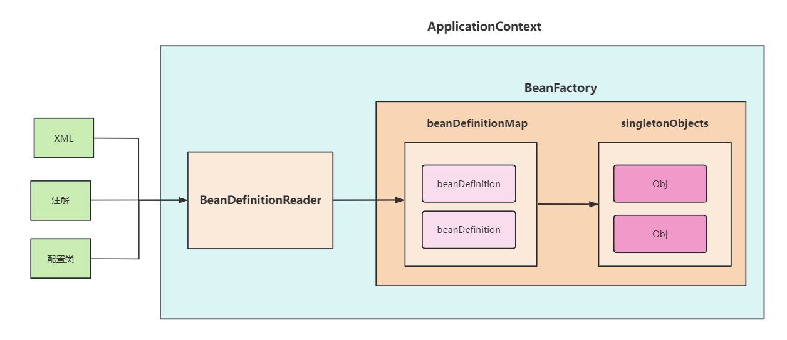

我们重点关注：`beanFactory` 、`beanDefinitionMap` 和 `singletonObjects` 这三个对象。

## 3.开始调试

1. **在main函数的这一行加一个断点，并启动调试：**

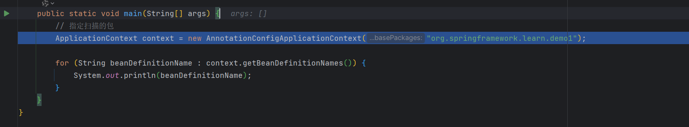

2. **首先step into，然后多次step over，直到进入`AnnotationConfigApplicationContext`的构造函数:**

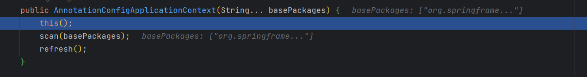

* `beanDefinitionMap` 是一个   `ConcurrentHashMap` ，它的键是 bean 的 name，值是对应的`BeanDefinition`。通过观察这个变量，我们就可以知道当前容器中所有已注册的bean信息。
* `singletonObjects` 是 Spring 的单例池，里面存放着所有的单例 bean

`beanDefinitionMap` 和 `singletonObjects` 都位于 `beanFactory` 中，所以我们在 Debug 框中添加 `beanFactory`、`beanFactory.beanDefinitionMap` 和  `beanFactory.singletonObjects` 

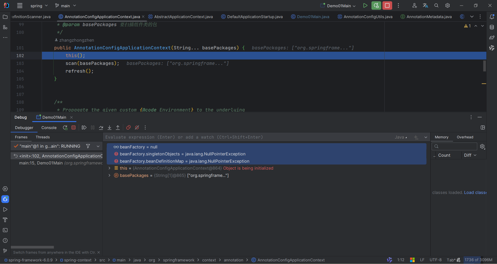

3. **继续step over，执行完`this()`调用：**

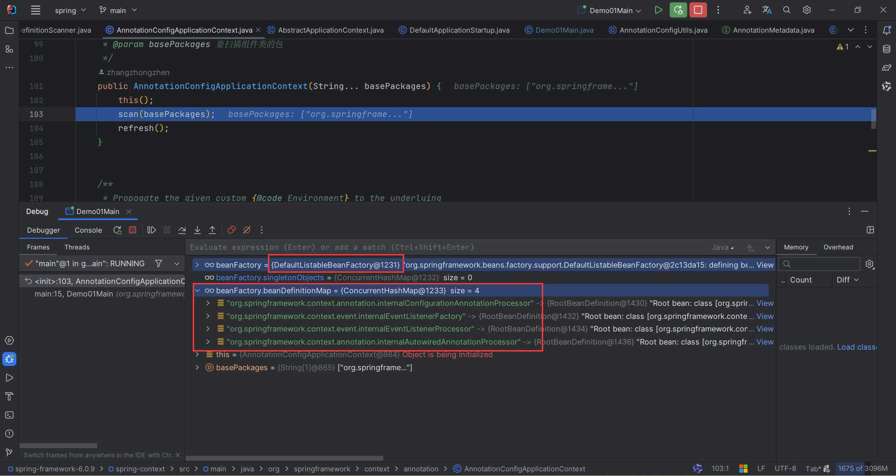

可以看到，`beanFactory`由 null 变成了 `DefaultListableBeanFactory` , `beanDefinitionMap` 的大小也变为 4，里面已经有了四个bean：

* **org.springframework.context.annotation.internalConfigurationAnnotationProcessor**: 主要用于处理带有 `@Configuration` 注解的类。
* **org.springframework.context.event.internalEventListenerFactory**: 主要用于创建监听器实例来处理应用上下文中的事件。
* **org.springframework.context.event.internalEventListenerProcessor**: 用于处理事件监听器的内部组件。
* **org.springframework.context.annotation.internalAutowiredAnnotationProcessor**: 处理自动装配（Autowiring）相关的注解。

这四个bean都是Spring内部自带的组件，由此可推测，Spring内部自带的组件的注册是在`this()`调用中，即 `AnnotationConfigApplicationContext` 的默认构造函数中完成的。

4. **继续step over，执行完`scan(basePackages)`：**

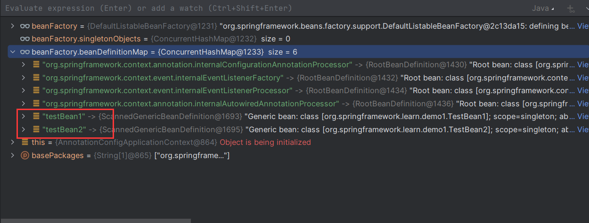

接着运行，发现 beanDefinitionMap 又多了两个：

* **testBean1**: 自定义 bean
* **testBean2**: 自定义 bean

这里的 `testBean1` 与 `testBean2` 就是我们自己的类了，由此可以判断出 spring 就是在 `AnnotationConfigApplicationContext#scan` 方法中对包进行扫描的。

直到这时，`singletonObjects` 还是空的，说明这时候还没有创建任何bean。

5. **继续step over，执行完`refresh()`调用：**

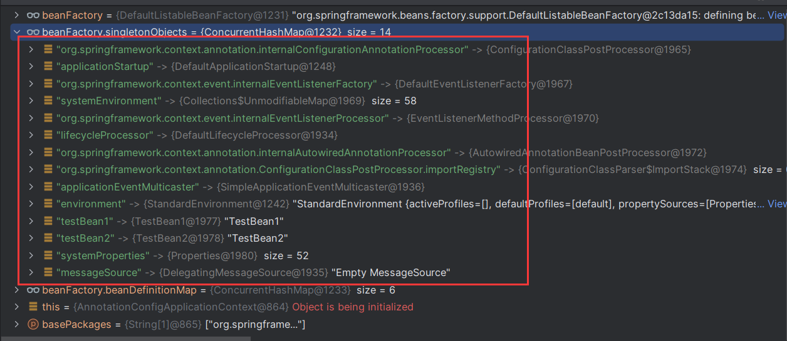

可以看到，`singletonObjects` 中添加了14个单例bean，其中有6个我们在 `beanDefinitionMap` 见过，还有一些新的单例 bean ：

* **applicationStartup**: 用于监听和记录应用启动阶段的行为。
* **systemEnvironment**: 当前运行环境的系统环境变量集合。
* **lifecycleProcessor**: 负责管理那些实现了 `Lifecycle` 接口或具有特定生命周期回调方法（如 `InitializingBean` 和 `DisposableBean`）的Bean。
* **org.springframework.context.annotation.ConfigurationClassPostProcessor.importRegistry**: 
* **applicationEventMulticaster**: 
* **environment**: 
* **systemProperties**: 
* **messageSource**: 

同时，在执行完 `refresh()` 后，控制台也进行了 `testBean1` 和 `testBean2` 的构造方法的调用。

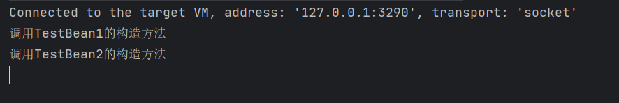

## 4.总结

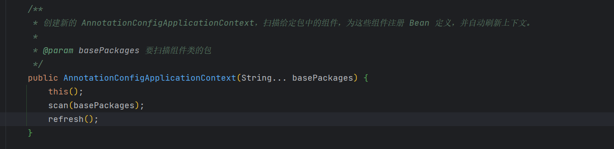

大概走过 `AnnotationConfigApplicationContext()` 的构造方法，再结合官方的注释，有大致一下的过程（只是这样看起来，不深究其细节）：

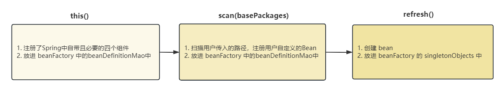